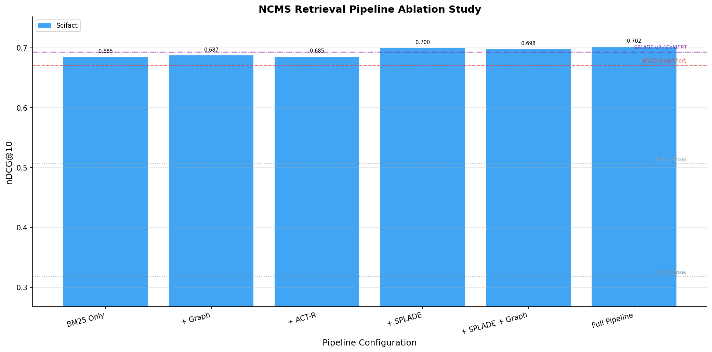

<p align="center">
  
</p>

<p align="center">
  <a href="#see-it-working">See It Working</a> &bull;
  <a href="#how-it-works">How It Works</a> &bull;
  <a href="#ablation-study">Benchmarks</a> &bull;
  <a href="docs/quickstart.md">Quickstart Guide</a>
</p>

<p align="center">
  
  
  
  
  
</p>

---

**Your AI agents forget everything between sessions.** Every conversation starts from zero. Every insight, every architectural decision, every hard-won debugging breakthrough &mdash; gone.

NCMS fixes this. Permanently.

```bash
pip install ncms
```

```python
from ncms.interfaces.mcp.server import create_ncms_services, create_mcp_server

memory, bus, snapshots, consolidation = await create_ncms_services()
server = create_mcp_server(memory, bus, snapshots, consolidation)
```

Three lines. Your agents now have persistent, searchable, shared memory with cognitive scoring &mdash; a system that learns while it sleeps, tracks how knowledge evolves, and lets agents share what they know like Neo downloading kung fu. No vector database. No embedding pipeline. No external services.

## What Makes NCMS Different

| Problem | Traditional Approach | NCMS |
|---------|---------------------|------|
| Memory retrieval | Dense vector similarity (lossy) | **BM25 + SPLADE + graph expansion + ACT-R cognitive scoring** (precise) |
| Agent coordination | Polling shared files, explicit tool calls | **Embedded Knowledge Bus** (osmotic) |
| Agent goes offline | Knowledge lost until restart | **Snapshot surrogate response** (always available) |
| Dependencies | Vector DB + graph DB + message broker | **Zero. Single `pip install`.** |
| Setup time | Hours of infrastructure | **3 seconds to first query** |

## See It Working

```bash
git clone https://github.com/AliceNN-ucdenver/ncms.git
cd ncms && uv sync
uv run ncms demo
```

Three collaborative agents run through a complete lifecycle &mdash; storing knowledge, asking questions, going offline with surrogate responses, and announcing breaking changes &mdash; all in-memory, under 10 seconds.

```bash
uv run ncms dashboard    # Real-time observability at http://localhost:8420
```

---

## How It Works

NCMS organizes agent memory into a **Hierarchical Temporal Memory Graph (HTMG)** &mdash; a four-level structure where raw facts crystallize into tracked states, states cluster into temporal episodes, and episodes consolidate into strategic insights. Think of it as giving your agents not just storage, but the ability to *understand* their knowledge. ([V1 architecture](docs/ncms_v1.md))

### NCMS Architecture (HTMG)

```
                     ┌─────────────────────────────────────────┐
                     │          Strategic Insights              │  ABSTRACT nodes
                     │    "Redis caching patterns emerge        │  (LLM-synthesized)
                     │     across 3 deployment episodes"        │
                     └──────────────┬──────────────────────────┘
                                    │ SUMMARIZES
                     ┌──────────────▼──────────────────────────┐
                     │          Temporal Episodes               │  EPISODE nodes
                     │    "API v2 migration (Mar 3-7)"         │  (7-signal linker)
                     └──────────────┬──────────────────────────┘
                                    │ BELONGS_TO_EPISODE
          ┌─────────────────────────▼──────────────────────────────────┐
          │                                                            │
┌─────────▼──────────┐                                   ┌─────────────▼─────────┐
│   Entity States     │ ←── SUPERSEDES/CONFLICTS ──→     │    Atomic Facts        │
│  "Redis: v7.2→v7.4" │    (bitemporal tracking)         │  "Use connection       │
│  (is_current=True)  │                                   │   pooling for PG"     │
└─────────────────────┘                                   └───────────────────────┘
  ENTITY_STATE nodes                                        ATOMIC nodes
```

Every memory enters through an **admission gate** that routes it &mdash; like a bouncer deciding who gets into the club. Raw facts become `ATOMIC` nodes. State changes ("`Redis upgraded to v7.4`") become `ENTITY_STATE` nodes with bitemporal validity tracking. Related events cluster into `EPISODE` nodes via a 7-signal hybrid linker. And overnight, **dream cycles** consolidate episodes into `ABSTRACT` insights &mdash; the system literally learns while it sleeps.

### Retrieval Pipeline

Traditional memory systems compress documents into dense vectors, losing precision. NCMS uses complementary mechanisms that work together without a single embedding:

<p align="center">
  
</p>

**Tier 0 &mdash; Intent Classification.** Before retrieval begins, the query is classified into one of 7 intent types (fact lookup, current state, historical, event reconstruction, change detection, pattern, strategic reflection) via a BM25 exemplar index. This shapes which memory types receive a scoring bonus downstream &mdash; asking "what changed?" boosts entity states, while "what patterns emerged?" boosts abstracts.

**Tier 1 &mdash; BM25 + SPLADE Hybrid Search.** BM25 via Tantivy (Rust) provides exact lexical matching. SPLADE adds learned sparse neural retrieval &mdash; expanding "API specification" to also match "endpoint", "schema", "contract". Results are fused via Reciprocal Rank Fusion (RRF).

**Tier 1.5 &mdash; Graph-Expanded Discovery.** Entity relationships in the knowledge graph discover related memories that search missed lexically. A query matching "connection pooling" also finds memories about "PostgreSQL replication" &mdash; because both share the `PostgreSQL` entity in the graph.

**Tier 2 &mdash; ACT-R Cognitive Scoring.** Every memory has an activation level computed from access recency, frequency, and contextual relevance &mdash; the same math that models human memory in cognitive science. Dream-learned association strengths weight entity connections, and reconciliation penalties demote superseded or conflicted states.

```
activation(m) = base_level(m) + spreading_activation(m, query) + noise
                - supersession_penalty - conflict_penalty + hierarchy_bonus
base_level(m) = ln( sum( (time_since_access)^(-decay) ) )
spreading(m)  = sum( learned_PMI_weight(entity) )     ← dream-learned associations
combined(m)   = bm25 * w_bm25 + splade * w_splade + activation * w_actr + graph * w_graph
```

### Entity Extraction & Memory Enrichment

Entities are automatically extracted at store-time and search-time, feeding the knowledge graph for spreading activation and graph expansion:

<p align="center">
  
</p>

**GLiNER NER** &mdash; Zero-shot Named Entity Recognition using a 209M-parameter [DeBERTa](https://github.com/urchade/GLiNER) model. Extracts entities across any domain with per-domain label customization via `ncms topics` CLI.

**Admission Scoring** &mdash; An 8-feature heuristic gate (novelty, utility, reliability, temporal salience, persistence, redundancy, episode affinity, state change signal) routes incoming memories to the right level of the hierarchy: discard, ephemeral cache, atomic fact, entity state update, or episode fragment. Not everything deserves to be remembered &mdash; like in the Matrix, you want to download kung fu, not every email you've ever read.

**State Reconciliation** &mdash; When a new entity state arrives ("Redis upgraded to v7.4"), NCMS classifies its relationship to existing states (supports, refines, supersedes, conflicts) and applies bitemporal truth maintenance. Superseded states get `is_current=False` with validity closure. Stale knowledge is automatically penalized in retrieval &mdash; you always get the current truth first.

**Episode Formation** &mdash; Related memories are automatically grouped into temporal episodes via a 7-signal hybrid linker (BM25, SPLADE, entity overlap, domain match, temporal proximity, source agent, structured anchors like JIRA tickets). Episodes give structure to "what happened during the API v2 migration" without requiring anyone to manually organize knowledge.

**Contradiction Detection** (opt-in) &mdash; New memories are compared against existing related memories via LLM to detect factual contradictions, with bidirectional annotation so stale knowledge is surfaced during retrieval.

**Knowledge Consolidation** (opt-in) &mdash; Clusters memories by shared entities, then uses LLM synthesis to discover emergent cross-memory patterns stored as searchable insights.

### Dream Cycles (Project Oracle)

<p align="center">
  
</p>

The keyword bridge [catastrophic failure](#negative-results-keyword-bridges) and ACT-R's underperformance on static benchmarks revealed a deeper insight: **ACT-R has the right mechanism but needs learned weights.** On static IR benchmarks, every document has identical access history &mdash; so `ln(sum(t^-d))` produces uniform scores that contribute only noise. Dream cycles fix this by creating *differential* access patterns offline, teaching the system what matters through its own cognitive architecture.

Like biological sleep consolidation &mdash; where the brain replays and strengthens important memories overnight &mdash; NCMS runs three non-LLM passes during "sleep":

- **Dream Rehearsal** &mdash; Selects high-value memories via a 5-signal weighted score (PageRank centrality 0.40, staleness 0.30, importance 0.20, access frequency 0.05, recency 0.05) and injects synthetic access records. These memories get stronger `B_i = ln(sum(t^-d))` scores without changing the formula &mdash; the system practices remembering what matters.

- **Association Learning** &mdash; Computes pointwise mutual information (PMI) from entity co-access patterns in the search log. When "Redis" and "caching" consistently appear together in search results, their learned association strength feeds into `spreading_activation()` &mdash; replacing uniform 1.0 weights with data-driven connections. This is what keyword bridges *tried* to do, but learned from actual usage instead of LLM-extracted generics.

- **Importance Drift** &mdash; Compares recent access rates against older rates and adjusts `memory.importance` within bounded limits. Frequently accessed memories rise; neglected ones gracefully decay. The system develops its own sense of what's important, based on how agents actually use knowledge.

### Knowledge Bus & Agent Sleep/Wake

Agents don't poll for updates. They don't call each other directly. Knowledge flows through domain-routed channels &mdash; osmotic knowledge transfer, like the Matrix's construct programs where knowledge loads instantly from anywhere in the network.

<p align="center">
  
</p>

```python
# API agent announces a change — frontend agent gets it automatically
await agent.announce_knowledge(
    event="breaking-change",
    domains=["api:user-service"],
    content="GET /users now returns role field",
    breaking=True,
)
```

**Ask/Respond** &mdash; Non-blocking queries routed by domain. Any agent can ask any domain and get answers from whoever knows.
**Announce/Subscribe** &mdash; Fire-and-forget broadcasts to interested agents. Breaking changes propagate instantly.
**Surrogate Response** &mdash; When agents go offline, they publish knowledge snapshots. Other agents can still ask them questions &mdash; the snapshot answers on their behalf using keyword matching, like leaving a well-organized notebook for your replacement.

<p align="center">
  
</p>

The agent lifecycle (`start → work → sleep → wake → shutdown`) ensures knowledge persists across sessions. An agent that goes offline at 5pm can still answer questions at 3am through its surrogate &mdash; and when it wakes up, it picks up exactly where it left off.

---

## Ablation Study

Systematic evaluation of each pipeline component's contribution using standard [BEIR](https://github.com/beir-cellar/beir) IR benchmarks. Full methodology in the [design doc](docs/ablation-study-design.md).

**Datasets:** SciFact (5,183 docs / 300 queries), NFCorpus (3,633 docs / 323 queries), ArguAna (8,674 docs / 1,406 queries)

### Domain-Specific Entity Labels

Graph expansion depends on GLiNER extracting meaningful entities at ingest time. We tested 5 label taxonomies per dataset and found that **label choice is critical** &mdash; abstract labels like `claim, evidence, study` produce zero entities, while concrete labels like `disease, protein, gene` produce 6&ndash;9 entities per document:

| Dataset | Domain | Selected Labels | Ent/Doc |
|---------|--------|-----------------|:-------:|
| **SciFact** | Science | `medical_condition, medication, protein, gene, chemical_compound, organism, cell_type, tissue, symptom, therapy` | 9.1 |
| **NFCorpus** | Nutrition | `disease, nutrient, vitamin, mineral, drug, food, protein, compound, symptom, treatment` | 9.3 |
| **ArguAna** | Debate | `person, organization, location, nationality, event, law` | 4.4 |

Synonym tuning matters: `medication` outperforms `drug`, `medical_condition` outperforms `disease` for scientific text, while nutrition-specific labels (`nutrient, vitamin, mineral, food`) are essential for dietary health corpora. See the [taxonomy experiment](docs/ablation-study-design.md#taxonomy-experiment) for the full comparison.

### Results

<p align="center">
  
</p>

**nDCG@10 across datasets** (8 pipeline configurations, SciFact BEIR benchmark):

| Configuration | SciFact | NFCorpus | ArguAna |
|---------------|:-------:|:--------:|:-------:|
| BM25 Only | 0.687 | 0.319 | &mdash; |
| + Graph Expansion | 0.690 | **0.321** | &mdash; |
| + ACT-R Scoring | 0.686 | 0.317 | &mdash; |
| + SPLADE Fusion | 0.697 | **0.339** | &mdash; |
| **+ SPLADE + Graph** | **0.698** | 0.338 | &mdash; |
| Full Pipeline | 0.690 | 0.337 | &mdash; |
| + Keyword Bridges | 0.032 | &mdash; | &mdash; |
| + Keywords + Judge | 0.032 | &mdash; | &mdash; |

*SciFact re-run with improved GLiNER/SPLADE text chunking. NFCorpus/ArguAna pending re-run.*

<details>
<summary><b>Detailed per-dataset metrics</b> (click to expand)</summary>

**SciFact** (300 queries, 5,183 documents):

| Configuration | nDCG@10 | MRR@10 | Recall@10 | Recall@100 |
|---------------|:-------:|:------:|:---------:|:----------:|
| BM25 Only | 0.687 | 0.653 | 0.809 | 0.893 |
| + Graph Expansion | 0.690 | 0.657 | 0.809 | 0.893 |
| + ACT-R Scoring | 0.686 | 0.650 | 0.809 | 0.893 |
| + SPLADE Fusion | 0.697 | 0.667 | 0.812 | 0.925 |
| **+ SPLADE + Graph** | **0.698** | **0.667** | **0.812** | **0.925** |
| Full Pipeline | 0.690 | 0.659 | 0.806 | 0.925 |
| + Keyword Bridges | 0.032 | 0.037 | 0.030 | 0.030 |
| + Keywords + Judge | 0.032 | 0.037 | 0.030 | 0.030 |

**NFCorpus** (323 queries, 3,633 documents):

| Configuration | nDCG@10 | MRR@10 | Recall@10 | Recall@100 |
|---------------|:-------:|:------:|:---------:|:----------:|
| BM25 Only | 0.319 | 0.524 | &mdash; | 0.215 |
| + Graph Expansion | 0.321 | 0.524 | &mdash; | 0.220 |
| + ACT-R Scoring | 0.317 | 0.523 | &mdash; | 0.215 |
| + SPLADE Fusion | **0.339** | **0.553** | &mdash; | 0.262 |
| + SPLADE + Graph | 0.338 | 0.552 | &mdash; | **0.266** |
| Full Pipeline | 0.337 | 0.547 | &mdash; | **0.266** |

</details>

**vs. published baselines** (horizontal lines in chart):

| System | SciFact nDCG@10 | NCMS Comparison |
|--------|:---------------:|:---------------:|
| DPR (dense) | 0.318 | NCMS +120% |
| ANCE (dense) | 0.507 | NCMS +38% |
| BM25 (published) | 0.671 | NCMS +4.0% |
| SPLADE v2 / ColBERT v2 | 0.693 | NCMS +0.7% |

NCMS achieves **0.698 nDCG@10 on SciFact without a single embedding vector** &mdash; outperforming published dense and sparse neural retrieval baselines using only BM25 + SPLADE sparse expansion + entity-graph traversal + cognitive scoring.

**Key findings:**
- **SPLADE fusion is the largest single contributor** (+1.5% SciFact, +6.2% NFCorpus), adding learned term expansion on top of BM25
- **Graph expansion provides consistent lift** across datasets (+0.4% SciFact, +0.6% NFCorpus) via entity-based cross-memory discovery
- **SPLADE + Graph is the best configuration** (0.698 SciFact) &mdash; combining learned term expansion with entity-graph discovery
- **Keyword bridges catastrophically fail** (0.032 nDCG@10) &mdash; LLM-extracted generic keywords create high-fanout hub nodes in the entity graph, flooding graph expansion with irrelevant candidates (see Negative Results below)

### Weight Tuning (Phase 7)

After the initial ablation established component contributions, we ran systematic grid searches to optimize weights and thresholds across three dimensions:

**Retrieval Ranking** (108 configurations, SciFact):

| Parameter | Search Range | Best Value |
|-----------|:------------:|:----------:|
| BM25 weight | 0.6 &ndash; 0.8 | **0.7** |
| ACT-R weight | 0.0 &ndash; 0.1 | **0.0** |
| SPLADE weight | 0.2 &ndash; 0.4 | **0.2** |
| Graph weight | 0.0 &ndash; 0.3 | **0.3** |
| Hierarchy weight | 0.0 &ndash; 0.1 | **0.0** |
| **Tuned nDCG@10** | | **0.7053** (+1.1%) |

The critical finding: **ACT-R weight = 0 is optimal on static benchmarks.** On BEIR datasets, every document has exactly one access at the same time, so `ln(sum(t^-d))` produces identical scores for all candidates &mdash; contributing only noise. This is expected: ACT-R was designed for systems with *real* temporal access patterns. Dream cycles (Phase 8) address this by creating differential access histories offline.

**Admission Routing** (486 configurations, 44 labeled examples): Best accuracy **65.9%** &mdash; entity state detection at 87.5%, discard at 90%, but atomic memory routing at 41.7% remains challenging.

**Reconciliation Penalties** (16 configurations, 20 state pairs): Tuned supersession penalty from 0.3 → **0.5** and conflict penalty from 0.15 → **0.3**, achieving 65% correct demotion rate.

**Quality & Latency** (full pipeline vs baseline):

| Metric | Baseline | Full Pipeline | Impact |
|--------|:--------:|:-------------:|:------:|
| Ingest p50 | 352ms | 674ms | 1.9&times; |
| Search p50 | 38ms | 35ms | Faster |
| Memory growth | 1.0&times; | 1.3&times; | HTMG nodes |

Search gets *faster* with the full pipeline because better candidate selection reduces downstream scoring work. The 1.9&times; ingest overhead comes from admission scoring, entity state reconciliation, and episode linking &mdash; investment at write time that pays dividends at read time.

### Negative Results: Keyword Bridges

LLM-extracted keyword bridge nodes were intended to connect entity subgraphs that share semantic themes. In practice, they **destroyed retrieval quality**, dropping nDCG@10 from 0.690 to 0.032 (&minus;95%).

**Root cause:** The LLM extracts generic conceptual keywords ("study", "treatment", "effect", "analysis") that connect thousands of documents as high-fanout hub nodes. During graph expansion, these hubs flood the candidate pool with irrelevant documents, pushing relevant results entirely out of the top-100. Recall@100 dropped from 0.925 to 0.030 &mdash; meaning relevant documents are no longer retrievable at all.

**Why this matters:** This is a fundamental architectural failure, not a tuning problem. Graph retrieval benefits from **specific, discriminative** entity nodes (GLiNER NER: "interleukin-6", "p53", "metformin") that connect only semantically related documents. Generic keyword nodes lack this discriminative power, creating connections so broad they carry no information.

**Forward direction:** This negative result motivates the [HTMG architecture](docs/ncms_next_internal_design_spec.md) (Hierarchical Temporal Memory Graph), which addresses cross-subgraph connectivity through structural mechanisms &mdash; temporal episodes that group co-occurring memories, entity state tracking that captures how concepts evolve, and hierarchical abstractions that synthesize patterns &mdash; rather than keyword-based bridge nodes. SPLADE already provides learned vocabulary expansion at the retrieval level, making keyword bridges redundant at the graph level.

*Dream cycles are covered in [How It Works](#dream-cycles-project-oracle) above. See the [design spec](docs/ncms_next_internal_design_spec.md#phase-8-project-oracle--dream-cycle) for implementation details.*

---

## Get Started

```bash
pip install ncms                    # Core install
pip install "ncms[docs]"            # + rich document support (DOCX/PPTX/PDF/XLSX)
pip install "ncms[dashboard]"       # + observability dashboard
```

```bash
uv run ncms demo                    # See it in action
uv run ncms serve                   # Start MCP server
uv run ncms dashboard               # Real-time dashboard
uv run ncms load file.md --domains arch  # Matrix-style knowledge download
```

**[Quickstart Guide](docs/quickstart.md)** &mdash; MCP server setup, Claude Code hooks, NeMo agent integration, configuration reference, and local LLM inference.

## GPU-Accelerated LLM Inference

NCMS LLM features (contradiction detection, knowledge consolidation) can be accelerated with an [NVIDIA DGX Spark](https://www.nvidia.com/en-us/products/workstations/dgx-spark/) running [vLLM](https://docs.vllm.ai/) via the [NGC vLLM container](https://catalog.ngc.nvidia.com/orgs/nvidia/containers/vllm).

**Deploy Nemotron on DGX Spark:**

```bash
docker run -d --gpus all --ipc=host --restart unless-stopped \
  -p 8000:8000 \
  -v /root/.cache/huggingface:/root/.cache/huggingface \
  nvcr.io/nvidia/vllm:26.01-py3 \
  vllm serve nvidia/NVIDIA-Nemotron-3-Nano-30B-A3B-BF16 \
    --host 0.0.0.0 \
    --port 8000 \
    --trust-remote-code \
    --max-model-len 32768
```

**Point NCMS at the Spark:**

```bash
# Contradiction detection + knowledge consolidation via DGX Spark
NCMS_CONTRADICTION_DETECTION_ENABLED=true \
NCMS_LLM_MODEL=openai/nvidia/NVIDIA-Nemotron-3-Nano-30B-A3B-BF16 \
NCMS_LLM_API_BASE=http://spark-ee7d.local:8000/v1 \
NCMS_CONSOLIDATION_KNOWLEDGE_ENABLED=true \
NCMS_CONSOLIDATION_KNOWLEDGE_MODEL=openai/nvidia/NVIDIA-Nemotron-3-Nano-30B-A3B-BF16 \
NCMS_CONSOLIDATION_KNOWLEDGE_API_BASE=http://spark-ee7d.local:8000/v1 \
uv run ncms serve
```

The Nemotron 3 Nano (30B total, 3B active MoE) fits entirely in the Spark's 128GB unified memory with room to spare, delivering sub-second LLM inference &mdash; orders of magnitude faster than CPU-based inference.

## Roadmap

**Retrieval & Scoring**
- [x] Graph-expanded retrieval (Tier 1.5) &mdash; entity-based cross-memory discovery
- [x] GLiNER entity extraction &mdash; zero-shot NER with per-domain label customization
- [x] ~~Keyword bridge nodes~~ &mdash; LLM-extracted semantic bridges ([negative result](#negative-results-keyword-bridges): generic keywords destroy retrieval)
- [x] Knowledge consolidation &mdash; entity clustering + LLM insight synthesis
- [x] SPLADE sparse neural retrieval &mdash; learned term expansion fused with BM25 via RRF
- [x] Contradiction detection &mdash; LLM-powered detection with bidirectional annotation
- [x] vLLM / local LLM support &mdash; `api_base` config for all LLM features
- [x] Intent-aware retrieval &mdash; BM25 exemplar index classifying 7 intent types with hierarchy bonus scoring

**Evaluation**
- [x] Retrieval pipeline ablation study &mdash; BEIR benchmarks with dataset-specific topic seeding ([design doc](docs/ablation-study-design.md))
- [x] Weight tuning &mdash; 108-config ranking grid search, 486-config admission tuning, reconciliation penalty optimization
- [ ] Oracle ablation &mdash; before/after benchmarking to validate dream-cycle-enhanced ACT-R

**HTMG Architecture** ([design spec](docs/ncms_next_internal_design_spec.md))
- [x] Admission scoring &mdash; 8-feature heuristic routing to typed memory hierarchy
- [x] Entity state reconciliation &mdash; bitemporal versioning with supports/refines/supersedes/conflicts
- [x] Episode formation &mdash; 7-signal hybrid linker with temporal clustering
- [x] Hierarchical abstraction &mdash; LLM-synthesized episode summaries, state trajectories, recurring patterns
- [x] Matrix-style knowledge download &mdash; `ncms load` imports files directly into memory (`"I know kung fu"`)

**Project Oracle &mdash; Dream Cycle** ([design spec](docs/ncms_next_internal_design_spec.md#phase-8-project-oracle--dream-cycle))
- [x] Search logging &mdash; `search_log` table tracking queries, candidates, and result sets for PMI
- [x] Dream rehearsal &mdash; 5-signal selector with synthetic access injection for important-but-decaying memories
- [x] Association learning &mdash; PMI-based entity co-access weights populating `spreading_activation()`
- [x] Importance drift &mdash; access trend analysis adjusting memory importance scores within bounded limits

**Ingestion**
- [ ] Directory watcher &mdash; filesystem monitor with auto-domain classification

**Knowledge Bus & Agents**
- [ ] Redis/NATS-backed transport for multi-process deployments
- [ ] NeMo Agent Toolkit `MemoryEditor`/`MemoryManager` adapter

**Infrastructure**
- [x] DGX Spark + vLLM serving &mdash; GPU-accelerated LLM inference for contradiction detection and consolidation
- [x] Real-time observability dashboard &mdash; SSE event streaming, entity/episode APIs, D3 knowledge graph
- [ ] Neo4j / FalkorDB graph backend for production-scale knowledge graphs
- [ ] Docker container with Helm charts (NIM-compatible packaging)

**Dashboard**
- [ ] Historical replay and time-travel debugging
- [ ] Prometheus metrics and OpenTelemetry traces

## Acknowledgments

- **[GLiNER](https://github.com/urchade/GLiNER)** &mdash; Zero-shot NER by [Zaratiana et al. (NAACL 2024)](https://arxiv.org/abs/2311.08526)
- **[SPLADE](https://github.com/naver/splade)** &mdash; Sparse neural retrieval by [Formal et al. (SIGIR 2021)](https://arxiv.org/abs/2107.05720), powered by [fastembed](https://github.com/qdrant/fastembed)
- **[Tantivy](https://github.com/quickwit-oss/tantivy)** &mdash; Rust-based full-text search engine
- **[ACT-R](https://en.wikipedia.org/wiki/ACT-R)** &mdash; Cognitive architecture by John R. Anderson

## License

MIT

---

<p align="center">
  <strong>Built for agents that remember.</strong><br>
  <sub>By Shawn McCarthy / Chief Archeologist</sub>
</p>
