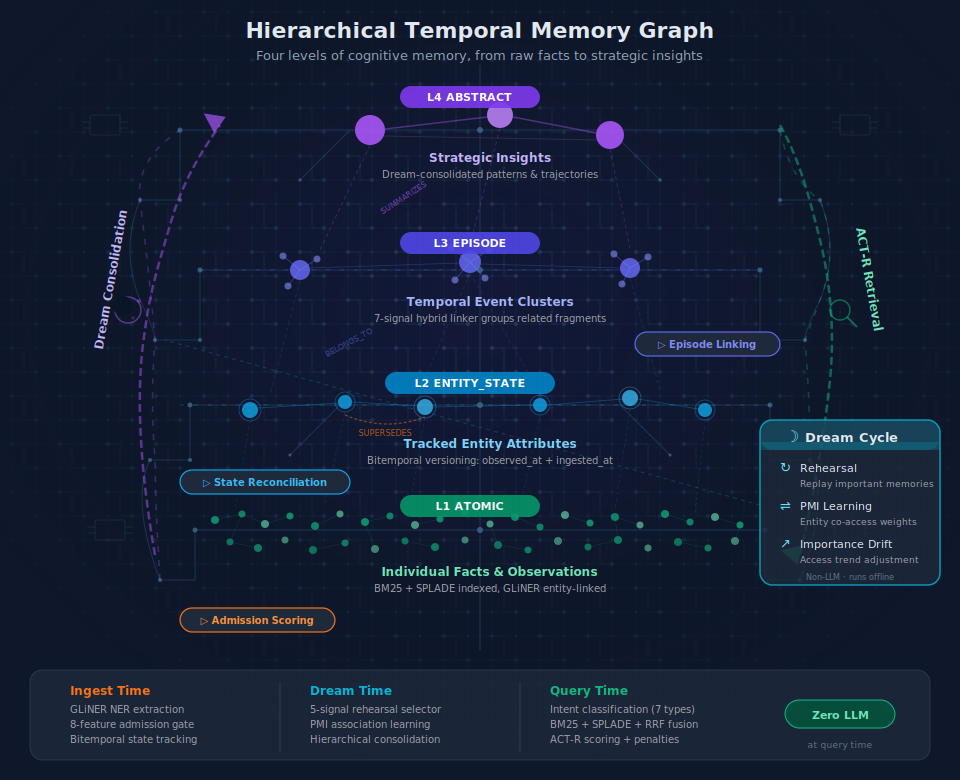
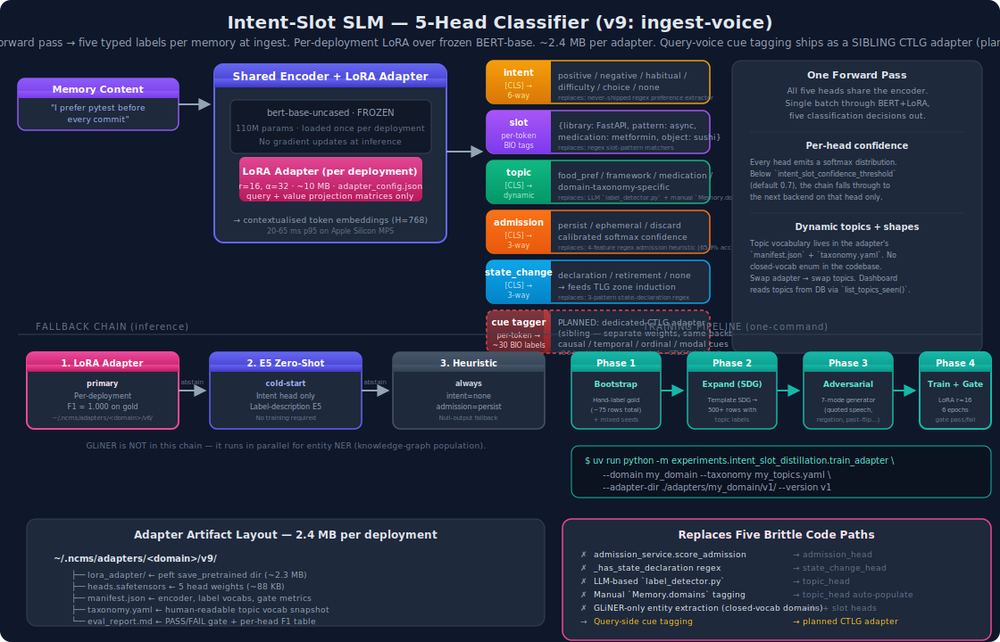
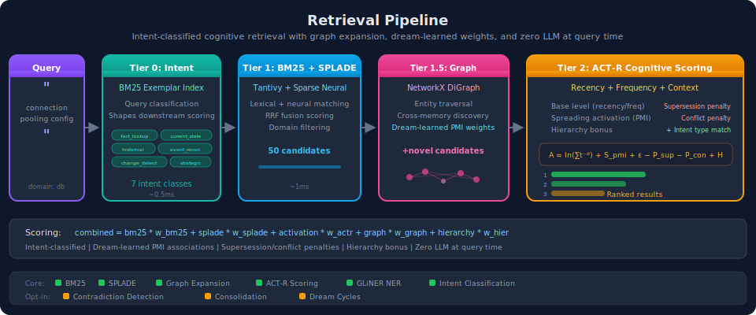
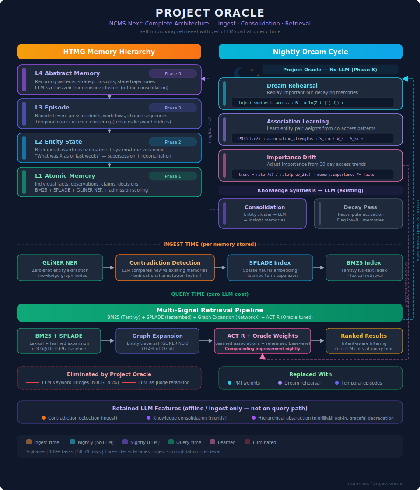
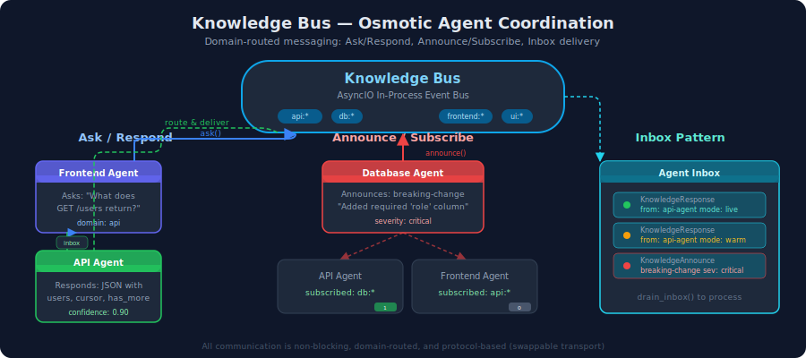
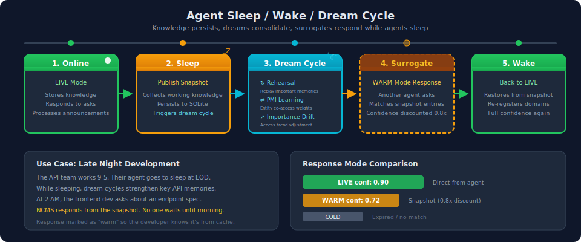

<p align="center">
  
</p>

<p align="center">
  <a href="#see-it-working">See It Working</a> &bull;
  <a href="#how-it-works">How It Works</a> &bull;
  <a href="#fine-tune-your-own-adapter">Fine-Tune Your Own Adapter</a> &bull;
  <a href="#benchmarks">Benchmarks</a> &bull;
  <a href="docs/quickstart.md">Quickstart Guide</a>
</p>

<p align="center">
  
  
  
  
  
  
  
</p>

---

**Your AI agents forget everything between sessions.** Every conversation starts from zero. Every insight, every architectural decision, every hard-won debugging breakthrough &mdash; gone.

NCMS fixes this. Permanently.

```bash
pip install ncms
```

```python
from ncms.interfaces.mcp.server import create_ncms_services, create_mcp_server

memory, bus, snapshots, consolidation = await create_ncms_services()
server = create_mcp_server(memory, bus, snapshots, consolidation)
```

Three lines. Your agents now have persistent, searchable, shared memory with cognitive scoring &mdash; a system that learns while it sleeps, tracks how knowledge evolves through state-change grammar, and optionally runs a fine-tuned ingest-side classifier that replaces brittle regex with a 2.4 MB LoRA adapter you train on your own corpus. No vector database. No embedding pipeline. No external services.

## What Makes NCMS Different

| Problem | Traditional Approach | NCMS |
|---|---|---|
| Memory retrieval | Dense vector similarity (lossy) | **BM25 + SPLADE + graph expansion + cross-encoder + structured recall** (precise) |
| "What's the current state?" | Recency sort or last-write-wins | **TLG grammar retrieval** — structural proof over typed state-transition edges, 32/32 rank-1 on ADR corpus |
| Admission / state-change / topic tagging | 5 separate regex & LLM code paths | **One fine-tuned 2.4 MB LoRA adapter** — five classification heads in a single forward pass |
| Agent coordination | Polling shared files, explicit tool calls | **Embedded Knowledge Bus** (osmotic) |
| Agent goes offline | Knowledge lost until restart | **Snapshot surrogate response** (always available) |
| Dependencies | Vector DB + graph DB + message broker | **Zero. Single `pip install`.** |
| Setup time | Hours of infrastructure | **3 seconds to first query** |

## See It Working

```bash
git clone https://github.com/AliceNN-ucdenver/ncms.git
cd ncms && uv sync
uv run ncms demo
```

Three collaborative agents run through a complete lifecycle &mdash; storing knowledge, asking questions, going offline with surrogate responses, and announcing breaking changes &mdash; all in-memory, under 10 seconds.

```bash
uv run ncms dashboard    # Real-time observability at http://localhost:8420
```

---

## How It Works

NCMS organizes agent memory into a **Hierarchical Temporal Memory Graph (HTMG)** &mdash; a four-level structure where raw facts crystallize into tracked states, states cluster into temporal episodes, and episodes consolidate into strategic insights. Think of it as giving your agents not just storage, but the ability to *understand* their knowledge. ([V1 architecture](docs/retired/ncms_v1.md))

### NCMS Architecture (HTMG)

<p align="center">
  
</p>

Every memory enters through an **ingest pipeline** that classifies it &mdash; like a bouncer deciding who gets into the club, but one who went to grad school. Raw facts become `ATOMIC` nodes. State changes ("`Redis upgraded to v7.4`") become `ENTITY_STATE` nodes with bitemporal validity tracking. Related events cluster into `EPISODE` nodes via a 7-signal hybrid linker. And overnight, **dream cycles** consolidate episodes into `ABSTRACT` insights &mdash; the system literally learns while it sleeps.

### Ingest-Side Intelligence — The Fine-Tunable SLM

The ingest pipeline used to depend on **five separate pieces of brittle pattern-matching code** to decide admission routing, detect state changes, tag topics, populate domains, and extract preferences. NCMS now replaces all of them with a **single fine-tuned LoRA adapter** running a multi-head BERT classifier — one forward pass produces five classification decisions per memory. ([P2 plan](docs/p2-plan.md) · [Sprint 4 findings](docs/intent-slot-sprint-4-findings.md))

<p align="center">
  
</p>

**Five heads, one forward pass (20-65 ms on MPS):**

| Head | Output | What it replaces |
|---|---|---|
| `intent` | positive / negative / habitual / difficulty / choice / none | (never-shipped) regex preference extractor |
| `slot` (BIO) | typed domain-specific surface forms: `{library: FastAPI, medication: metformin, object: sushi}` | regex slot-pattern matchers |
| `topic` | dynamic — label from **the adapter's** taxonomy, not a hardcoded enum | LLM-based `label_detector.py` + manual `Memory.domains` tagging |
| `admission` | persist / ephemeral / discard, with calibrated softmax confidence | 4-feature regex heuristic (65.9% accuracy on labeled set) |
| `state_change` | declaration / retirement / none → **feeds TLG zone induction** | 3-pattern state-declaration regex (8/8 false positives on NemoClaw YAML templates) |

**SLM-first, regex-fallback.** When the classifier is confident (head confidence ≥ `intent_slot_confidence_threshold`, default 0.7), its decision wins. On abstain or when the feature flag is off, the ingest pipeline falls back to the original regex / heuristic code. The zero-confidently-wrong invariant from TLG carries over: **abstain is always an option**.

**3-tier fallback chain** (no GLiNER on this path — GLiNER stays in NCMS for entity NER, a separate concern):

```
primary:    LoRA adapter  (per-deployment, F1 = 1.000 on gold, ~2.4 MB on disk)
   ↓ if adapter missing / head abstained
fallback:   E5 zero-shot   (cold-start: intent-only head, no training required)
   ↓ if torch unavailable
heuristic:  null output    (admission=persist, everything else None — ingest keeps working)
```

**Dynamic topics.** The topic vocabulary lives in the adapter's `manifest.json` + `taxonomy.yaml`, **not** in the codebase. Swap adapter → swap topics. The dashboard enumerates topics directly from the database (`SQLiteStore.list_topics_seen()`) with zero config coupling. Three reference adapters ship today: `conversational`, `software_dev`, `clinical` — each 2.4 MB at `~/.ncms/adapters/<domain>/v4/`.

### Retrieval Pipeline

Traditional memory systems compress documents into dense vectors, losing precision. NCMS uses complementary mechanisms that work together without a single embedding:

<p align="center">
  
</p>

**Tier 0 &mdash; Intent Classification.** Queries are classified into one of 7 intent types (fact lookup, current state, historical, event reconstruction, change detection, pattern, strategic reflection) via a BM25 exemplar index. This shapes which memory types receive a scoring bonus downstream.

**Tier 1 &mdash; BM25 + SPLADE Hybrid Search.** BM25 via Tantivy (Rust) provides exact lexical matching. SPLADE adds learned sparse neural retrieval &mdash; expanding "API specification" to also match "endpoint", "schema", "contract". Results fuse via Reciprocal Rank Fusion.

**Tier 1.5 &mdash; Graph-Expanded Discovery.** Entity relationships in the knowledge graph discover related memories that search missed lexically. A query matching "connection pooling" also finds memories about "PostgreSQL replication" &mdash; because both share the `PostgreSQL` entity.

**Tier 2 &mdash; ACT-R Cognitive Scoring.** Every memory has an activation level computed from access recency, frequency, and contextual relevance. Dream-learned association strengths weight entity connections; reconciliation penalties demote superseded or conflicted states.

**Tier 2.5 &mdash; Score Normalization.** Per-query min-max normalization brings all signals to [0,1] scale before combining.

**Tier 3 &mdash; Selective Cross-Encoder Reranking.** A 22M-parameter cross-encoder (ms-marco-MiniLM-L-6-v2) reranks candidates &mdash; but only for fact lookup, pattern, and strategic reflection queries. State and temporal queries skip reranking to preserve chronological and causal ordering.

**Tier 4 &mdash; Structured Recall.** The `recall()` method layers structured context on top: entity state snapshots, episode membership with sibling expansion, causal chains from the HTMG. One call returns what takes 5+ tool calls elsewhere.

**Tier 5 &mdash; Temporal Linguistic Geometry (TLG).** For state-evolution queries ("What's the *current* authentication scheme?", "What caused the payments delay?", "What came before MFA?"), TLG runs a **grammar-based structural proof** over typed state-transition edges. It produces an exact answer (or abstains) with a readable syntactic proof — and composes with BM25 via a **zero-confidently-wrong invariant**: when TLG's confidence is high, its rank-1 answer replaces BM25's head; when it abstains, BM25 ordering is returned unchanged. On the 32-query ADR corpus spanning 11 intent shapes (current_state, ordinal_first/last, causal_chain, sequence, predecessor, interval, transitive_cause, before_named, concurrent, noise), **TLG hits 32/32 top-5 and rank-1** vs BM25's 41 % / 16 %. ([Pre-paper](docs/temporal-linguistic-geometry.md) · [Validation findings](docs/tlg-validation-findings.md) · [Integration plan](docs/p1-plan.md))

```
activation(m) = base_level(m) + spreading_activation(m, query) + noise
                - supersession_penalty - conflict_penalty + hierarchy_bonus
base_level(m) = ln( sum( (time_since_access)^(-decay) ) )
spreading(m)  = sum( learned_PMI_weight(entity) )     ← dream-learned associations
combined(m)   = bm25 * w_bm25 + splade * w_splade + activation * w_actr + graph * w_graph
              ⊕ TLG grammar answer  (when has_confident_answer(), replaces rank-1)
```

### Memory Ingestion Pipeline

Entities, preferences, topics, admission routing, and state-change detection all run on the same memory at ingest time — but the SLM (when enabled) is the **primary source of truth** on admission / state-change / topic, with regex paths kept alive as fallback for cold-start deployments.

<p align="center">
  
</p>

**Content Classification** &mdash; Incoming content passes through a dedup gate (SHA-256) then a two-class classifier. **NAVIGABLE** documents (ADRs, PRDs, YAML configs with headings/structure) get section-aware ingestion: one vocabulary-dense profile memory in the memory store, full document + sections in the document store. **ATOMIC** fragments (facts, observations, announcements) proceed through the standard pipeline.

**Intent-Slot SLM** (optional, `NCMS_INTENT_SLOT_ENABLED=true`) &mdash; Runs **before** admission. Produces all five classification outputs in one forward pass. Its `admission_head` replaces the regex admission scorer when confident; its `state_change_head` replaces the state-declaration regex; its `topic_head` auto-populates `Memory.domains`.

**GLiNER NER** &mdash; Zero-shot Named Entity Recognition using a 209M-parameter [DeBERTa](https://github.com/urchade/GLiNER) model. Extracts entities across any domain, **running in parallel with the SLM** — GLiNER's output feeds the knowledge graph (spreading activation, co-occurrence edges, entity-state reconciliation) while the SLM's output feeds ingest decisions. The two are complementary: GLiNER handles open-vocabulary NER, SLM handles typed domain-specific slot extraction.

**Admission Routing** &mdash; 3-way gate: discard, ephemeral cache, or persist. Either the SLM's `admission_head` (when confident) or the 4-feature regex heuristic (fallback) decides. Memories with `importance >= 8.0` bypass admission entirely.

**State Reconciliation** &mdash; When a new entity state arrives ("Redis upgraded to v7.4"), NCMS classifies its relationship to existing states (supports / refines / supersedes / conflicts) and applies bitemporal truth maintenance. Superseded states get `is_current=False` with validity closure.

**Episode Formation** &mdash; Related memories are automatically grouped into temporal episodes via a 7-signal hybrid linker (BM25, SPLADE, entity overlap, domain match, temporal proximity, source agent, structured anchors like JIRA tickets).

**Contradiction Detection** (opt-in) &mdash; LLM-powered post-ingest scan for factual contradictions against existing related memories.

**Knowledge Consolidation** (opt-in) &mdash; Offline clustering + LLM synthesis of cross-memory patterns into searchable `ABSTRACT` insights.

### Dream Cycles (Project Oracle)

<p align="center">
  
</p>

Like biological sleep consolidation, NCMS runs three non-LLM passes during "sleep" to create the *differential* access patterns ACT-R cognitive scoring needs to contribute signal:

- **Dream Rehearsal** &mdash; Selects high-value memories via 5-signal weighted scoring (PageRank centrality 0.40, staleness 0.30, importance 0.20, frequency 0.05, recency 0.05) and injects synthetic access records.
- **Association Learning** &mdash; Computes pointwise mutual information (PMI) from entity co-access patterns in the search log, feeding learned weights into `spreading_activation()`.
- **Importance Drift** &mdash; Compares recent access rates to older rates and adjusts `memory.importance` within bounded limits. Frequently accessed memories rise; neglected ones gracefully decay.

### Knowledge Bus & Agent Sleep/Wake

Agents don't poll for updates. They don't call each other directly. Knowledge flows through domain-routed channels &mdash; osmotic knowledge transfer.

<p align="center">
  
</p>

```python
# API agent announces a change — frontend agent gets it automatically
await agent.announce_knowledge(
    event="breaking-change",
    domains=["api:user-service"],
    content="GET /users now returns role field",
    breaking=True,
)
```

**Ask/Respond** &mdash; Non-blocking queries routed by domain.
**Announce/Subscribe** &mdash; Fire-and-forget broadcasts to interested agents.
**Surrogate Response** &mdash; When agents go offline, they publish knowledge snapshots. Other agents can still ask them questions through the snapshot.

<p align="center">
  
</p>

---

## Fine-Tune Your Own Adapter

The three reference adapters ship at `~/.ncms/adapters/{conversational,software_dev,clinical}/v4/` — but the point of the architecture is that **operators train their own for their own domain**. The classifier does its best work when it's been fine-tuned on the kind of content your users actually ingest.

### One-command training

```bash
# Put your corpus JSONL + taxonomy YAML in a directory:
./my_corpus/
├── gold.jsonl       # hand-labeled examples (start with ~50-75 rows)
├── topics.yaml      # topic_labels: [framework, testing, infra, ...]
└── object_to_topic: # map surface forms to topics
```

```bash
# Run the four-phase pipeline (takes ~5-15 min on Apple Silicon MPS):
uv run python -m experiments.intent_slot_distillation.train_adapter \
    --domain my_domain \
    --taxonomy ./my_corpus/topics.yaml \
    --adapter-dir ./adapters/my_domain/v1 \
    --target-size 500 \
    --adversarial-size 300 \
    --epochs 6 \
    --lora-r 16
```

**What happens:**

1. **Bootstrap** — loads your gold + any mixed-content seeds (admission / state-change variety). Auto-labels topic/admission/state_change from the taxonomy map where gold doesn't already have them.
2. **Expand (SDG)** — template-based synthetic data expansion. 500 target → ~400 deduped examples with full multi-head labels.
3. **Adversarial** — generates 200–300 hard cases across 7 failure modes (quoted speech, negated positives, past-flip, third-first contrast, double negation, sarcasm, empty/minimal).
4. **Train + Gate** — LoRA fine-tune with class-weighted slot loss. The gate refuses to promote an adapter that doesn't meet thresholds (intent F1 ≥ 0.70, slot F1 ≥ 0.75, confidently-wrong ≤ 10 %) or regresses against a named baseline adapter.

**Output:** a 2.4 MB adapter directory with `lora_adapter/` + `heads.safetensors` + `manifest.json` + `taxonomy.yaml` + `eval_report.md` (PASS/FAIL gate + per-head F1 table).

### Point NCMS at your adapter

```python
# Via config
NCMS_INTENT_SLOT_ENABLED=true \
NCMS_INTENT_SLOT_CHECKPOINT_DIR=./adapters/my_domain/v1 \
uv run ncms serve

# Or via benchmark runner
uv run python -m benchmarks longmemeval --features-on \
    --intent-slot-domain my_domain
```

See [P2 plan §2.3 Adapter lifecycle](docs/p2-plan.md#23-adapter-lifecycle), [Sprint 4 findings §7 Known sharp edges](docs/intent-slot-sprint-4-findings.md), and [Sprint 1–3 findings §9 Post-sprint fixes](docs/intent-slot-sprints-1-3.md) for the detailed playbook.

---

## Benchmarks

NCMS achieves **nDCG@10 = 0.7206 on SciFact** — the BEIR dataset most aligned with factual knowledge retrieval — exceeding published ColBERTv2 (0.693, +4.0%) and SPLADE++ (0.710, +1.5%) without dense vectors or LLM at query time. Cross-domain validation on NFCorpus (biomedical) shows consistent improvement: **+10.0% over BM25** (0.3188 → 0.3506).

On **SWE-bench Django** (503 documents, 170 test queries), structured recall achieves **Recall AR nDCG@10 = 0.2032**, exceeding search-only AR (0.1759) by **+15.5%**. ([Full SWE-bench results](docs/paper.md#69-swe-bench-django-pre-tuning-baseline-results))

### TLG — state-evolution retrieval (NEW, 2026-04)

Across 11 intent shapes on the hand-curated ADR / project / clinical corpus:

| Strategy | Top-5 accuracy | Rank-1 accuracy |
|---|---:|---:|
| BM25 | 13 / 32 (41 %) | 5 / 32 (16 %) |
| BM25 + `observed_at DESC` | 13 / 32 (41 %) | 0 / 32 (0 %) |
| Entity-scoped + path-rerank | 14 / 32 (44 %) | 6 / 32 (19 %) |
| **TLG grammar** | **32 / 32 (100 %)** | **32 / 32 (100 %)** |

Every TLG answer comes with a readable syntactic proof ("successor = ADR-010 (refines)", "walked 6 predecessors; root = ADR-001"). On LongMemEval's conversational subset the grammar correctly **abstains** (framing mismatch — LME isn't state-evolution content) and falls through to BM25+SPLADE unchanged. Full validation in [`docs/tlg-validation-findings.md`](docs/tlg-validation-findings.md); the reusable SWE state-evolution benchmark is planned at [`docs/p3-state-evolution-benchmark.md`](docs/p3-state-evolution-benchmark.md).

### Intent-Slot SLM — ingest classifier (NEW, 2026-04)

Three reference adapters trained on 27-42 gold examples per domain plus ~400 SDG rows + 300 adversarial:

| Domain | Intent F1 | Slot F1 | Joint | Topic F1 | Admission F1 | State F1 | p95 ms |
|---|--:|--:|--:|--:|--:|--:|--:|
| conversational | 1.000 | 0.987 | 0.972 | 1.000 | 1.000 | 0.333¹ | 43 |
| software_dev | 1.000 | 0.983 | 0.952 | 1.000 | 1.000 | 1.000 | 73 |
| clinical | 1.000 | 0.966 | 0.926 | 1.000 | 1.000 | 1.000 | 42 |

¹ Preferences never declare / retire state, so state_change collapses to "none" by design on conversational.

Compare to zero-shot baselines: E5 label-similarity hits intent F1 0.347–0.612 on the same gold — the LoRA adapters gain **+0.22 to +0.49 absolute intent F1** while eliminating the 26.7–56.7% confidently-wrong rate.

### LongMemEval A/B (500-question non-regression check, 2026-04-20)

The SLM on vs. off on LongMemEval is an **axis-mismatch test** — conversational memory recall isn't the axis the SLM was built for, so the point of this run is confirming zero regression + acceptable latency, not headline accuracy:

| | Baseline (`--features-on`) | SLM (`--intent-slot-domain conversational`) | Δ |
|---|---:|---:|---:|
| Recall@5 | 0.4680 | 0.4680 | **0.0000** (bit-identical across all 6 categories) |
| Elapsed | 10,562 s | 11,099 s | +537 s (~48 ms / memory overhead) |
| Memories stored | 10,960 | 10,960 | — |
| Errors / tracebacks / HTTP 4xx | 0 | 0 | — |

The classifier ran ~11k forward passes cleanly; it just didn't move the number because LongMemEval's retrieval path doesn't consume the SLM's outputs on the axes it classifies. **Expected and desired** — the real benchmark for the SLM's admission + state_change + topic heads is state-evolution retrieval, not conversational recall.  See [`docs/intent-slot-sprint-4-findings.md`](docs/intent-slot-sprint-4-findings.md) §10 for the full A/B breakdown.

### Baseline Comparison (SWE-bench Django)

Compared against [Mem0](https://github.com/mem0ai/mem0) and [Letta](https://github.com/letta-ai/letta) on SWE-bench Django (850 issues, 80/20 chronological split). NCMS wins 3 of 4 metrics with zero OpenAI API calls &mdash; Mem0 and Letta both use OpenAI `text-embedding-3-small` dense vectors.

| Metric | NCMS | NCMS Recall | Mem0 | Letta |
|---|---|---|---|---|
| AR nDCG@10 | 0.1750 | **0.2031** | 0.1550 | 0.1412 |
| TTL Accuracy | 0.6529 | &mdash; | 0.5941 | **0.7412** |
| CR Temporal MRR | **0.0947** | &mdash; | 0.0150 | 0.0616 |
| LRU nDCG@10 | **0.3540** | &mdash; | 0.1979 | 0.1245 |

See the [full ablation study, weight tuning results, and completed milestones](docs/retired/ncms_v1.md#v1-ablation-study) for methodology, per-dataset metrics, and development history.

---

## Get Started

```bash
pip install ncms                    # Core install
pip install "ncms[docs]"            # + rich document support (DOCX/PPTX/PDF/XLSX)
pip install "ncms[dashboard]"       # + observability dashboard
```

```bash
uv run ncms demo                    # See it in action
uv run ncms serve                   # Start MCP server
uv run ncms dashboard               # Real-time dashboard
uv run ncms load file.md --domains arch   # Matrix-style knowledge download
uv run ncms lint                    # Diagnose memory store health
uv run ncms export --output-dir wiki      # Export as linked markdown wiki
```

**[Quickstart Guide](docs/quickstart.md)** &mdash; MCP server setup, Claude Code hooks, NeMo agent integration, configuration reference, and local LLM inference.

## GPU-Accelerated LLM Inference

NCMS LLM features (contradiction detection, knowledge consolidation) can be accelerated with an [NVIDIA DGX Spark](https://www.nvidia.com/en-us/products/workstations/dgx-spark/) running [vLLM](https://docs.vllm.ai/) via the [NGC vLLM container](https://catalog.ngc.nvidia.com/orgs/nvidia/containers/vllm).

**Deploy Nemotron on DGX Spark:**

```bash
sudo docker run -d --gpus all --ipc=host --restart unless-stopped \
  --name vllm-nemotron-nano \
  -p 8000:8000 \
  -e VLLM_ALLOW_LONG_MAX_MODEL_LEN=1 \
  -v /root/.cache/huggingface:/root/.cache/huggingface \
  nvcr.io/nvidia/vllm:26.01-py3 \
  vllm serve nvidia/NVIDIA-Nemotron-3-Nano-30B-A3B-BF16 \
    --host 0.0.0.0 --port 8000 --trust-remote-code \
    --max-model-len 524288 \
    --enable-auto-tool-choice --tool-call-parser qwen3_coder
```

**Point NCMS at the Spark:**

```bash
NCMS_CONTRADICTION_DETECTION_ENABLED=true \
NCMS_LLM_MODEL=openai/nvidia/NVIDIA-Nemotron-3-Nano-30B-A3B-BF16 \
NCMS_LLM_API_BASE=http://spark-ee7d.local:8000/v1 \
NCMS_CONSOLIDATION_KNOWLEDGE_ENABLED=true \
NCMS_CONSOLIDATION_KNOWLEDGE_MODEL=openai/nvidia/NVIDIA-Nemotron-3-Nano-30B-A3B-BF16 \
NCMS_CONSOLIDATION_KNOWLEDGE_API_BASE=http://spark-ee7d.local:8000/v1 \
uv run ncms serve
```

The Nemotron 3 Nano (30B total, 3B active MoE) fits entirely in the Spark's 128GB unified memory, delivering sub-second LLM inference.

Note: the ingest-side intent-slot SLM (`bert-base-uncased` + LoRA) runs happily on Apple Silicon MPS, CUDA, or CPU — no DGX required. The DGX is only for the LLM-dependent opt-in features (contradiction detection, knowledge consolidation, synthesis).

## Completed Features

**Core retrieval (Phases 0-11)**
- [x] BM25 + SPLADE + Graph hybrid retrieval (nDCG@10=0.72 SciFact)
- [x] Selective cross-encoder reranking (intent-aware)
- [x] Per-query score normalization
- [x] Structured recall with episode / entity / causal context (+15.5% AR)
- [x] 4-feature admission scoring with 3-way quality gate
- [x] Bitemporal state reconciliation (supports / refines / supersedes / conflicts)
- [x] 7-signal hybrid episode formation
- [x] Intent-aware retrieval (7 intent classes)
- [x] Hierarchical consolidation: episode summaries, state trajectories, recurring patterns
- [x] Dream cycles: rehearsal, PMI association learning, importance drift
- [x] ACT-R cognitive scoring with dream-learned association weights

**P1 — Temporal Linguistic Geometry** ✅ SHIPPED 2026-04-19
- [x] Grammar-based structural retrieval over typed state-transition edges
- [x] 11 intent shapes (current_state, ordinal, causal_chain, sequence, predecessor, interval, transitive_cause, concurrent, before_named, range, noise)
- [x] Zero-confidently-wrong composition invariant with BM25
- [x] Readable syntactic proofs on every grammar answer
- [x] 32/32 top-5 and rank-1 on ADR state-evolution corpus
- [x] Full integration: `NCMS_TLG_ENABLED`, `ncms tlg status|induce`, `--tlg` benchmark flag

**P2 — Intent-Slot SLM** ✅ SHIPPED 2026-04-20
- [x] LoRA multi-head classifier (5 heads, one forward pass per memory)
- [x] Replaces admission regex, state-change regex, LLM topic labeller, manual domain tagging, never-shipped preference extractor
- [x] 3-tier fallback chain (LoRA adapter → E5 zero-shot → heuristic)
- [x] Per-deployment adapter training: 4-phase pipeline with pass/fail gate
- [x] 3 reference adapters shipped (conversational / software_dev / clinical, F1=1.000 on gold)
- [x] Dynamic topics (no closed-vocab enum in code; lives in adapter manifest)
- [x] Benchmark runner integration (`--intent-slot-domain` on LongMemEval)
- [x] Dashboard event + `SQLiteStore.list_topics_seen()` for config-free topic enumeration

**Content-aware ingestion & document model**
- [x] Two-class content gate: ATOMIC fragments vs NAVIGABLE documents
- [x] Document Profile model (one profile memory + sections in document store)
- [x] Content-hash deduplication (SHA-256) at store boundary
- [x] Content size gating with importance-based exemptions
- [x] Entity quality filtering (rejects junk: numeric %, hex IDs, count patterns)

**Retrieval enhancements**
- [x] Level-first retrieval with intent-driven traversal strategies
- [x] Synthesis pipeline with 5 modes (summary, detail, timeline, comparison, evidence)
- [x] Emergent topic map from L4 abstract clustering
- [x] Temporal query parsing with proximity boost

**Tools & interfaces**
- [x] 25 MCP tools via FastMCP
- [x] HTTP REST API with bearer token auth
- [x] A2A JSON-RPC 2.0 bridge (agent discovery + task routing)
- [x] CLI: `ncms serve|demo|dashboard|info|load|lint|reindex|export|maintenance|watch|topics|state|episodes|topic-map|tlg`
- [x] Observability dashboard (SSE + D3 graph + entity / episode / state / intent-slot views)

**Ingestion & monitoring**
- [x] Filesystem watcher with auto-domain classification (`ncms watch`)
- [x] Matrix-style knowledge loader (MD, JSON, YAML, CSV, HTML, DOCX, PPTX, PDF, XLSX)
- [x] Index rebuild utility (`ncms reindex`)
- [x] Read-only diagnostics (`ncms lint`)
- [x] Wiki export (`ncms export`)
- [x] Background maintenance scheduler
- [x] OpenTelemetry tracing integration
- [x] Prometheus metrics endpoint

**Deployment & integration**
- [x] NemoClaw integration (MCP config, OpenClaw skill, sandbox blueprint)
- [x] NeMo Agent Toolkit `MemoryEditor` adapter
- [x] Bus heartbeat + offline detection with auto-snapshot
- [x] Helm chart for Kubernetes
- [x] All-in-one Docker image with pre-baked models
- [x] docker-compose multi-agent hub

**Evaluation**
- [x] SciFact ablation: nDCG@10=0.7206, exceeds ColBERTv2 (+4.0%) and SPLADE++ (+1.5%)
- [x] SWE-bench Django: Recall AR 0.2032, +15.5% over search; beats Mem0 and Letta on 3 / 4 metrics
- [x] TLG ADR validation: 32 / 32 top-5 and rank-1 across 11 intent shapes
- [x] Intent-Slot LoRA gate: F1=1.000 on gold across 5 heads, 3 reference domains
- [x] Dream cycle benchmark (SciFact, NFCorpus, ArguAna)
- [x] LongMemEval: Recall@5=0.4680 (500 questions, 6 categories)
- [x] MemoryAgentBench harness (AR, TTL, LRU, selective forgetting)

## Roadmap (Post-v1)

**P3 — SWE state-evolution benchmark** (planned)
- [ ] SWE-bench Verified-derived state-evolution corpus (~500 issues, ~6k memories, ~100 gold queries across 11 intent shapes) — see [`docs/p3-state-evolution-benchmark.md`](docs/p3-state-evolution-benchmark.md)
- [ ] Reusable JSONL artefact that other memory systems can consume without knowing NCMS internals
- [ ] Gates paper milestone M3 ("confidently-wrong = 0 at scale")

**Adapter operations** (follow-up from Sprint 4)
- [ ] `ncms train-adapter` / `adapter-list` / `adapter-promote` CLIs (thin wrappers over the experiment driver)
- [ ] Drift detection (dashboard watches per-head confidence distributions, warns on OOD content)
- [ ] Generic-domain adapter (one broad adapter shipped with NCMS as Tier-2 fallback)
- [ ] LoRA hyperparameter sweep automation
- [ ] Encoder comparison (RoBERTa / DistilBERT) for latency / quality tradeoff

**Distributed infrastructure**
- [ ] NATS / Redis-backed Knowledge Bus transport (implementing existing `KnowledgeBusTransport` Protocol)
- [ ] Neo4j / FalkorDB graph backend (implementing existing `KnowledgeGraph` Protocol)
- [ ] BM25-scored surrogate responses

**Production validation** (requires real agent workloads)
- [ ] Simulated Agent Workday benchmark (3-7 day multi-agent workload for ACT-R validation)
- [ ] ACT-R weight crossover demonstration (show ACT-R weight becomes beneficial *with* dream-learned access patterns)
- [ ] Rehearsal Boost Rate measurement (validate ≥85% of rehearsed memories show activation increase)

**Dashboard & observability**
- [ ] Historical replay and time-travel debugging (replay memory state at any point in time)
- [ ] Intent-slot confidence histogram + drift alerts

*See [completed milestones and V1 ablation results](docs/retired/ncms_v1.md#completed-milestones-v1-to-project-oracle) for development history.*

## Research Artefacts

- **[Temporal Linguistic Geometry pre-paper](docs/temporal-linguistic-geometry.md)** — grammar-theoretic framework for state-evolution retrieval
- **[Intent-Slot Distillation pre-paper](docs/intent-slot-distillation.md)** — replacing regex with a learned multi-head classifier
- **[TLG validation findings](docs/tlg-validation-findings.md)** — ADR corpus + LongMemEval framing analysis
- **[Intent-Slot Sprints 1–3 findings](docs/intent-slot-sprints-1-3.md)** — LoRA + multi-head + 4-phase orchestrator
- **[Intent-Slot Sprint 4 findings](docs/intent-slot-sprint-4-findings.md)** — NCMS integration + fitness tests
- **[Main paper](docs/paper.md)** — architecture, SciFact/SWE-bench results, ablation studies

## Acknowledgments

- **[GLiNER](https://github.com/urchade/GLiNER)** &mdash; Zero-shot NER by [Zaratiana et al. (NAACL 2024)](https://arxiv.org/abs/2311.08526)
- **[SPLADE](https://github.com/naver/splade)** &mdash; Sparse neural retrieval by [Formal et al. (SIGIR 2021)](https://arxiv.org/abs/2107.05720), powered by [sentence-transformers](https://www.sbert.net/) SparseEncoder
- **[Tantivy](https://github.com/quickwit-oss/tantivy)** &mdash; Rust-based full-text search engine
- **[peft](https://github.com/huggingface/peft)** &mdash; LoRA adapter implementation (HuggingFace PEFT)
- **[transformers](https://github.com/huggingface/transformers)** &mdash; BERT encoder for the intent-slot SLM
- **[safetensors](https://github.com/huggingface/safetensors)** &mdash; Adapter artifact serialization
- **[ACT-R](https://en.wikipedia.org/wiki/ACT-R)** &mdash; Cognitive architecture by John R. Anderson
- **[Linguistic Geometry](https://www.springer.com/us/book/9780387742403)** &mdash; Game-state reduction framework by Boris Stilman — inspiration for TLG's zone / trajectory primitives
- **[BEIR](https://github.com/beir-cellar/beir)** &mdash; Heterogeneous IR benchmark by [Thakur et al. (NeurIPS 2021)](https://arxiv.org/abs/2104.08663)
- **[NetworkX](https://networkx.org/)** &mdash; Graph library powering the knowledge graph
- **[litellm](https://github.com/BerriAI/litellm)** &mdash; Universal LLM API proxy
- **[aiosqlite](https://github.com/omnilib/aiosqlite)** &mdash; Async SQLite wrapper

## License

MIT

---

<p align="center">
  <strong>Built for agents that remember — and reason over how knowledge changes.</strong><br>
  <sub>By Shawn McCarthy / Chief Archeologist</sub>
</p>
