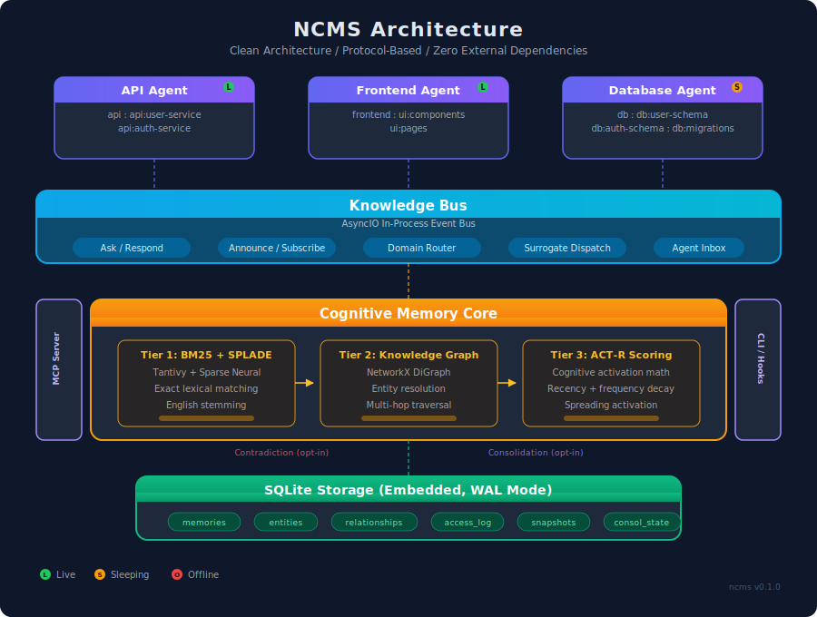

<p align="center">
  
</p>

<p align="center">
  <a href="#see-it-working">See It Working</a> &bull;
  <a href="#how-it-works">How It Works</a> &bull;
  <a href="#mcp-server">MCP Server</a> &bull;
  <a href="#nemo-agent-quickstart">NeMo Agents</a> &bull;
  <a href="#coding-agent-quickstart">Coding Agents</a>
</p>

<p align="center">
  
  
  
  
  
</p>

---

**Your AI agents forget everything between sessions.** Every conversation starts from zero. Every insight, every architectural decision, every hard-won debugging breakthrough &mdash; gone.

NCMS fixes this. Permanently.

```bash
pip install ncms
```

```python
from ncms.interfaces.mcp.server import create_ncms_services, create_mcp_server

memory, bus, snapshots = await create_ncms_services()
server = create_mcp_server(memory, bus, snapshots)
```

Three lines. Your agents now have persistent, searchable, shared memory with cognitive scoring. No vector database. No embedding pipeline. No external services.

## What Makes NCMS Different

| Problem | Traditional Approach | NCMS |
|---------|---------------------|------|
| Memory retrieval | Dense vector similarity (lossy) | **BM25 + ACT-R cognitive scoring** (precise) |
| Agent coordination | Polling shared files, explicit tool calls | **Embedded Knowledge Bus** (osmotic) |
| Agent goes offline | Knowledge lost until restart | **Snapshot surrogate response** (always available) |
| Dependencies | Vector DB + graph DB + message broker | **Zero. Single `pip install`.** |
| Setup time | Hours of infrastructure | **3 seconds to first query** |

## See It Working

```bash
git clone https://github.com/AliceNN-ucdenver/ncms.git
cd ncms
uv sync
uv run ncms demo
```

The demo runs three collaborative agents through a complete lifecycle including a "Matrix-style" knowledge download:

```
  Phase 0  Download architecture knowledge ("I know kung fu." -- Neo)
  Phase 1  Three agents store domain knowledge
  Phase 2  Frontend agent asks API agent for endpoint specs (live response)
  Phase 3  API agent goes to sleep, frontend gets surrogate response from snapshot
  Phase 4  Database agent announces a breaking schema change
  Phase 5  Memory search shows ACT-R activation scoring in action
```

All in-process. All in-memory. Zero external dependencies. Under 10 seconds.

---

## How It Works

<p align="center">
  
</p>

### Three-Tier Retrieval Pipeline

Traditional memory systems compress documents into dense vectors, losing precision. NCMS uses three complementary mechanisms that work together without a single embedding:

<p align="center">
  
</p>

**Tier 1 &mdash; BM25 Sparse Search** via Tantivy (Rust). Exact lexical matching plus stemming. When you search for `getProfile`, it matches `getProfile` &mdash; not "things conceptually near profiles."

**Tier 2 &mdash; Knowledge Graph** via NetworkX. Entities and relationships extracted from memories. Multi-hop traversal finds connections BM25 misses: "UserService EXPOSES /profile" linked to "FrontendApp DEPENDS_ON UserService."

**Tier 3 &mdash; ACT-R Cognitive Scoring.** Every memory has an activation level computed from access recency, frequency, and contextual relevance &mdash; the same math that models human memory in cognitive science.

```
activation(m) = base_level(m) + spreading_activation(m, query) + noise
base_level(m) = ln( sum( (time_since_access)^(-0.5) ) )
```

Recently and frequently accessed memories rise to the top. Dormant memories decay naturally. No manual curation needed.

### Knowledge Bus: Osmotic Agent Coordination

Agents don't poll for updates. They don't call each other directly. Knowledge flows through domain-routed channels:

<p align="center">
  
</p>

```python
# API agent announces a change
await agent.announce_knowledge(
    event="breaking-change",
    domains=["api:user-service"],
    content="GET /users now returns role field",
    breaking=True,
)

# Frontend agent subscribed to "api:*" gets it automatically
# Next time it checks its inbox, the knowledge is already there
```

**Ask/Respond** &mdash; Non-blocking queries routed by domain, not by agent name.
**Announce/Subscribe** &mdash; Fire-and-forget broadcasts to all interested agents.
**Inbox** &mdash; Responses queue up. Agents process them between task steps.

### Snapshot Surrogate Response

When an agent goes offline, its knowledge doesn't disappear:

<p align="center">
  
</p>

A developer using Copilot at 2 AM gets answers from the API agent's snapshot even though that agent last ran during business hours. The response is marked as "warm" so consumers know it's from cache, with confidence automatically discounted.

### Matrix-Style Knowledge Download

Seed your agents with knowledge from any file format:

```python
from ncms.application.knowledge_loader import KnowledgeLoader

loader = KnowledgeLoader(memory_service)

# Load architecture docs, API specs, meeting notes
stats = await loader.load_file("docs/architecture.md", domains=["arch"])
stats = await loader.load_directory("docs/", domains=["docs"])
stats = await loader.load_text(raw_text, domains=["platform"])
```

Supports Markdown, plain text, JSON, YAML, CSV, HTML, and reStructuredText. Content is automatically chunked by semantic boundaries (headings, paragraphs, entries) for precise retrieval.

```bash
# CLI version
uv run ncms load docs/architecture.md --domains arch platform
```

---

## Quick Start

### Install

```bash
# With uv (recommended)
uv add ncms

# With pip
pip install ncms
```

### Run the Demo

```bash
uv run ncms demo
```

### Start the MCP Server

```bash
uv run ncms serve
```

Add to your Claude Code MCP config:

```json
{
  "mcpServers": {
    "ncms": {
      "command": "uv",
      "args": ["run", "--directory", "/path/to/ncms", "ncms", "serve"]
    }
  }
}
```

## MCP Server

NCMS exposes 10 tools and browsable resources via the Model Context Protocol:

| Tool | Description |
|------|-------------|
| `search_memory` | BM25 + ACT-R scored search across all memories |
| `store_memory` | Store knowledge with automatic indexing |
| `ask_knowledge` | Non-blocking ask routed to live agents |
| `ask_knowledge_sync` | Blocking ask with surrogate fallback |
| `announce_knowledge` | Broadcast changes to subscribed agents |
| `commit_knowledge` | Store knowledge from a coding session |
| `get_provenance` | Trace a memory's origin and access history |
| `list_domains` | List all knowledge domains and providers |
| `get_snapshot` | Retrieve an agent's Knowledge Snapshot |
| `load_knowledge` | Import files into memory (Matrix download) |

**Resources:** `ncms://status`, `ncms://domains`, `ncms://agents`, `ncms://graph/entities`

## NeMo Agent Quickstart

Build knowledge-aware agents by extending `KnowledgeAgent`:

```python
from ncms.interfaces.agent.base import KnowledgeAgent
from ncms.domain.models import (
    KnowledgeAsk, KnowledgeResponse, KnowledgePayload,
    KnowledgeProvenance, SnapshotEntry,
)

class MyAgent(KnowledgeAgent):
    def declare_expertise(self) -> list[str]:
        return ["my-domain", "my-domain:subtopic"]

    def declare_subscriptions(self) -> list[str]:
        return ["other-domain"]

    async def on_ask(self, ask: KnowledgeAsk) -> KnowledgeResponse | None:
        results = await self._memory.search(ask.question, domain="my-domain")
        if results:
            return KnowledgeResponse(
                ask_id=ask.ask_id,
                from_agent=self.agent_id,
                confidence=0.9,
                knowledge=KnowledgePayload(
                    type="fact",
                    content=results[0].memory.content,
                ),
                provenance=KnowledgeProvenance(source="memory-store"),
            )
        return None

    async def collect_working_knowledge(self) -> list[SnapshotEntry]:
        memories = await self._memory.list_memories(agent_id=self.agent_id)
        return [
            SnapshotEntry(
                domain="my-domain",
                knowledge=KnowledgePayload(type=m.type, content=m.content),
            )
            for m in memories
        ]
```

**Lifecycle:**

```python
agent = MyAgent("my-agent", bus_service, memory_service, snapshot_service)
await agent.start()           # Register + restore from snapshot
await agent.store_knowledge("learned something important")
await agent.ask_knowledge("what do you know about X?", domains=["other-domain"])
snapshot = await agent.sleep() # Publish snapshot, go offline
await agent.wake()             # Restore from snapshot, go online
await agent.shutdown()         # Final snapshot + deregister
```

When integrated with NeMo Agent Toolkit (NeMoClaw), the `KnowledgeAgent` base class plugs into NAT's `MemoryEditor` and `MemoryManager` interfaces, making NCMS a drop-in replacement for Mem0, Zep, or Redis memory backends.

## Coding Agent Quickstart

### Claude Code

Add NCMS hooks to `.claude/settings.json`:

```json
{
  "hooks": {
    "Stop": [{
      "hooks": [{
        "type": "command",
        "command": "ncms-commit-hook --event stop"
      }]
    }],
    "PreCompact": [{
      "hooks": [{
        "type": "command",
        "command": "ncms-commit-hook --event pre-compact"
      }]
    }],
    "SessionStart": [{
      "hooks": [{
        "type": "command",
        "command": "ncms-context-loader --project $CLAUDE_PROJECT_DIR"
      }]
    }]
  }
}
```

**What happens:**
- `SessionStart`: Previous session knowledge loaded automatically
- `Stop`: Knowledge from the completed task committed to NCMS
- `PreCompact`: Full context dump before window compaction (critical &mdash; compaction destroys context)

### GitHub Copilot

Add to `.github/hooks/ncms-hooks.json` (on default branch):

```json
{
  "version": 1,
  "hooks": {
    "sessionStart": [{
      "type": "command",
      "bash": "ncms-context-loader --project $(pwd)",
      "cwd": ".", "timeoutSec": 15
    }],
    "sessionEnd": [{
      "type": "command",
      "bash": "ncms-commit-hook --event session-end",
      "cwd": ".", "timeoutSec": 30
    }],
    "postToolUse": [{
      "type": "command",
      "bash": "ncms-commit-hook --event post-tool",
      "cwd": ".", "timeoutSec": 10
    }]
  }
}
```

### Any MCP-Compatible Agent (Cursor, etc.)

Just connect to the MCP server:

```bash
uv run ncms serve
```

## Architecture

```
src/ncms/
  domain/           Pure models, protocols, ACT-R scoring (zero deps)
  application/      Memory service, bus service, snapshot service, knowledge loader
  infrastructure/   SQLite, Tantivy, NetworkX, AsyncIO bus, LLM judge
  interfaces/       MCP server, CLI, agent base class, hooks
```

**Clean Architecture.** Domain layer has zero infrastructure dependencies. Every infrastructure component implements a Protocol interface. Swap SQLite for Postgres, NetworkX for Neo4j, or AsyncIO for Redis Pub/Sub &mdash; no application code changes.

**Embedded First.** Everything runs in-process with `pip install ncms`. No Docker. No Redis. No vector database. Scale up when you need to, not before.

## Configuration

Environment variables with `NCMS_` prefix:

| Variable | Default | Description |
|----------|---------|-------------|
| `NCMS_DB_PATH` | `~/.ncms/ncms.db` | SQLite database path |
| `NCMS_INDEX_PATH` | `~/.ncms/index` | Tantivy index directory |
| `NCMS_ACTR_DECAY` | `0.5` | Memory decay rate |
| `NCMS_ACTR_THRESHOLD` | `-2.0` | Retrieval activation threshold |
| `NCMS_BUS_ASK_TIMEOUT_MS` | `5000` | Knowledge Bus ask timeout |
| `NCMS_LLM_JUDGE_ENABLED` | `false` | Enable LLM-as-judge scoring |
| `NCMS_LLM_MODEL` | `gpt-4o-mini` | Model for LLM-as-judge |
| `NCMS_SNAPSHOT_TTL_HOURS` | `168` | Snapshot expiry (default 7 days) |

## License

MIT

---

<p align="center">
  <strong>Built for agents that remember.</strong><br>
  <sub>By Shawn McCarthy / Chief Archeologist</sub>
</p>
