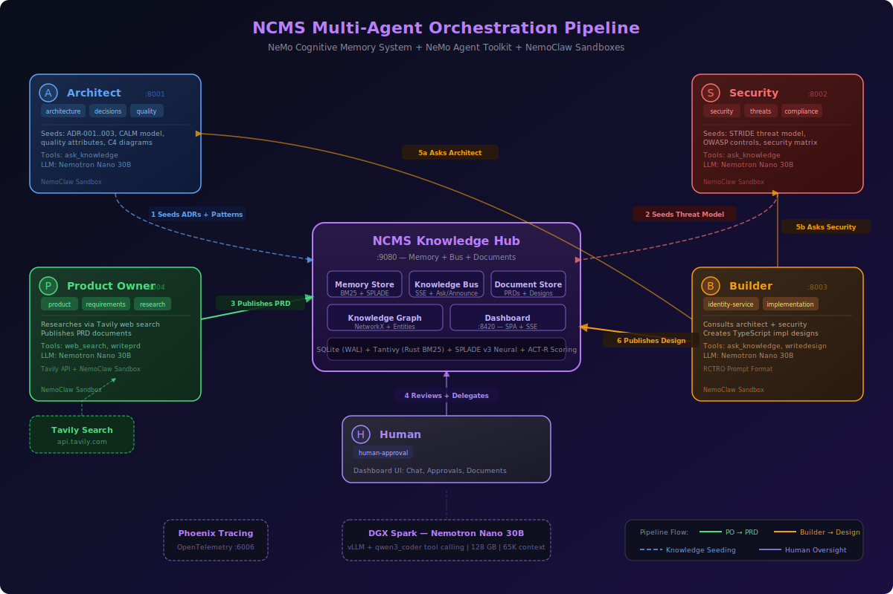

# Multi-Agent Software Delivery Pipeline

**Four AI agents that research, design, and review a microservice — with shared persistent memory, kernel-level sandboxing, web search, document publishing, and full LLM observability. Running on commodity hardware.**

## Executive Summary

This system replaces manual research-to-design handoffs with an autonomous agent pipeline. A Product Owner agent searches the live web for current industry standards, synthesizes a PRD, and hands it to a Builder agent that consults domain experts — an Architect and a Security specialist — in parallel. The entire pipeline runs on a single DGX Spark (128GB) using Nemotron Nano 30B, a mixture-of-experts model with only 3B active parameters, inside kernel-isolated sandboxes with explicit network policies. In our test run, the Security agent cited specific threat IDs (THR-001, THR-002) and NIST control references (IA-2(1), SC-13(1)) from its seeded STRIDE threat model — not generic LLM knowledge, but grounded domain expertise. The Builder produced a three-phase implementation plan with per-STRIDE-category mitigations, all with zero human intervention between phases.

This guide covers the real setup process, including the parts that fight back.

---

## What You Are Building

Four specialized agents work together through a research-to-design pipeline, coordinated by a shared knowledge bus and observable through a real-time dashboard.

| Agent | Role | Domains | Tools | Port |
|-------|------|---------|-------|------|
| **Architect** | ADRs, CALM model, system design | architecture, calm-model, quality, decisions | ask_knowledge, announce_knowledge | 8001 |
| **Security** | OWASP threats, STRIDE, compliance | security, threats, compliance, controls | ask_knowledge, announce_knowledge | 8002 |
| **Builder** | Creates implementation designs from PRDs | identity-service, implementation | ask_knowledge, writedesign | 8003 |
| **Product Owner** | Researches topics, creates PRDs | product, requirements, research | web_search, ask_knowledge, writeprd | 8004 |

The Product Owner researches topics via Tavily web search and publishes PRDs. The Builder consults the Architect and Security agents using native tool calling — in parallel — then produces design documents. NCMS provides BM25 + SPLADE v3 hybrid retrieval as the shared memory layer. NVIDIA NeMo Agent Toolkit (NAT) provides the agent framework. Every agent runs in its own NemoClaw kernel-isolated sandbox with explicit network policies. Phoenix OpenTelemetry tracing gives you full LLM observability per agent.



---

## How the Pipeline Works

This is not a chatbot. It is a software delivery pipeline where AI agents play distinct roles in a structured workflow. Each agent runs in its own kernel-isolated sandbox, communicates through a shared knowledge bus, and produces artifacts that downstream agents consume.

### Phase 1 — Knowledge Seeding

Before any work begins, agents load domain knowledge into the NCMS memory store. The Architect seeds ADRs (Architecture Decision Records), CALM model specifications, and quality attribute scenarios. The Security agent seeds STRIDE threat models, OWASP control mappings, and compliance matrices. The Product Owner loads PRD templates and product methodology guides. This knowledge becomes searchable by any agent through the knowledge bus — and it is the foundation that turns generic LLM reasoning into domain-grounded expert responses.

### Phase 2 — Research and Requirements

When you ask the Product Owner to research a topic, it searches the live web via Tavily to find current best practices, industry standards, and security guidelines. It synthesizes the research into a PRD using a structured template — problem statement, goals, user stories, technical constraints, security requirements, and references with source URLs.

**What we observed:** The Product Owner searched for current authentication best practices and published a 3.0KB PRD covering passwordless magic link authentication, JWT with RSA-256/ECDSA signing, scope-based access control (`watchlist:read`, `movie:search`, `profile:read`), Redis-backed token revocation, AES-256-GCM credential encryption at rest, and rate limiting. The PRD cited NIST 800-63B authentication assurance levels and specific OWASP ASVS v5.0 controls (ASVS2 for Authentication, ASVS3 for Authorization). It included a five-step system architecture flow and explicit non-goals — a sign the agent understood the project's "lite" scope from its seeded knowledge.

### Phase 3 — Implementation Design

Click "Send to Builder" on any PRD. The Builder receives the design request and consults expert agents through the knowledge bus. Here is where the architecture pays off: the Builder issues parallel tool calls — asking the Architect and Security agent simultaneously — because NAT's native tool calling lets the LLM emit multiple function calls in a single response.

**What we observed:** The Builder consulted both experts in parallel via native tool calling:

- **Architect** synthesized: RBAC enforcement with role hierarchy (ADMIN > STAFF > USER), CALM infrastructure-as-code governance, SOA integration patterns, bcrypt password hashing, and compliance alignment with NIST/OWASP ASVS/STRIDE. The architect referenced all six STRIDE categories with specific mitigations for each.
- **Security** synthesized with specific threat IDs: THR-001 (Spoofing via JWT forgery — mitigated by short-lived tokens + revocation lists), THR-002 (Tampering via NoSQL injection — mitigated by parameterized queries), with NIST control references (IA-2(1), SC-13(1)). This is domain knowledge from the seeded STRIDE threat model, not generic LLM output.

The Builder compiled all expert input into a 2.1KB implementation design organized as a three-phase delivery plan: Phase 1 (Core Authentication — registration, JWT, roles), Phase 2 (Security Enhancements — revocation, audit logging, rate limiting), Phase 3 (Compliance and Hardening — CSP, CORS, security headers, testing). The design included specific mitigations for spoofing (RS256 asymmetric signing), tampering (input validation + parameterized queries), information disclosure (AES-256 + PII minimization), and availability (CDN DDoS + circuit breakers).

### Phase 4 — Observability and Human Oversight

Every agent generates Phoenix OpenTelemetry traces. You observe everything through the NCMS dashboard: real-time SSE event feeds on each agent card, document publishing notifications, Phoenix trace links for debugging LLM reasoning, and the ability to chat directly with any agent. All four agents generated complete traces during the test run — full visibility into every LLM call, tool invocation, and knowledge bus interaction.

---

## Architecture

### LLM Infrastructure

The pipeline runs on Nemotron Nano 30B — a mixture-of-experts model with 256 experts and only 3B active parameters per inference pass — served via the NGC vLLM container on a DGX Spark with 128GB of memory and a 65K context window. Two configuration choices were critical:

- **`--tool-call-parser qwen3_coder`** — Nemotron Nano emits tool calls in a `<tool_call><function=name>` format. The `qwen3_coder` parser is the correct match. Other parsers (including `hermes`) silently fail to parse tool calls, causing agents to loop without acting.
- **`tool_calling_agent` with `enable_thinking: false`** — Structured tool calls without thinking-mode tokens consuming the context budget. Thinking mode is valuable for open-ended reasoning, but for structured pipelines where the agent's job is to call specific tools in sequence, it wastes tokens and increases latency.

### Networking and Sandboxes

NemoClaw sandboxes are fully network-isolated k3s pods. All traffic goes through the OpenShell proxy at `10.200.0.1:3128`. LLM calls route through NemoClaw's built-in `inference.local` proxy, which forwards to your configured inference provider. External API keys (like `TAVILY_API_KEY`) are injected into sandboxes via OpenShell providers — no hardcoded secrets in configuration files. Everything else (hub connections, PyPI, HuggingFace) needs explicit policy rules in `policies/openclaw-sandbox.yaml`.

### Shared Memory Layer

NCMS provides the shared persistent memory that makes agent collaboration possible. When agents store knowledge, it is indexed in BM25 (via Tantivy) and optionally SPLADE v3 sparse neural retrieval, then linked in a NetworkX knowledge graph. When an agent asks the knowledge bus a question, the domain expert searches this shared store with hybrid retrieval — lexical precision from BM25, semantic expansion from SPLADE — and grounds its LLM response in retrieved facts rather than hallucinating.

### Knowledge Seeding

Each expert agent loads curated domain knowledge at startup:

- `knowledge/architecture/` — ADRs, CALM model specifications
- `knowledge/security/` — STRIDE threat models, OWASP control mappings
- `knowledge/product-owner/` — PRD templates, product methodology guides
- Builder has no knowledge files — it learns by asking experts

---

## Prerequisites

Before you start:

1. **macOS with Docker Desktop** — running and healthy.
2. **NemoClaw installed and onboarded:**
   ```bash
   curl -fsSL https://www.nvidia.com/nemoclaw.sh | bash
   openshell gateway start
   ```
3. **DGX Spark or other vLLM endpoint** — serving a model accessible from your network. This guide uses a DGX Spark at `spark-ee7d.local:8000` running Nemotron-3-Nano-30B via the NGC vLLM container.
4. **HF_TOKEN** — a HuggingFace token with access to gated models (SPLADE v3 requires it).
5. **TAVILY_API_KEY** — a Tavily API key for the Product Owner's web search. Get one at tavily.com.
6. **A `.env` file** in the project root (`~/ncms/.env`) with your keys:
   ```bash
   HF_TOKEN=hf_your_token_here
   TAVILY_API_KEY=tvly-your_key_here
   ```
   The setup script auto-loads this file. No need to export variables manually.
7. **Python 3.12+ with uv** — the NCMS build toolchain:
   ```bash
   curl -LsSf https://astral.sh/uv/install.sh | sh
   ```

---

## Step-by-Step Setup

### Step 1: Configure the Inference Provider

Tell NemoClaw where your LLM lives. This creates a named provider that sandboxes can use through `inference.local`:

```bash
openshell provider create --name dgx-spark --type openai \
  --credential "OPENAI_API_KEY=dummy" \
  --config "OPENAI_BASE_URL=http://spark-ee7d.local:8000/v1"

openshell inference set --no-verify --provider dgx-spark \
  --model nvidia/NVIDIA-Nemotron-3-Nano-30B-A3B-BF16
```

After this, any sandbox can reach the LLM at `https://inference.local/v1` and NemoClaw handles the routing transparently. The `--no-verify` flag skips TLS verification for the local endpoint.

If you are using a different model or endpoint, substitute your values. The agent configs reference the model by name, so update `configs/*.yml` if your model name differs.

### Step 2: One-Command Deploy

```bash
cd deployment/nemoclaw-blueprint
./setup_nemoclaw.sh
```

That is the happy path. Here is what happens under the hood:

**Step 0 — Environment and Providers**

- Loads `~/ncms/.env` (API keys, endpoint overrides).
- Creates the `tavily` OpenShell provider from `TAVILY_API_KEY` (idempotent — skips if already exists). This injects the key into the Product Owner's sandbox as an environment variable.

**Step 1/5 — NCMS Hub and Phoenix (Docker)**

- Builds the `ncms-hub` Docker image: Python 3.12 + NCMS + pre-downloaded models (GLiNER 209MB, cross-encoder 80MB, SPLADE 500MB if HF_TOKEN provided).
- Starts two containers via `docker-compose.hub.yaml`:
  - `ncms-hub` — NCMS HTTP API on `:9080` + Dashboard on `:8420`
  - `phoenix` — Arize Phoenix tracing UI on `:6006`
- Waits up to 180 seconds for the hub health endpoint to respond.

**Steps 2-5 — Agent Sandboxes (NemoClaw + NAT)**

Each agent gets the same treatment:

- Creates a NemoClaw sandbox from the `openclaw` template with the network policy.
- Attaches providers as needed (the Product Owner gets the `tavily` provider).
- Uploads NCMS source code (`src/`, `pyproject.toml`, `uv.lock`) into `/sandbox/ncms/`.
- Uploads the `nvidia-nat-ncms` plugin into `/sandbox/nvidia-nat-ncms/`.
- Uploads the agent's NAT config and domain knowledge files.
- Installs NCMS via `uv sync`, then installs NAT packages (`nvidia-nat-core`, `nvidia-nat-langchain`, `nvidia-nat-opentelemetry`).
- Installs the NAT-NCMS plugin as an editable package.
- Starts the NAT agent via `nat start fastapi --config_file /sandbox/configs/<agent>.yml --host 0.0.0.0 --port <port>`.
- Sets up an `openshell forward` mapping `localhost:<port>` to the sandbox.

| Step | Sandbox | Agent | Port |
|------|---------|-------|------|
| 2/5 | ncms-architect | architect | 8001 |
| 3/5 | ncms-security | security | 8002 |
| 4/5 | ncms-builder | builder | 8003 |
| 5/5 | ncms-product-owner | product_owner | 8004 |

**Final step:** Polls the hub health endpoint waiting for all 4 agents to register, with a 60-second timeout.

### Step 3: Approve Network Connections

This is where the real adventure begins.

NemoClaw sandboxes are fully network-isolated. Every outbound connection goes through the OpenShell proxy. Static YAML policies work for public HTTPS endpoints like PyPI, GitHub, and HuggingFace. Private IP endpoints are a different story — the OpenShell proxy requires interactive approval regardless of what the YAML says.

Open a second terminal and run:

```bash
openshell term
```

This is the interactive approval terminal. When a sandbox tries to reach a private IP, you will see a prompt like:

```
[ncms-architect] python3.13 wants to connect to host.docker.internal:9080 (192.168.65.254)
Allow? [y/N]
```

Type `y` and hit enter. You will need to approve connections for:

- **Each sandbox** connecting to the hub (`host.docker.internal:9080`)
- **Each sandbox** connecting to Phoenix tracing (`host.docker.internal:6006`)
- **Each binary** that makes the connection (`python3.13`, `curl`, `nat`)
- **DGX Spark** if not routed through `inference.local` (`spark-ee7d.local:8000`)

With four agent sandboxes, expect a burst of approval prompts during initial setup. Keep the terminal open for the entire process.

### Rebuild from Scratch

If something goes wrong (it will, the first time), tear everything down and start fresh:

```bash
./setup_nemoclaw.sh --rebuild
```

This destroys all sandboxes and Docker containers, then runs the full setup again.

---

## Testing the Pipeline

This is the end-to-end workflow from research to design document. These steps mirror the test run that produced the results described above.

### 1. Start the Product Owner Research

Open http://localhost:8420 and click the **Product Owner** card to open the chat overlay. Type:

> Research modern identity service patterns including OAuth 2.0, passkeys, and zero-trust authentication. Create a PRD.

The Product Owner will:
1. Call `web_search` (Tavily) to research current authentication best practices.
2. Call `web_search` again for security-specific standards.
3. Call `writeprd` to compile findings into a PRD.

**Expected result:** A PRD appears in the Documents sidebar covering OAuth 2.0 PKCE, JWT management, MFA, Argon2 hashing, RBAC, token revocation, and social login integration. In our test run, the PRD was 1.9KB and cited NIST SP 800-63B, OWASP, and OAuth 2.0 PKCE specifications found via live web search.

### 2. Send the PRD to the Builder

Click **"Send to Builder"** on the PRD in the Documents sidebar. This triggers the Builder's design workflow.

**Expected result:** The Builder issues parallel `ask_knowledge` calls to the Architect and Security agents. In our test run:
- The Architect returned JWT Bearer Token patterns, stateless design principles, and three-tier RBAC (viewer/reviewer/admin) with role embedding in JWT claims.
- The Security agent returned token lifecycle management (15-30 minute expiry), relay party architecture considerations, MFA strategy, and STRIDE threat mitigations.

### 3. Review the Design Document

The Builder publishes a design document to the document store. It appears in the Documents sidebar alongside the originating PRD.

**Expected result:** A comprehensive implementation design. In our test run, the 3.6KB design included Mermaid flow diagrams, step-by-step middleware validation, STRIDE threat mitigations (spoofing, tampering, elevation-of-privilege), token lifecycle management, and a future-proofing section with an Auth0/Cognito migration path.

### 4. Inspect Traces

Open Phoenix at http://localhost:6006. Each agent traces to a separate project (`ncms-architect`, `ncms-security`, `ncms-builder`, `ncms-product-owner`). You can follow the full reasoning chain — every LLM call, tool invocation, and knowledge bus interaction is captured.

### Scripted Trigger (Alternative)

You can also trigger a design cycle from the command line:

```bash
./setup_nemoclaw.sh --trigger
```

This simulates the builder's design process without going through the dashboard UI.

---

## Configuration Reference

### Agent Configs

Each agent is configured via a NAT YAML file in `deployment/nemoclaw-blueprint/configs/`. All agents share common patterns:

- `use_native_tool_calling: true` — agents use the LLM's native function calling instead of ReAct text parsing. This is more reliable and avoids the bold-formatting problem where LLMs emit `**tool_name**` instead of `tool_name`.
- `max_tokens: 16384` — all agents set this explicitly (vLLM serves with `--max-model-len 65536`, leaving headroom for the prompt).
- `react_agent` as the base agent type — simpler and more reliable than the `reasoning_agent` wrapper for tool-calling workflows.
- Single-word tool names (`writeprd`, `writedesign`, not `write_prd` or `write_design`) — NAT's text parser sometimes bolds multi-word names, breaking tool dispatch.

### Builder Config (`configs/builder.yml`)

The Builder uses the RCTRO prompt format (Role, Context, Task, Requirements, Output):

```yaml
llms:
  spark_llm:
    _type: openai
    model_name: nvidia/NVIDIA-Nemotron-3-Nano-30B-A3B-BF16
    base_url: "https://inference.local/v1"
    api_key: "dummy"
    max_tokens: 16384

memory:
  ncms_store:
    _type: ncms_memory
    hub_url: "http://host.docker.internal:9080"
    agent_id: builder
    domains: [identity-service, implementation]
    subscribe_to: [architecture, security, threats, controls, product, requirements]

functions:
  ask_knowledge:
    _type: ask_knowledge
    hub_url: "http://host.docker.internal:9080"
    from_agent: builder
    timeout_ms: 120000

  writedesign:
    _type: writedesign
    hub_url: "http://host.docker.internal:9080"
    from_agent: builder

  builder_agent:
    _type: react_agent
    llm_name: spark_llm
    tool_names: [ask_knowledge, writedesign]
    use_native_tool_calling: true
    max_iterations: 6
    description: >
      Role: You are a software builder who creates implementation designs.
      Context: You consult expert agents (architect, security) and use PRDs ...
      Task: For every design request, follow these steps exactly:
        1. ask_knowledge -- query domains "architecture,decisions"
        2. ask_knowledge -- query domains "security,threats"
        3. writedesign -- compile expert input into a design document
      Requirements: Every design MUST include architecture + security input.
      Output: A published design document in the document store.
```

### Product Owner Config (`configs/product_owner.yml`)

The Product Owner has web search via Tavily and publishes PRDs:

```yaml
functions:
  web_search:
    _type: web_search
    hub_url: "http://host.docker.internal:9080"
    from_agent: product_owner

  ask_knowledge:
    _type: ask_knowledge
    hub_url: "http://host.docker.internal:9080"
    from_agent: product_owner
    timeout_ms: 120000

  writeprd:
    _type: writeprd
    hub_url: "http://host.docker.internal:9080"
    from_agent: product_owner

  po_agent:
    _type: react_agent
    llm_name: spark_llm
    tool_names: [web_search, ask_knowledge, writeprd]
    use_native_tool_calling: true
    max_iterations: 6
```

The `TAVILY_API_KEY` is injected into the sandbox environment by the OpenShell `tavily` provider — no hardcoded keys in config files.

### Agent Differences

- **Architect and Security** have `knowledge_paths` and both `ask_knowledge` + `announce_knowledge` (domain experts that can cross-consult).
- **Builder** has `ask_knowledge` + `writedesign` (consults experts, produces design docs).
- **Product Owner** has `web_search` + `ask_knowledge` + `writeprd` (researches via Tavily, produces PRDs).
- Each agent traces to a separate Phoenix project (`ncms-architect`, `ncms-security`, `ncms-builder`, `ncms-product-owner`).

### Network Policy Reference

The policy file at `deployment/nemoclaw-blueprint/policies/openclaw-sandbox.yaml` defines all allowed network endpoints:

| Policy Name | Host | Port | Purpose |
|------------|------|------|---------|
| `ncms_hub` | host.docker.internal | 9080 | Hub API + Bus + SSE |
| `dgx_spark` | spark-ee7d.local | 8000 | LLM inference (direct) |
| `phoenix` | host.docker.internal | 6006 | Tracing (OpenTelemetry) |
| `python_packages` | pypi.org, files.pythonhosted.org | 443 | pip/uv installs |
| `nvidia_packages` | pypi.nvidia.com | 443 | NAT packages |
| `huggingface` | huggingface.co, cdn-lfs.huggingface.co | 443 | Model downloads |
| `tavily` | api.tavily.com | 443 | Web search (Product Owner) |
| `claude_code` | api.anthropic.com | 443 | Claude Code (if using) |
| `github` | github.com, api.github.com | 443 | Git operations |

For private IP endpoints (`host.docker.internal`, `spark-ee7d.local`), use `access: full` with `allowed_ips` and explicit binary paths. The wildcard binary `{ path: "-" }` is supposed to match any binary but does not always work for private IPs — list specific binaries as well.

### Config File Locations

```
deployment/nemoclaw-blueprint/
  configs/
    architect.yml          # Architect agent NAT config
    security.yml           # Security agent NAT config
    builder.yml            # Builder agent NAT config
    product_owner.yml      # Product Owner agent NAT config
  knowledge/
    architecture/          # ADRs, CALM model
    security/              # Threat model, OWASP
    product-owner/         # PRD template, product methodology
  policies/
    openclaw-sandbox.yaml  # Network policy for all sandboxes
  docker-compose.hub.yaml  # Hub + Phoenix Docker Compose
  setup_nemoclaw.sh        # One-command deploy script
```

---

## Troubleshooting

### LLM outputs bold tool names (`**ask_knowledge**`)

**Cause:** Some models emit markdown bold around tool names in their ReAct output. NAT's text parser fails to match the bolded name to a registered tool.

**Fix:** All agent configs now use `use_native_tool_calling: true` and single-word tool names (`writeprd`, `writedesign`). If you still see this, check that the agent config has native tool calling enabled and that tool names contain no underscores or special characters.

### Agent times out or hangs

**Cause:** vLLM not running or not reachable from the sandbox.

**Fix:** Verify vLLM is healthy:
```bash
curl http://spark-ee7d.local:8000/health
```
From inside a sandbox, the agent reaches the LLM through `inference.local`. Check the NemoClaw inference config:
```bash
openshell inference show
```

### Documents don't appear in the sidebar

**Cause:** The hub is not emitting `document.published` SSE events, or the document was not actually published.

**Fix:** Check hub logs for document events:
```bash
docker logs ncms-hub 2>&1 | grep document
```
Verify the agent's `writeprd` or `writedesign` tool call completed successfully in the Phoenix trace.

### Tavily web search fails

**Cause:** `TAVILY_API_KEY` not injected into the Product Owner's sandbox.

**Fix:** Verify the provider exists and the key is set:
```bash
openshell provider list
```
If the tavily provider is missing, create it:
```bash
openshell provider create --name tavily --type generic \
  --credential "TAVILY_API_KEY=your_key_here"
```
Then rebuild the product owner sandbox so it picks up the provider.

### "Failed to fetch" in dashboard chat

**Cause:** CORS issue. The dashboard is calling the agent directly instead of through the hub proxy.

**Fix:** Make sure you are using the dashboard at `http://localhost:8420`, not calling agent ports directly. The hub proxy at `/api/v1/agent/{id}/chat` handles CORS correctly.

### Agent not connecting to hub

**Cause:** Proxy blocking the connection to `host.docker.internal:9080`.

**Fix:** Open `openshell term` and approve the pending connection. Look for:
```
[ncms-architect] python3.13 wants to connect to host.docker.internal:9080
```

### 403 Forbidden in agent logs

**Cause:** OpenShell proxy denying the connection.

**Fix:** Check `openshell term` for pending approvals. If approvals were previously denied, restart the gateway:
```bash
openshell gateway restart
```
Then rebuild the problematic sandbox or run `./setup_nemoclaw.sh --rebuild`.

### Knowledge not loading

**Cause:** Agent cannot reach hub to upload knowledge files.

**Fix:** Check agent logs:
```bash
ssh openshell-ncms-architect 'tail -20 /tmp/ncms-nat-agent.log'
```
If you see connection errors, approve the hub connection in `openshell term`.

### NAT not installed in sandbox

**Cause:** PyPI access blocked by proxy.

**Fix:** The `python_packages` policy in `policies/openclaw-sandbox.yaml` should allow PyPI access. If it does not, approve PyPI connections in `openshell term`. The setup script installs:
```
nvidia-nat-core nvidia-nat-langchain nvidia-nat-opentelemetry
```
These pull from `pypi.org` and `files.pythonhosted.org`.

### `nat serve` crashes with `_dask_client` error

**Cause:** Known NAT bug.

**Fix:** Use `nat start fastapi` instead of `nat serve`. The setup script already does this.

### Multiple NAT processes fighting for a port

**Cause:** Previous agent process was not killed before starting a new one.

**Fix:** Shell into the sandbox and kill stale processes:
```bash
openshell sandbox connect ncms-builder
killall -9 python3.13
exit
```
Then restart the agent or run `./setup_nemoclaw.sh --rebuild`.

### Known Quirks

1. **Architect always needs manual approval.** Security, builder, and product owner tend to auto-approve after the first time, but the architect sandbox has stale state in the gateway database that persists across restarts.

2. **Gateway restart wipes approvals.** If you restart the NemoClaw gateway (`openshell gateway restart`), all interactive approvals are lost. The sandboxes will need re-approval on their next connection attempt.

3. **Stale sandbox names.** If a sandbox name was previously denied, the gateway DB keeps the deny state. Restarting the gateway clears this. If you see persistent 403 errors after creating a sandbox with a previously-used name, restart the gateway.

4. **`openshell forward` maps same port only.** You cannot map `localhost:9000` to sandbox port `8000`. Each agent listens on a unique port (8001/8002/8003/8004) so the forwards work 1:1.

---

## Commands Reference

```bash
# Full lifecycle
./setup_nemoclaw.sh                     # Full setup (hub + 4 sandboxes)
./setup_nemoclaw.sh --rebuild           # Teardown everything, then full setup
./setup_nemoclaw.sh --status            # Show status of all components
./setup_nemoclaw.sh --teardown          # Remove everything (sandboxes + Docker)
./setup_nemoclaw.sh --trigger           # Trigger builder design cycle via bus
./setup_nemoclaw.sh --skip-hub          # Only create agent sandboxes (hub already running)

# NemoClaw management
openshell term                          # Interactive approval terminal (KEEP THIS OPEN)
openshell sandbox connect ncms-builder  # Shell into a sandbox
openshell sandbox list                  # List all sandboxes
openshell forward list                  # Check port forwards
openshell gateway restart               # Clear stale proxy state
openshell provider list                 # Check providers (tavily, dgx-spark)

# Agent debugging
ssh openshell-ncms-architect 'tail -f /tmp/ncms-nat-agent.log'       # Stream agent logs
ssh openshell-ncms-product-owner 'tail -f /tmp/ncms-nat-agent.log'   # Product owner logs
ssh openshell-ncms-builder 'pgrep -fa python'                         # Check running processes
ssh openshell-ncms-security 'curl -s localhost:8002/health'           # Agent health check

# Hub debugging
docker logs -f ncms-hub                 # Hub container logs
curl http://localhost:9080/api/v1/health  # Hub health (includes agent count)

# Custom inference endpoint
INFERENCE_ENDPOINT=http://my-gpu:8000/v1 \
INFERENCE_MODEL=my-org/my-model \
./setup_nemoclaw.sh
```

---

## The NAT-NCMS Plugin

The glue between NAT and NCMS lives in `packages/nvidia-nat-ncms/`. It is a NAT plugin that registers these components:

- **`ncms_memory`** — A `MemoryEditor` that stores and searches memories via the NCMS Hub HTTP API. Handles agent registration, SSE subscription, and knowledge file loading on startup.
- **`ask_knowledge`** — A tool that sends questions through the Knowledge Bus to domain experts and returns their answers. Supports comma-separated domain targeting.
- **`announce_knowledge`** — A tool that broadcasts information to all subscribed agents.
- **`web_search`** — A tool that calls the Tavily API for web search results. Uses the `TAVILY_API_KEY` environment variable injected by the OpenShell provider.
- **`writeprd`** — A tool that publishes a PRD to the hub's document store, triggering an SSE event for the dashboard.
- **`writedesign`** — A tool that publishes a design document to the hub's document store.

The plugin uses namespace packages (no `__init__.py` in `nat/` or `nat/plugins/`). Only `nat/plugins/ncms/__init__.py` exists, which imports the registration decorators. This is critical — adding `__init__.py` files in the wrong places shadows the core NAT package and breaks everything.

---

## What's Next

The pipeline runs end-to-end. These are the next areas of investment:

### Model Experiments

The current pipeline runs on Nemotron Nano 30B (3B active parameters). The results are strong — real web research, multi-agent coordination, domain-grounded designs — but the model doesn't always cite specific ADR numbers or produce language-specific code snippets. Larger models should close this gap.

**Nemotron Super 120B-A12B-NVFP4** is the next experiment. At 120B total / 12B active parameters with NVIDIA's FP4 quantization, it fits on the DGX Spark (~60GB model, ~68GB for KV cache) and provides 4x the active compute. Expected improvements: explicit ADR citations by number, CALM model references, TypeScript code snippets in designs, and more reliable multi-step tool calling. The vLLM command:

```bash
sudo docker run -d --gpus all --ipc=host --restart unless-stopped \
  -p 8000:8000 \
  -v /root/.cache/huggingface:/root/.cache/huggingface \
  nvcr.io/nvidia/vllm:26.01-py3 \
  vllm serve nvidia/NVIDIA-Nemotron-3-Super-120B-A12B-NVFP4 \
    --host 0.0.0.0 --port 8000 \
    --trust-remote-code \
    --max-model-len 65536 \
    --enable-auto-tool-choice \
    --tool-call-parser qwen3_coder
```

**Qwen 3.5 Coder (various sizes)** is a potential alternative for code-heavy output. The 32B variant fits easily; the 80B variant would require FP8 quantization (~80GB, leaving ~48GB for KV cache — tight but feasible for single-agent workloads). Qwen models have excellent tool calling compliance and may not need `enable_thinking: false`.

| Model | Active Params | Memory (FP4/FP8) | KV Cache | Fit on 128GB Spark? |
|-------|--------------|-------------------|----------|-------------------|
| Nemotron Nano 30B (current) | 3B | ~15GB | ~113GB | Easy |
| **Nemotron Super 120B-A12B** | **12B** | **~60GB** | **~68GB** | **Yes — next experiment** |
| Qwen 3.5 Coder 32B | 32B (dense) | ~32GB (FP8) | ~96GB | Yes |
| Qwen 3.5 Coder 80B | 80B (dense) | ~80GB (FP8) | ~48GB | Tight — single user only |

No agent config changes are needed when switching models — just update the vLLM serve command and the `model_name` in each agent's YAML config.

### Platform Capabilities

- **Human approval workflows** — The dashboard supports agent chat, but structured approve/reject/modify flows for PRDs before they reach the Builder are not yet wired up. This is the path to human-in-the-loop governance.
- **CrewAI StorageBackend integration** — CrewAI defines 14 storage methods vs NAT's 3. An NCMS StorageBackend would let CrewAI agents use the same shared memory, opening the platform to a second agent framework.
- **Automated proxy approval** — NemoClaw issue #326 tracks the request for static policy to work with private IPs without interactive approval. When that lands, the setup becomes truly one-command with zero manual steps.
- **Multi-pipeline orchestration** — Running multiple pipelines concurrently (e.g., identity service + payment service) with cross-pipeline knowledge sharing through the bus.
- **Production hardening** — mTLS between agents and hub, secret rotation for API keys, pod-level resource limits, and horizontal scaling of the hub.
- **Coding agent integration** — A fifth agent that takes the Builder's implementation design and generates actual TypeScript source code, tests, and Dockerfiles. The design documents are already structured for this — the coding agent would consume them as specifications.
