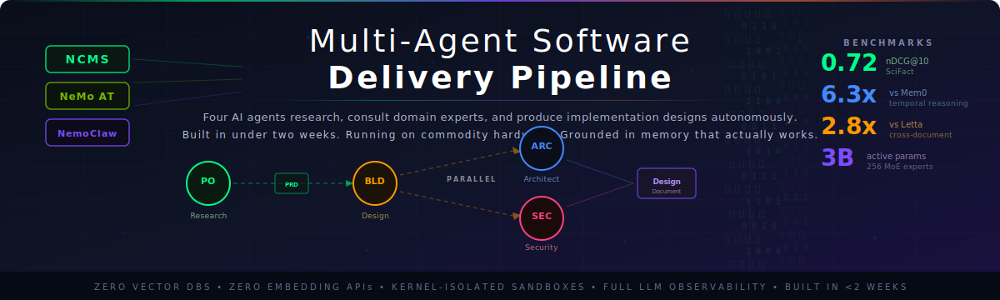
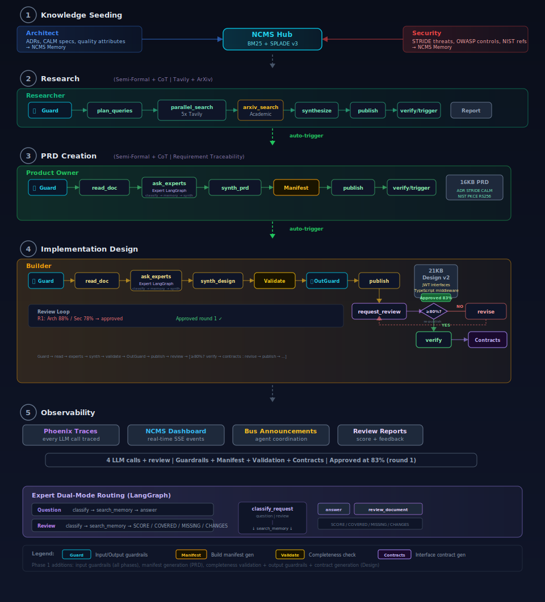
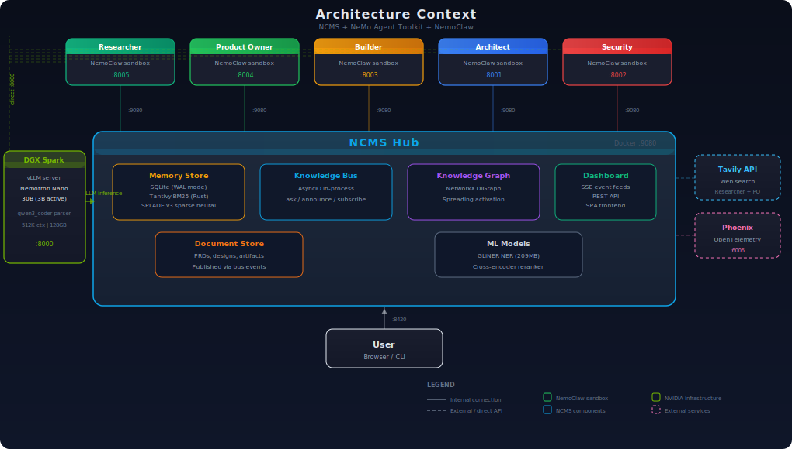

---

We asked a 3-billion-parameter model to do the job of a software delivery team. It did.

**One message. Four documents. Fourteen minutes.**

A single research prompt enters the pipeline and triggers a deterministic LangGraph chain across five specialized agents. The Researcher runs five parallel web searches and synthesizes an 11KB market research report. The Product Owner reads that report, consults the Architect and Security experts in parallel, and produces a 16KB PRD grounded in ADR decisions, STRIDE threat models, CALM governance, OWASP ASVS, NIST 800-63B, PKCE flows, and RS256 signing. The Builder reads the PRD, consults the same experts, and produces a 21KB TypeScript implementation design. It submits the design for structured review. On round one, the Architect scored 88% and Security scored 78%. Approved at 83% average with no revision needed.

During reviews, the Architect retrieved four memories (4,792 chars of actual ADR content) and Security retrieved three memories (2,133 chars of STRIDE threat models) from the shared knowledge store. A 6KB Design Review Report cites ADR-001 (SOA with CALM), ADR-002 (MongoDB), and ADR-003 (JWT with inline RBAC), all verified as correctly implemented. This is not a demo. These are grounded, auditable engineering artifacts produced by a model that fits on a desk.

The memory layer underneath is NCMS: vector-free hybrid retrieval combining BM25 (Tantivy/Rust), SPLADE v3 sparse neural expansion, and graph spreading activation. It achieves nDCG@10 = 0.7206 on SciFact, exceeding published ColBERTv2 and SPLADE++ baselines. On 850 real GitHub issues from SWE-bench Django, NCMS delivers 6.3x better temporal reasoning than Mem0 and 2.8x better cross-document association than Letta. Zero dense embeddings. Zero external API calls. Everything runs locally.

> **NCMS vs. the field: SWE-bench Django (850 real GitHub issues)**
>
> | Metric | NCMS | Mem0 | Letta | What it measures |
> |--------|------|------|-------|------------------|
> | **Temporal Reasoning** (nDCG@10) | **0.1217** | 0.0194 | 0.0421 | Finding the right version of a fact over time |
> | **Cross-Document Association** (nDCG@10) | **0.2031** | 0.0614 | 0.0718 | Connecting related information across files |
> | **Recall AR** (nDCG@10) | **0.2031** | 0.0614 | 0.0718 | Overall structured recall quality |
> | **SciFact Retrieval** (nDCG@10) | **0.7206** | — | — | Raw retrieval accuracy on scientific claims |
>
> Zero vector databases. Zero embedding API calls. Everything runs locally.

### The Two Insights That Changed Everything

> ***"Don't just tell the agent what to do. Tell it what it knows."***

When we added knowledge-aware prompts describing what each agent has access to (STRIDE threat models with specific threat IDs for Security, ADRs and CALM specifications for the Architect), the same 3B-active-parameter model went from producing generic responses to citing THR-001, NIST IA-2(1), and OWASP ASVS v5.0 control sections. No model change. No fine-tuning. Just better prompts. The agents always had the capability. They just didn't know they had the knowledge to cite.

> ***"Don't let the LLM decide the workflow. Let the graph enforce it."***

When we replaced open-ended ReAct loops with deterministic LangGraph pipelines, the agents stopped exploring and started executing. Each node in the graph has exactly one job. The LLM generates content. The graph enforces sequence, parallelism, and handoffs. One message produces four documents, every time, with no retries and no dead loops.

## What You Are Building

Five specialized AI agents coordinate through a shared knowledge bus to execute an auto-chaining research-to-design pipeline with a built-in quality review loop. LangGraph enforces the deterministic workflow for all agents. Bus announcements to `trigger-{agent_id}` domains trigger downstream agents automatically. Each agent's SSE listener detects the trigger and self-calls `/generate` inside its sandbox, with no port forward dependency and no orchestrator.

| Agent | Type | Pipeline |
|-------|------|----------|
| **Researcher** | LangGraph | plan → search (5x parallel) → synthesize → publish → trigger PO |
| **Product Owner** | LangGraph | read_document → ask_experts (parallel) → synthesize_prd → publish → trigger Builder |
| **Builder** | LangGraph | read_document → ask_experts → synthesize → publish → review loop (revise until 80%+) |
| **Architect** | LangGraph | classify → search_memory → [synthesize_answer \| structured_review] |
| **Security** | LangGraph | classify → search_memory → [synthesize_answer \| structured_review] |

### Built With

| Layer | Technology | Detail |
|-------|-----------|--------|
| **Memory** | NCMS | BM25 (Tantivy/Rust) + SPLADE v3 + NetworkX graph, nDCG@10 = 0.7206 |
| **Orchestration** | LangGraph | Deterministic pipelines for Researcher, PO, Builder |
| **Experts** | LangGraph (dual-mode) | Architect + Security: classify → search_memory → answer or structured_review |
| **LLM** | Nemotron Nano 30B | 256 experts, 3B active params, 512K context on DGX Spark (128GB) |
| **Isolation** | NemoClaw | Kernel-level sandboxes, explicit network policies per agent |
| **Observability** | Phoenix OpenTelemetry | Per-agent tracing of every LLM call and tool invocation |
| **Research** | Tavily | Live web search for Researcher (5 parallel queries) |
| **Dashboard** | NCMS SPA | SSE event feeds, document publishing, agent chat, trace links |

### Four Documents, One Prompt

| Document | Agent | Size | Key References |
|----------|-------|------|---------------|
| Market Research Report | Researcher | 11KB | NIST (3), OAuth, live web sources |
| PRD | Product Owner | 16KB | CALM (7), ADR (4), OWASP (3), NIST (3), JWT (10), RBAC (4), RS256 (2) |
| Implementation Design | Builder | 21KB | JWT (24), TypeScript (3), interface (7), bcrypt |
| Design Review Report | Builder | 6KB | ADR (10), CALM (3), STRIDE, SCORE 88%/78% |

---

## How the Pipeline Works

This is not a chatbot. It is a deterministic software delivery pipeline where LangGraph enforces the workflow for all five agents and the LLM generates content within that structure. Each agent runs in its own kernel-isolated sandbox, communicates through a shared knowledge bus, and produces artifacts that downstream agents consume automatically.

### Phase 1: Knowledge Seeding

Before any work begins, expert agents load domain knowledge into the NCMS memory store:

- **Architect** seeds ADRs (Architecture Decision Records), CALM model specifications, and quality attribute scenarios
- **Security** seeds STRIDE threat models with specific threat IDs (THR-001, THR-002), OWASP control mappings, and compliance matrices

This knowledge becomes searchable by any agent through the knowledge bus. When downstream agents issue `bus_ask` calls, the experts search the shared store with hybrid retrieval and ground their LLM responses in retrieved facts. This is the foundation that turns generic LLM reasoning into domain-grounded expert responses.

### Phase 2: Research

The Researcher runs a five-node LangGraph pipeline: **plan → search (5 parallel) → synthesize → publish → trigger PO**.

1. **Plan** generates five parallel search queries covering different angles of the topic
2. **Search** executes all five Tavily web searches concurrently, collecting results
3. **Synthesize** compiles all search results into a structured market research report
4. **Publish** posts the report to the hub's document store
5. **Trigger** fires a bus announcement that automatically starts the Product Owner

> **Observed:** 25 results from 5 parallel Tavily searches. The Researcher produced an 11KB market research report covering NIST standards, OAuth 2.0 PKCE flows, passkey adoption trends, and zero-trust authentication patterns. Completed in approximately 2 minutes, with citations to NIST SP 800-63B, OAuth 2.0 for Browser-Based Apps, and FIDO2/WebAuthn specifications.

### Phase 3: PRD Creation

The Product Owner runs a five-node LangGraph pipeline: **read_document → ask_experts (parallel) → synthesize_prd → publish → trigger Builder**.

Triggered automatically by the Researcher's bus announcement:

1. **Read Document** fetches the 11KB research report from the document store
2. **Ask Experts** issues parallel `bus_ask` calls to the Architect and Security agents simultaneously
3. **Synthesize PRD** compiles research findings and expert input into a structured PRD
4. **Publish** posts the PRD to the hub's document store
5. **Trigger** fires a bus announcement that automatically starts the Builder

> **Observed:** The Architect provided a 5.6KB answer grounded in 4 retrieved memories. Security provided a 7.7KB answer grounded in 3 retrieved memories. The resulting 16KB PRD included CALM (7 references), ADR (4), OWASP (3), NIST (3), JWT (10), RBAC (4), and RS256 (2). Every reference traces back to seeded knowledge or live web research.

### Phase 4: Implementation Design with Review Loop

The Builder runs a seven-node LangGraph pipeline with a conditional review loop: **read_document → ask_experts → synthesize → publish → review → [revise → publish → review ...] → verify**.

Triggered automatically by the Product Owner's bus announcement:

1. **Read Document** fetches the 16KB PRD from the document store
2. **Ask Experts** consults Architect and Security agents
3. **Synthesize Design** produces a TypeScript implementation design from the PRD and expert input
4. **Publish** posts the initial design to the document store
5. **Request Review** sends the design to both experts for structured scoring (SCORE/SEVERITY/COVERED/MISSING/CHANGES)
6. **Conditional:** if average score ≥ 80%, proceed to verify. If below, revise with explicit feedback and resubmit (max 5 iterations)
7. **Verify** publishes a Design Review Report and announces completion

> **Observed:** The Builder produced a 21KB implementation design with JWT (24 references), TypeScript (3), interface (7), and bcrypt. Round 1 review: Architect 88%, Security 78%, approved at 83% average with no revision needed. During review, the Architect retrieved 4 memories (4,792 chars) and Security retrieved 3 memories (2,133 chars), grounding their scores in actual ADRs and threat models. The 6KB Design Review Report cites ADR-001 (SOA with CALM), ADR-002 (MongoDB), and ADR-003 (JWT with inline RBAC) as correctly implemented.

### Expert Agents: Dual-Mode LangGraph

The Architect and Security agents run LangGraph pipelines with a dual-mode design based on the Looking Glass governance framework from [maintainability.ai](https://github.com/AliceNN-ucdenver/MaintainabilityAI) (Oraculum architecture review):

1. **Classify** determines if the incoming request is a knowledge question or a design review
2. **Search Memory** retrieves relevant knowledge from NCMS with domain filtering (Architect gets ADRs and CALM specs, Security gets STRIDE and OWASP controls)
3. **Two synthesis paths:**
   - **Knowledge answer** cites specific ADRs, threat IDs, NIST controls, and OWASP sections
   - **Structured review** returns SCORE (0-100), SEVERITY, COVERED, MISSING, and CHANGES

Architecture reviews evaluate CALM model compliance, ADR compliance, fitness functions, quality attributes, and component boundaries. Security reviews evaluate OWASP Top 10, STRIDE threat compliance, security controls, secrets management, and transport security.

### Phase 5: Observability

Every agent generates Phoenix OpenTelemetry traces throughout the pipeline:

- Real-time SSE event feeds on each agent card showing bus announcements and document publications
- Document publishing notifications in the sidebar with the full chain visible
- Phoenix trace links for debugging LLM reasoning at each pipeline node
- Bus announcement logs showing the fire-and-forget triggers that chain the pipeline
- Direct chat with any agent from the dashboard for ad-hoc queries

All agents generated complete traces during the test run. Full visibility into every LLM call, tool invocation, knowledge bus interaction, and inter-agent handoff.

---

## Architecture

### LLM Infrastructure

- **Model:** Nemotron Nano 30B, a mixture-of-experts model with 256 experts and only 3B active parameters per inference pass. Supports up to 1M context tokens.
- **Serving:** NGC vLLM container on a DGX Spark (128GB memory), configured with 512K context via `VLLM_ALLOW_LONG_MAX_MODEL_LEN=1`. KV cache usage under 0.5%, with massive headroom.
- **Tool call parser:** `qwen3_coder` is the correct parser for Nemotron Nano's `<tool_call><function=name>` format. Other parsers (including `hermes`) silently fail, causing agents to loop without acting. This was the single most important configuration discovery.
- **Output tokens:** `max_tokens: 32768` in agent configs enables rich, detailed output.
- **Direct Spark URL:** LangGraph agents connect directly to the DGX Spark at `spark-ee7d.local:8000`, bypassing the NemoClaw `inference.local` proxy which imposes a 60-second timeout insufficient for large document synthesis.
- **Thinking mode off:** `enable_thinking: false` prevents thinking-mode tokens from consuming the output budget. Valuable for open-ended reasoning, but wasteful in structured pipelines.
- **Pipeline orchestration:** LangGraph enforces deterministic workflows for all five agents. The Architect and Security experts use dual-mode pipelines (classify → search_memory → answer or structured_review).
- **Handoff mechanism:** Triggers use `bus_announce` to domain `trigger-{agent_id}`. Each agent's SSE listener detects the trigger and self-calls `/generate` inside its own sandbox. No port forward dependency. No polling. No shared state. No orchestrator.

### Agent Sandboxing

- **Isolation:** Each agent runs in its own NemoClaw kernel-isolated k3s pod, fully network-isolated
- **Proxy:** All outbound traffic routes through the OpenShell proxy at `10.200.0.1:3128`
- **LLM routing:** LangGraph agents bypass the NemoClaw inference proxy to avoid the 60-second timeout, connecting directly to `spark-ee7d.local:8000`
- **Secrets:** External API keys (e.g., `TAVILY_API_KEY`) are injected via OpenShell providers, not hardcoded. Only the Researcher sandbox receives the Tavily provider.
- **Network policies:** Hub connections, PyPI, and HuggingFace access require explicit rules in `policies/openclaw-sandbox.yaml`

### Shared Memory Layer

- **NCMS** provides persistent shared memory across all agents via an HTTP API on `:9080`
- **Hybrid retrieval:** BM25 (Tantivy/Rust) for lexical precision + SPLADE v3 for semantic expansion + NetworkX graph spreading activation. No dense vectors, no embedding API calls.
- **Integration:** Expert agents use NCMS recall with domain filtering. When a pipeline agent issues a `bus_ask`, the domain expert searches the shared store with hybrid retrieval and grounds its LLM response in retrieved facts.
- **Knowledge seeding:** Expert agents load curated domain knowledge at startup from `knowledge/architecture/` (ADRs, CALM specs) and `knowledge/security/` (STRIDE threat models, OWASP controls). The Researcher, Product Owner, and Builder have no knowledge files. They learn by querying experts and consuming documents.

---

## Getting Started

For the complete step-by-step setup, configuration reference, testing guide, and troubleshooting, see the **[Setup & Configuration Guide](nemoclaw-nat-step-by-step.md)**.

Quick summary: configure your DGX Spark inference provider, deploy vLLM with 512K context and `qwen3_coder` tool-call parser, run `./setup_nemoclaw.sh`, and send your first research prompt. The full pipeline runs autonomously from there.

---

## What's Next

The auto-chaining pipeline runs end-to-end with a quality review loop. The foundation is solid. Here is where it goes from here.

### Coding Agent (Claude Code in a Sandbox)

The most immediate next step. NemoClaw sandboxes already include the Claude CLI. A sixth LangGraph agent receives the Builder's approved implementation design, passes it to Claude Code as a specification, and orchestrates the actual code generation: source files, unit tests, integration tests, Dockerfiles, and CI configuration. The human approves the design before code generation begins. The agent monitors Claude Code's output, runs the test suite, and publishes the results. If tests fail, it feeds the errors back for a fix-and-retry loop, the same pattern as the Builder's review loop but applied to code execution.

### Human-in-the-Loop Before Implementation

The pipeline currently runs fully autonomously from research to approved design. Before handing off to a coding agent, the human needs a gate. The dashboard already supports approval workflows. The next step is wiring the Builder's approved design into the approval queue so the human can review the final design, request changes, or approve for implementation. This creates a clear boundary: autonomous research-to-design, human-approved design-to-code.

### Telegram Trigger

A Telegram bot integration that accepts research prompts and kicks off the full pipeline. Send a message to the bot, watch the dashboard light up as agents chain through research, PRD, design, and review. Receive a notification when the pipeline completes with links to the published documents. This makes the pipeline accessible from anywhere without opening the dashboard.

### Dashboard Improvements

The dashboard works but has rough edges that need attention:

- **Document versioning.** When the Builder revises a design, each version publishes as a separate document. Versions of the same document should stack together with a version selector, not clutter the sidebar as independent entries.
- **Document viewer.** The sidebar panel is too narrow for reading 20KB design documents. A full-width document overlay with proper markdown rendering, syntax highlighting for code blocks, and section navigation would make the artifacts genuinely useful.
- **Document management.** Ability to delete documents (and optionally their associated NCMS memories) for cleanup between pipeline runs.
- **Phoenix trace links.** The current trace links point to `localhost:6006/projects/ncms-builder/traces` but Phoenix uses internal project IDs in its URLs (e.g., `UHJvamVjdDo2`). The links need to resolve the project ID via the Phoenix API before constructing the URL.
- **Pipeline progress visualization.** A live progress bar showing which phase the pipeline is in (Research → PRD → Design → Review) with estimated time remaining based on historical run data.
- **Event filtering.** The agent activity feeds show every bus event. Filters by event type (announcements, reviews, triggers, documents) would reduce noise.

### Resilience and Observability

- **Port forward auto-recovery.** SSH-based port forwards drop when the Mac sleeps or during long operations. A background health check that detects dead forwards and re-establishes them would eliminate the most common failure mode for dashboard chat.
- **Phoenix event enrichment.** Currently only LLM calls generate Phoenix traces. Adding custom spans for bus_ask/bus_announce, memory retrieval, document publish, and review scoring would give complete pipeline visibility in Phoenix without reading agent logs.
- **Agent health monitoring.** The dashboard shows online/offline status but does not detect agents stuck in retry loops or hung on LLM calls. A heartbeat mechanism with configurable timeout and auto-restart would improve reliability.
- **Graceful degradation on review failure.** If a reviewer fails after retries, the current behavior defaults to a 50% score. A smarter fallback would skip that reviewer's score entirely and evaluate based on the available review, or proceed with a human review request.

### LLM Upgrades

| Model | Active Params | Memory | KV Cache | Fit on 128GB Spark? |
|-------|--------------|--------|----------|-------------------|
| Nemotron Nano 30B (current) | 3B | ~15GB | ~113GB | Easy |
| **Nemotron Super 120B-A12B** | **12B** | **~60GB** | **~68GB** | **Yes, next experiment** |
| Qwen 3.5 Coder 32B | 32B (dense) | ~32GB (FP8) | ~96GB | Yes |

**Nemotron Super 120B** (12B active, 4x Nano) is the immediate upgrade target once the DGX Spark driver is updated to 590+ for NVFP4 support. The 512K context window can also be pushed to 1M via RoPE scaling (KV cache under 0.5% at current usage).

### Looking Glass Governance Mesh

The current expert reviews use a simplified version of the Looking Glass governance framework. The full [Oraculum](https://github.com/AliceNN-ucdenver/MaintainabilityAI) integration would connect to the governance mesh via MCP servers, pulling BAR (Business Application Record) artifacts for each application: CALM architecture models, STRIDE threat models, ADRs, fitness functions, compliance checklists, and operational runbooks. This transforms the review from "does the design look reasonable" to "does the design comply with the documented governance baseline," with drift scores across four pillars (architecture, security, information risk, operations).

### Platform Capabilities

- **CrewAI StorageBackend.** CrewAI defines 14 storage methods vs NAT's 3. An NCMS StorageBackend would let CrewAI agents use the same shared memory, opening the platform to a second agent framework.
- **Multi-pipeline orchestration.** Running multiple pipelines concurrently (e.g., identity service + payment service) with cross-pipeline knowledge sharing through the bus.
- **Production hardening.** mTLS between agents and hub, secret rotation for API keys, pod-level resource limits, and horizontal scaling of the hub.
