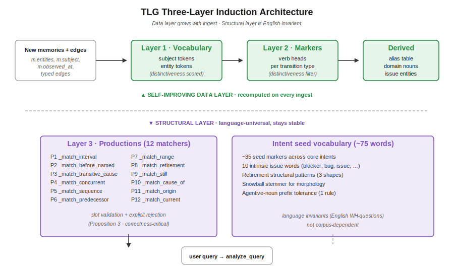
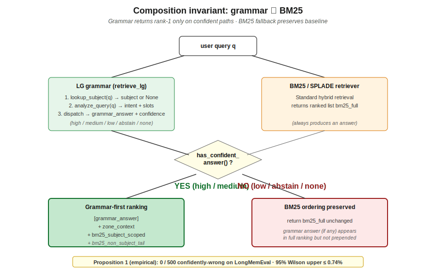
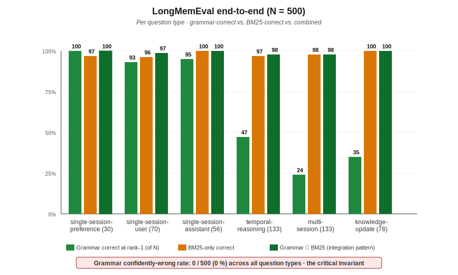
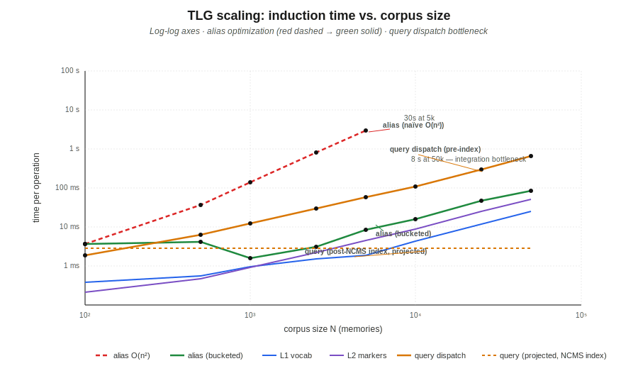

# Temporal Linguistic Geometry

**A Grammar-First Theory of Memory-Trajectory Retrieval**

*Pre-paper draft · 2026-04-18*

---

## Abstract

We propose **Temporal Linguistic Geometry (TLG)**, a grammar-theoretic framework for retrieval over time-evolving agent memory.  TLG extends Boris Stilman's Linguistic Geometry — originally developed for search reduction in adversarial games — to the retrieval of state-evolving memories.  The framework introduces (a) a hierarchical grammar induced from corpus ingest, (b) production-rule query routing with slot validation, and (c) confident abstention as a first-class primitive that lets grammar-based retrieval compose cleanly with statistical retrievers (BM25/SPLADE).

TLG operates via three internal grammars directly inherited from LG: a **trajectory grammar** (typed edges generating admissible state-evolution paths), a **zone grammar** (memories partition into contiguous state regions bounded by supersedes/retires transitions), and a **target grammar** (query productions matching temporal intent families).  The name foregrounds the application domain — temporal memory retrieval — while the internal mechanism preserves LG's trajectory-and-zone machinery.

Validation on hand-curated corpora (3 domains, 22 memories, 32 gold queries) achieves 100 % rank-1 accuracy under both hand-labeled and mock-reconciliation edges, with zero regression across 15 adversarial queries.  End-to-end on the full 500-question LongMemEval benchmark [Wu et al. 2024], TLG answers 54 % of questions at rank-1 with **0 / 500 confidently-wrong answers** (95 % Wilson upper bound: 0.74 %), composing with a BM25 fallback to reach 99 % combined coverage.  Synthetic-corpus scaling confirms linear induction up to 50,000 memories; one identified O(|entities|²) bottleneck was resolved in-flight via length-bucket partitioning (407× speedup at 5 k memories).  Data-layer self-improvement from corpus ingest is empirically demonstrated: 15 LongMemEval haystacks grow the induced vocabulary by 606 tokens, the transition-marker set by 4 verbs, and the alias table by 10 pairs — without hand-tuning.

TLG is LLM-free throughout.  The grammar is deterministic, explainable, and integrates with existing hybrid retrievers without displacing them.

**Contributions.**  This pre-paper contributes:

1. **C1**  — A homomorphism from Stilman's game-state Linguistic Geometry to AI memory retrieval, identifying zones, trajectories, and target grammars as directly applicable primitives.
2. **C2**  — A **three-layer induction architecture** separating corpus-derived data (L1 vocabulary, L2 transition markers, alias table, domain-noun filter) from a language-universal structural layer (L3 production regexes, intent seeds).  The data layer self-improves with every ingest; the structural layer stays stable.
3. **C3**  — **Confident abstention** as a first-class retrieval primitive with a four-level confidence label, enabling lossless composition with statistical retrievers (BM25 / SPLADE).
4. **C4**  — A **zero-confidently-wrong composition invariant**: when `has_confident_answer()` gates the response, TLG never overrides BM25 with an incorrect grammar answer.  Proven as Proposition 1; empirically validated at 0 / 500 on LongMemEval.
5. **C5**  — Production-rule query routing with **slot validation and explicit rejection**, replacing the regex-alternation classifiers that silently produce confident-wrong answers on ambiguous input.
6. **C6**  — Empirical validation: structured (32/32), adversarial (15/15), taxonomy (15/15), end-to-end (270/500 correct, 0/500 wrong), scale (50 k memories), determinism (3× identical), ablation (slot-rejection identified as correctness-critical).

---

## 1. What failed, and why a new theory

This theory emerged from a sequence of failures in the NCMS temporal retrieval stack.  Each failure motivated a specific primitive that ended up in TLG.

### 1.1 Numeric reranking for state-evolution queries

**Failure.**  NCMS's temporal-boost rerankers (recency half-life, observed-at proximity, ACT-R decay) couldn't answer "What authentication does the system currently use?" over a corpus of architecture decision records.  All memories mention "authentication"; BM25 ranked by lexical overlap; temporal boost ranked by recency; neither understood that one ADR supersedes another.

**Insight.**  *Current-state* is a structural property of a state graph, not a scalar to be reranked.  You need typed edges and zones.

### 1.2 Hand-coded per-domain grammars

**Failure.**  Early temporal grammars required domain-specific vocabularies ("authentication", "passkeys", "JWT", …).  Adding a medical domain meant rewriting the vocab; adding a project-lifecycle domain meant another rewrite.  This is the usual domain-adaptation wall.

**Insight.**  *Vocabularies should be induced from the corpus*, not hand-coded per domain.  Only the GRAMMAR (production shapes, intent families) needs to be language-universal.  This became TLG's Layer 1/2/3 split.

### 1.3 Regex-alternation query classifiers

**Failure.**  "Do we still use JWT?" and "What led to the decision to retire JWT?" share the word "JWT" and the verb "retire".  A regex that matched either based on keyword priority produced confidently-wrong answers on ambiguous queries — the matcher fired, the retriever dispatched, the ranking said rank-1.

**Insight.**  *Routing is itself a parse problem*.  Each intent's production must validate the full query shape (marker plus slots) and explicitly reject queries it can't fully parse.  This became the routing-as-parse refactor.

### 1.4 Set-diff reconciliation

**Failure.**  Given a corpus where ADR-021 "retires long-lived JWTs" and ADR-029 supersedes ADR-021, a naive reconciler inferred `retires_entities` by entity-set difference.  But JWT still appears in ADR-021's own entity list (the memory mentions the retired item), so set-diff produced an empty set and the grammar lost the retirement signal.

**Insight.**  *Retirement is a grammatical fact*, not a set operation.  Structural extraction over retirement verbs in the destination content, aligned with cumulative ancestor state, recovers the right answer.  This became the structural retirement extractor.

### 1.5 Confident-wrong answers on unknown entities

**Failure.**  Adversarial query "What caused the outage on payments?" — "outage" isn't in the corpus.  Our grammar's `cause_of` matcher fired anyway because "caused" was present; target extraction collapsed to the subject noun ("payments project"); the content-marker fallback returned the first issue memory (PROJ-03, about a different issue).  Rank-1: PROJ-03 with high confidence.  Wrong.

**Insight.**  *Productions must reject on slot-resolution failure*.  When the extracted target collapses to a generic domain noun, the query's specific concept is unknown and the grammar should abstain — not substitute a generic answer.  This became the `_DOMAIN_NOUNS` production guard and eventually the broader four-level confidence system.

### 1.6 Grammar that doesn't self-improve

**Failure.**  A grammar that requires manual updates per corpus is a liability at scale.  Every new domain means re-engineering the vocab, re-tuning weights, re-writing regexes.

**Insight.**  *Separate the data layer (self-improving) from the structural layer (stable)*.  Entity vocab, transition markers, alias tables, domain nouns — all grow from corpus ingest.  Production regexes and intent seeds — English-grammar invariants, don't vary with domain.  This became TLG's hierarchical induction architecture.

### 1.7 The bigger question: when should grammar defer?

**Failure.**  Many queries aren't trajectory queries ("How many Korean restaurants have I tried?" is an aggregation).  Forcing a grammar answer on every query is wrong.  But so is having no principled way to know when to defer.

**Insight.**  *Confident abstention is a first-class primitive*.  The grammar returns a four-level confidence label; integration code uses `has_confident_answer()` to decide grammar-first or BM25-first.  Bimodal retrieval that never commits confidently-wrong.

Each failure became a specific primitive.  TLG is the coherent theory that holds them together.

---

## 2. Theoretical framework

### 2.0 Preliminaries

**Linguistic Geometry (brief).**  Stilman's LG (2000) is a
grammar-theoretic search-reduction framework originally developed
for adversarial games.  Instead of exploring a game tree
exhaustively, LG partitions the board into **zones of influence**
(regions of the state space controlled by a piece or group),
generates admissible move paths (**trajectories**) via typed
grammars, and reduces search by eliminating moves whose trajectories
don't reach the current goal.  The three LG grammars are:

* **Trajectory grammar (G_tr)** — generates admissible piece-move
  sequences; admissibility is a structural property, not a heuristic.
* **Zone grammar (G_z)** — partitions the state space into zones
  where specific pieces have influence.
* **Target grammar (G_t)** — specifies the goal states the search
  is driving toward; productions match goal conditions on the
  current state.

LG's core claim is that a carefully-constructed grammar can reduce
exponential search to polynomial by eliminating moves that can't
structurally reach the target.  TLG applies the same machinery to
memory retrieval: zones replace game-state regions, trajectories
replace move sequences, and target grammars match query intent
against memory rather than against game-state positions.

**Memory retrieval task.**  Formally, we fix:

* **M** — finite set of memories.  Each memory `m ∈ M` has
  attributes `(content: str, observed_at: datetime, entities:
  frozenset[str], subject: str | None)`.
* **E** — finite set of typed edges over `M × M × T × 2^entities`
  where `T = {introduces, refines, supersedes, retires}`.  An edge
  `(src, dst, t, r)` carries a `retires_entities` set `r`
  (non-empty only for `supersedes`/`retires`).
* **Q** — the query language (English WH-questions over memory).
* **I** — the intent space (13 temporal intent families in TLG;
  `{current, origin, still, cause_of, retirement, range, sequence,
  predecessor, interval, before_named, transitive_cause,
  concurrent, none}`).

**Retrieval task (TLG formulation).**  Given `(q ∈ Q, M, E)`,
produce a ranked list `r: ℕ → M` and a confidence label
`c ∈ {high, medium, low, abstain, none}`.  The integration
objective is dual:

* **Rank-1 recall**: maximize `P[r[0] is a gold memory]` subject to
* **Confident-wrong rate = 0**: `P[c ∈ {high, medium} ∧ r[0] is wrong] = 0`.

The second constraint is what distinguishes TLG from conventional
retrievers.  TLG is willing to return `c = abstain` rather than
commit to a wrong rank-1 — enabling lossless composition with a
statistical retriever (BM25, SPLADE, dense) which takes over on
abstentions.

### 2.1 LG primitives, restated for memory retrieval

| Stilman's LG | TLG adaptation |
|---|---|
| Board state | Corpus (memories + typed edges) |
| Piece zone of influence | Subject-partitioned memories |
| Trajectory | Admissible state path through typed edges |
| Zone | Connected component under `refines` edges, bounded by `supersedes`/`retires` |
| Grammar of trajectories | Typed edges generate the admissible state-evolution paths |
| Grammar of targets | Query productions identify *what* to retrieve (current/origin/retirement/…) |
| Bidirectional search | Grammar rules backward from query intent; data (memories) forward from subject |
| Search reduction | Non-admissible memories (wrong subject, unreachable in typed graph) excluded before scoring |

### 2.2 Hierarchical induction (what makes TLG a THEORY, not just an engine)

TLG splits retrieval-relevant knowledge into three layers.  Each
grows with corpus ingest; only the seed primitives of the top
layer are hand-written.  **Figure 1** summarizes the split: data-
layer artifacts (L1 vocabulary, L2 markers, alias table, domain-
noun filter) are recomputed on every ingest, while the structural
layer (12 production matchers and a ~75-word intent-seed
vocabulary) is a language invariant that stays stable.



***Figure 1.*** *TLG's three-layer induction architecture.  Top
row (green): the self-improving data layer — L1 vocabulary
(subject and entity tokens with distinctiveness), L2 transition
markers (verb heads mined from edge-destination content, filtered
by distinctiveness), and derived tables (initials-based alias map,
domain-noun filter, issue-entity inventory).  Every new memory or
typed edge triggers recomputation.  Bottom row (purple): the
structural layer — 12 production matchers (`_match_*`) and a
~75-word intent-seed vocabulary (current/still/origin markers,
retirement structural patterns, intrinsic issue words).  These
encode English WH-question grammar, don't vary with the corpus,
and never self-modify.  The data-vs-structural split is the
architectural choice that lets TLG generalize to new domains
without retraining.*

**Layer 1 — Entity / subject vocabulary.**  Induced from `memory.entities`.  Subject-lookup uses per-token distinctiveness (1 / number-of-subjects-a-token-indexes), preferring distinctive tokens over polysemous ones.  Multi-word entities contribute their word-splits too.  Entirely corpus-derived.

**Layer 2 — Transition markers.**  Verb heads mined from edge-destination content.  Per-transition distinctiveness filter: a verb stays in bucket *T* only when it appears strictly more often in *T* than in any other transition type.  Prevents ambiguous verbs (e.g., "resolved" seen in both supersedes and refines) from polluting either bucket.

**Layer 3 — Query productions.**  A small, language-universal set of 12 production matchers (English WH-question shapes) covering 13 temporal intent families (§2.0).  Each validates full query structure — marker plus slot resolution — and rejects when slots don't resolve.  The only hand-coded component; ~35 seed markers total across the core intent families (`current`, `still`, `origin`, `cause_of`, `retirement` carry the bulk of the seed vocabulary; the memory-return intents `sequence` / `predecessor` / `interval` / `before_named` / `transitive_cause` / `concurrent` are driven primarily by structural pattern matching and the `range` intent delegates to NCMS's `temporal_parser`); ~75 total seed words including issue-words and retirement-structural shapes.

Plus two corpus-derived tables used across layers:

* **Alias table** (initials-based, e.g., JWT ↔ JSON Web Tokens).
* **Issue-entity inventory** (intrinsic seed + all corpus `retires_entities`).

### 2.3 Confident abstention: the integration primitive

Every query produces an `LGTrace` with a four-level confidence:

* **high** — deterministic grammar path, slots resolved exactly (zone terminal, direct edge lookup, alias match).
* **medium** — well-defined path with minor approximation (content-marker fallback, entity-in-current-zone, temporal-proximity window).
* **low** — loose fallback (generic entity-mention).
* **abstain** — intent matched but slots didn't resolve, or no subject inferred.

`has_confident_answer()` returns True iff confidence ∈ {high, medium}.  **Figure 2** shows the composition pattern that makes abstention useful: a query is run through both grammar and BM25 in parallel; the `has_confident_answer()` gate decides whether the grammar's rank-1 answer takes precedence or whether the BM25 ordering is returned unchanged.

```python
trace = retrieve_lg(query, bm25_ranking)
if trace.has_confident_answer():
    return trace.full_ranking     # grammar wins at rank-1
else:
    return bm25_ranking           # BM25 + SPLADE handle it
```



***Figure 2.*** *The grammar-∨-BM25 composition flow.  A user
query q is routed in parallel through TLG (left, green) and a
statistical retriever (right, orange).  The TLG path resolves
subject, parses intent, dispatches to a zone-level operation, and
returns a `grammar_answer` plus a confidence label in
{high, medium, low, abstain, none}.  The decision point in the
center checks `has_confident_answer()`: only high/medium paths
prepend the grammar answer to rank-1, followed by zone context
and then BM25 ordering for the rest.  Low/abstain paths leave the
BM25 ordering entirely unchanged.  Proposition 1 states that if
reconciliation produces correct typed edges, this composition
never returns a confidently-wrong rank-1 answer; the call-out at
the bottom shows the empirical validation at N=500.*

This is the critical property: **the grammar never displaces BM25 when it shouldn't**.  On 15 adversarial queries designed to trip confident-wrong: 0 confident-wrong answers.  On the full 500-question LongMemEval benchmark: 0 / 500 confident-wrong answers (§5.4).

### 2.4 Self-improvement, without rewriting the structural layer

Data-layer artifacts auto-derived from corpus:

* Layer 1 vocabulary (subject/entity tokens with distinctiveness counts)
* Layer 2 transition markers (with distinctiveness filter)
* Alias table (initials abbreviation detection)
* Domain-noun filter (≥60 % subject membership)
* Issue-entity inventory (seed ∪ retires)
* Structural retirement extractor's verb inventory (uses Layer 2)

Structural-layer artifacts that stay stable:

* Production regex shapes (English WH-question grammar)
* Intent seed markers (~35 words)
* Issue seed words (10 words)
* Retirement structural patterns (active/passive/directional)

**The claim:** this is the correct split.  English question structure is a language-invariant; entity vocabulary and transition verbs are corpus-dependent.  Putting self-improvement only in the data layer gives us a grammar that generalizes to new domains without retraining, tuning, or re-engineering.

### 2.5 Query-shape cache (runtime self-improvement)

Each successfully-parsed query has its **skeleton** cached against the resolved intent.  A skeleton is the query with vocabulary entities replaced by positional placeholders (`<X>`, `<Y>`) and remaining content words Snowball-stemmed.

Cache grows across runs.  New queries with matching skeletons hit the cache and bypass the production list.  Failed productions whose query-shape matches a cached skeleton inherit the cached intent (cross-variant learning).

Serializable via `to_dict()`/`from_dict()` — integrates with a persistent store.

---

## 3. Formal grammars

TLG uses three interlocking grammars.  Each is a 4-tuple
⟨N, Σ, P, S⟩ (nonterminals, terminals, productions, start symbol)
in the usual CFG convention.  Together they define the admissible
memory trajectories, the zones that partition them, and the query
shapes that dispatch to zone-level operations.

### 3.1 Trajectory Grammar G_tr

Generates the admissible typed-edge paths through memory.  Typed
edges come from reconciliation (structural extractor + mock or
real `ReconciliationService`); the grammar constrains which edge
sequences form valid state evolutions.

```
G_tr = ⟨N, Σ, P, S⟩

N  = { Trajectory, Zone, Chain, State, Transition }
Σ  = M ∪ { refines, supersedes, retires, introduces, ε }
     where M is the set of memory IDs in the corpus
S  = Trajectory

P:
  (1) Trajectory  → Zone
  (2) Trajectory  → Zone  supersedes(m, m')  Trajectory      [zone junction]
  (3) Trajectory  → Zone  retires(m)  ε                      [terminal junction]
  (4) Zone        → introduces(m)  Chain                     [zone start]
  (5) Chain       → refines(m, m')  Chain                    [same-zone extension]
  (6) Chain       → ε                                         [zone end]
  (7) State       → m    for m ∈ M[subject = S₀]
  (8) Transition  → refines | supersedes | retires | introduces
```

Admissibility constraints (inherited semantic checks beyond the
CFG):

  **A1.** `refines(m, m')` requires `m.subject = m'.subject` and
  `m.observed_at < m'.observed_at`.

  **A2.** `supersedes(m, m')` requires same-subject, chronological
  order, AND a non-empty `retires_entities(m, m')` either from
  hand-label OR produced by the structural extractor.

  **A3.** `introduces(m)` holds iff m has no incoming admissible
  edge in the subject's graph.

  **A4.** `retires(m)` holds iff m has an outgoing `retires` edge
  terminating the zone without opening a successor.  Notation
  convention: `retires(m)` in the grammar productions is unary
  (the last memory of a zone); in the stored-edge representation
  an optional `retires(m, m')` form carries an annotation `m'`
  identifying what the retirement references (not a successor zone
  root).  Implementations may treat both as a zone-terminating
  edge; the distinction matters only for trace / explanation.

### 3.2 Zone Grammar G_z

Partitions the subject's memories into contiguous state regions.
Zones are the atomic unit of current-state queries: the current
state of a subject is the terminal memory of the one zone with no
closing transition.

```
G_z = ⟨N, Σ, P, S⟩

N  = { ZoneSet, Zone, Boundary, RefinesChain }
Σ  = { introduces, refines, supersedes, retires } ∪ M ∪ { ε }
S  = ZoneSet

P:
  (1) ZoneSet       → Zone  ZoneSet                [many zones per subject]
  (2) ZoneSet       → Zone                         [final zone]
  (3) Zone          → introduces(m)  RefinesChain  Boundary
  (4) RefinesChain  → refines(m, m')  RefinesChain
  (5) RefinesChain  → ε
  (6) Boundary      → supersedes(m, m')
  (7) Boundary      → retires(m)
  (8) Boundary      → ε                            [open zone = current state]
```

Derived function:

  **current_zone(s : Subject) → Zone**  — the unique zone in
  G_z(s) whose Boundary derives to ε.  By construction of
  reconciliation, this is unique for a well-formed corpus.  (If
  ambiguous, `current_zone()` returns the zone with latest
  terminal `observed_at` — a deterministic tiebreaker.)

### 3.3 Target Grammar G_t (query productions)

Matches English-language queries against the 13 temporal intent
families.  Each production validates BOTH the linguistic shape
(marker + structure) AND the slot resolution (target entities must
resolve to non-domain-noun corpus entities, or the production
rejects and the next production tries).

```
G_t = ⟨N, Σ, P, S⟩

N  = { Query, Intent, Marker, Entity, SubjectRef, Slot }
Σ  = words of the query language ∪ { <X>, <Y> }
S  = Query

Productions (in specificity order — first match wins):

  (P1)  Query → Interval       → between Slot<X> and Slot<Y>
  (P2)  Query → BeforeNamed    → (did|was|...) Slot<X> before Slot<Y>
                               | which ... first, Slot<X> or Slot<Y>
  (P3)  Query → TransitiveCause → what (eventually|ultimately) led to Slot<X>
  (P4)  Query → Concurrent     → what (else)? ... (during|while) Slot<X>
  (P5)  Query → Sequence       → WH ... after Slot<X>
  (P6)  Query → Predecessor    → WH ... before Slot<X>
  (P7)  Query → Range          → <calendar_reference with span ≥ 7 days>
  (P8)  Query → Retirement     → <retirement_verb> in <retirement_structure>(Slot<X>)
  (P9)  Query → Still          → still <verb|prep> Slot<X>
                               | currently in/on Slot<X>
  (P10) Query → CauseOf        → what caused Slot<X>   [X ∉ domain nouns]
  (P11) Query → Origin         → original|first|initial Slot<X>
  (P12) Query → Current        → current|now|latest Slot<X>?

Slot resolution:
  Slot<X> matches canonical entity E iff lookup_entity(X) = E
       AND E.lower() ∉ domain_nouns

  Slot<Y> identical to Slot<X>; independent lookup.

Retirement structure (for (P8)):
  passive        → (is|was|has been) [fully|now]? V(retirement)
  imperative     → [to|led to|decision to|...] V(retirement) NP
  directional    → V(move|migrate) from NP [to NP]

  NON-matching context (bare marker word, no structure):
    productions (P8) rejects — the verb is plain motion or
    mention, not a retirement.
```

The explicit **reject-on-slot-failure** is what distinguishes TLG
from regex-alternation classifiers.  A production that matches a
marker but cannot resolve its slots returns ⊥ and the parser tries
the next production.  If every production rejects, `intent = none`
and confidence is `abstain`.

### 3.4 Layer decomposition

The three grammars compose across TLG's three induction layers:

| Layer | Grammar | Induction source | Growth with ingest |
|---|---|---|---|
| **L1** | Entity / Subject vocab | `memory.entities` | ✓ |
| **L2** | Trajectory markers | Edge-destination content (verb heads) | ✓ |
| **L3** | Target (query) productions | Hand-coded seed + Layer 2 augmentation | structural: no; vocab: ✓ |

L1 and L2 are fully corpus-derived.  L3's production regexes are
hand-coded (English WH-grammar), but the vocabulary they match
against (`_AUGMENTED_MARKERS`) is extended by L2's induced markers.

---

## 4. Algorithms

Pseudocode for TLG's core operations.  All algorithms are
deterministic and polynomial in corpus size; no LLM calls.

### 4.1 Zone computation

```
ALGORITHM compute_zones(subject)
  INPUT: subject S
  OUTPUT: ordered list of Zone objects

  # Build an adjacency index: memory mid → list of outgoing admissible
  # edges.  Only edges where both endpoints belong to S qualify.
  out_edges : dict[mid → list[Edge]] ← defaultdict(list)
  for e ∈ EDGES where e.src.subject = S ∧ e.dst.subject = S
                   ∧ e.transition ∈ ADMISSIBLE:
      out_edges[e.src].append(e)

  # Derive `incoming` from out_edges by inverting the relation.
  incoming : dict[mid → list[Edge]] ← defaultdict(list)
  for edge_list in out_edges.values():
      for e in edge_list:
          incoming[e.dst].append(e)

  # Roots of S's graph: memories with no incoming admissible edge.
  roots ← { m : m.subject = S ∧ incoming[m.mid] is empty }
  sort roots by m.observed_at ascending

  zones ← []
  worklist ← roots[:]                               # BFS queue
  visited ← ∅

  while worklist non-empty:
      r ← worklist.pop_front()
      if r ∈ visited: continue
      chain ← [r]
      cur ← r
      ended_by, ended_tr ← None, None
      loop:
          out ← out_edges.get(cur, [])
          refine_next ← first { e ∈ out : e.transition = refines }
          super_next  ← first { e ∈ out : e.transition = supersedes }
          retire_next ← first { e ∈ out : e.transition = retires }
          if refine_next:
              chain.append(refine_next.dst)
              cur ← refine_next.dst                 # fix: not `dst`
              continue
          if super_next:
              ended_by, ended_tr ← super_next.dst, supersedes
              break
          if retire_next:
              # `retires` can be terminal (unary, no successor) OR
              # have a destination annotating what ended; in the unary
              # case retire_next.dst = None.  Both shapes close the zone.
              ended_by, ended_tr ← retire_next.dst, retires
              break
          break                                     # open zone (current state)
      visited ∪= chain
      zones.append(Zone(chain, ended_by, ended_tr))
      if ended_tr = supersedes ∧ ended_by ∉ visited:
          worklist.append(ended_by)
  return zones
```

Complexity: O(|M_S| + |E_S|) where `M_S`, `E_S` are the subject's
memories and edges.

### 4.2 Structural retirement extractor

Produces `retires_entities` for a supersedes edge, given the
destination content and ancestor entity set.  Supplants the
naive set-diff approach.

```
ALGORITHM extract_retired(dst_content, src_ents, dst_ents, subject)
  INPUT: content text, src/dst entity sets, subject
  OUTPUT: frozenset[entity] of retired entities

  verbs ← retirement_verbs()              # Layer 2 supersedes + retires markers
  domain ← domain_entities(subject)       # ≥60% membership
  candidates ← { e.lower() → e : e ∈ src_ents ∪ dst_ents }

  retired ← ∅

  for each sentence s in split_sentences(dst_content):
      verb_hits ← [ (v, start, end) : v ∈ verbs, s contains \b v \w* \b ]
      if verb_hits is empty: continue

      # Directional verbs (move/migrate) require "from" in the sentence.
      if any(v starts with "mov"/"migrat" for v ∈ verb_hits) ∧ "from" ∉ s:
          continue

      # "moves from X to Y" → only X is retired
      if "from" ∈ s and any directional:
          window ← s[after "from"  :  before "to"|end]
          retired ∪= match_in_window(window, candidates, domain)
          continue

      # Non-directional: scan pre-verb and post-verb windows.
      for (v, vs, ve) ∈ verb_hits:
          pre  ← s[vs-60 : vs]
          post ← s[ve : ve+80]
          retired ∪= match_in_window(pre, candidates, domain)
          retired ∪= match_in_window(post, candidates, domain)

  # Always union with filtered set-diff (catches silent disappearances)
  for e ∈ src_ents − dst_ents:
      if e ∉ domain ∧ e not mid-like:
          retired ∪= {e}

  # dst_new filter: entities first appearing in dst can't be retired by this edge
  dst_new ← { e.lower() : e ∈ dst_ents } − { e.lower() : e ∈ src_ents }
  retired ← { e ∈ retired : e.lower() ∉ dst_new }

  return retired
```

`match_in_window(w, C, domain)` returns the subset of `C` whose
lowercased key is found with word-boundary in `w`, minus
mid-references and domain nouns.

### 4.3 Layer 2 marker induction (with distinctiveness filter)

```
ALGORITHM induce_layer2_markers()
  INPUT: EDGES, ADR_CORPUS
  OUTPUT: { transition_type → frozenset[verb_head] }

  accum ← defaultdict(Counter)               # trans_type → verb → count

  for each edge ∈ EDGES:
      dst_content ← corpus[edge.dst].content
      heads ← extract_verb_heads(dst_content)   # using _VERB_PHRASE_SHAPES
      for h ∈ heads:
          accum[edge.transition][h] += 1

  # Distinctiveness filter: keep verb v in bucket T iff
  #   count(v, T) > count(v, T') for all T' ≠ T
  markers ← {}
  for transition_type T ∈ accum:
      distinctive ← ∅
      for v ∈ accum[T]:
          mine ← accum[T][v]
          others_max ← max over T' ≠ T of accum[T'][v]  (or 0)
          if mine > others_max:
              distinctive ∪= {v}
      markers[T] ← frozenset(distinctive)

  return markers
```

This filter is critical: without it, ambiguous verbs like
"resolved" (appearing in both supersedes-dst and refines-dst
content in our corpus) would be registered in both buckets,
causing mock reconciliation to tie on every such verb and emit
no edge.  Distinctiveness concentrates the signal.

### 4.4 Initials-based alias induction

Naive pairwise enumeration of entity pairs is O(|entities|²) and
observed at 30 s / 5 k memories during development (§5.7).  The
implementation uses a short/long bucket partition: abbreviations
are always short single-word tokens (2–8 chars); full forms are
always multi-word phrases.  Comparing short × long reduces work
to O(|short| · |long|) — measured 407× speedup at 5 k memories
while preserving correctness across all test suites.

```
ALGORITHM induce_aliases(corpus, edges)
  INPUT: corpus memories, edges with retires_entities
  OUTPUT: { entity → frozenset[alias] } bidirectional map

  all_ents ← { e : e ∈ m.entities, m ∈ corpus }
              ∪ { e : e ∈ edge.retires_entities, edge ∈ edges }

  # Partition into short (abbreviation candidates) vs long (full
  # forms).  An entity is "short" when its normalized (alphanumeric-
  # only) form is 2–8 characters AND it's a single token.  An entity
  # is "long" when it has ≥ 2 tokens (whitespace or hyphen split).
  # The two buckets overlap (neither) for numeric IDs and single
  # long-word entities.
  shorts, longs ← [], []
  for ent ∈ all_ents:
      n_tokens ← |split(ent.strip(), /[\s\-]+/)|
      if n_tokens ≥ 2:
          longs.append(ent)
      normed ← regex_sub(/[^\w]/, "", ent.strip())
      if 2 ≤ |normed| ≤ 8 and n_tokens = 1:
          shorts.append(ent)

  aliases ← defaultdict(set)
  for short in shorts:                             # O(|shorts| · |longs|)
      for full in longs:
          if is_abbreviation(short, full):
              aliases[short] ∪= {full}
              aliases[full] ∪= {short}

  return aliases

FUNCTION is_abbreviation(short, long)
  short_n  ← normalize(short)    # lowercase, strip non-word chars
  initials ← concat(word[0] for word in split(long, /[\s-]+/)) . lower()
  if |short_n| < 2 or |split(long, /[\s-]+/)| < 2: return false
  return short_n = initials
         OR (short_n ends in "s" AND short_n[:-1] = initials)
```

Catches JWT ↔ JSON Web Tokens, MFA ↔ multi-factor authentication,
PT ↔ physical therapy.  Does not catch semantic synonyms (delay ↔
blocker) — those require embedding or curated synonym packs
(M6).

**Lookup helper.**  The retirement and cause_of handlers consult
the alias table via:

```
FUNCTION expand_aliases(E)
  INPUT:  entity surface form E
  OUTPUT: {E} ∪ all surfaces the alias table links to E (case-insensitive)

  out ← {E}
  e_lc ← E.lower()
  for (canon, alias_set) in ALIASES.items():
      if canon.lower() = e_lc:
          out ∪= alias_set
  return frozenset(out)
```

`ALIASES` is the map returned by `induce_aliases()` above.  Keys
are case-preserved; lookup is case-insensitive to tolerate query-
time variation.

### 4.5 Retirement lookup (alias-aware)

```
ALGORITHM retirement_memory(subject, entity)
  INPUT: subject S, query entity E
  OUTPUT: mid of memory that ended E's state, or None

  query_stems ← ∅
  for surface in expand_aliases(E):
      s ← " ".join(stem(w) for w in split(surface.lower()))
      if s non-empty: query_stems ∪= {s}
  if query_stems = ∅: return None

  for each edge ∈ EDGES:
      if edge.subject ≠ S: continue
      if edge.transition ∉ {supersedes, retires}: continue
      for retired_ent in edge.retires_entities:
          retired_stem ← " ".join(stem(w) for w in split(retired_ent.lower()))
          if retired_stem = ∅: continue

          # Direct stem equality
          if retired_stem ∈ query_stems: return edge.dst

          # Prefix tolerance (≥4 chars) — agentive -er case
          # (e.g., "blocker" matches "blocked" via stem prefix)
          for qs in query_stems:
              if |qs| ≥ 4 and |retired_stem| ≥ 4 and
                 (retired_stem.startswith(qs) or qs.startswith(retired_stem)):
                  return edge.dst
  return None
```

Stem equality (Snowball) handles morphology; alias expansion
handles abbreviation; prefix tolerance handles agentive nouns
(Snowball preserves "-er" endings, so "blocker" ≠ "block" stem-
wise but they should match within the scoped retires_entities).

### 4.6 Query parse with production-rule rejection

```
ALGORITHM analyze_query(query)
  INPUT: user query string
  OUTPUT: QueryStructure with intent, slots, confidence hint

  subject ← lookup_subject(query)

  cache_hit ← GLOBAL_CACHE.lookup(query)

  for matcher in PRODUCTIONS:                # P1..P12, specificity order
      result ← matcher(query, subject)
      if result ≠ None:
          GLOBAL_CACHE.learn(query, result.intent)
          return result

  # All productions rejected — try cache for shape-match fallback
  if cache_hit ≠ None:
      (cached_intent, cached_slots) ← cache_hit
      return QueryStructure(intent=cached_intent, subject=subject,
                            target_entity=cached_slots["<X>"],
                            secondary_entity=cached_slots.get("<Y>"),
                            detected_marker="cache_hit")

  return QueryStructure(intent="none", subject=subject,
                        target_entity=None, detected_marker=None)
```

Each `matcher` in `PRODUCTIONS` must fully validate its slots.
Example for cause_of:

```
MATCHER _match_cause_of(query, subject)
  marker ← _find_marker(query, "cause_of")
  if marker = None: return None
  target ← _prefer_issue_entity(query) or lookup_entity(query)
  if target ≠ None AND target.lower() ∈ _DOMAIN_NOUNS:
      return None                            # reject on slot failure
  return QueryStructure(intent="cause_of", subject=subject,
                        target_entity=target, detected_marker=marker)
```

### 4.7 Query-shape cache (skeleton extraction)

```
ALGORITHM extract_skeleton(query)
  INPUT: raw query
  OUTPUT: (skeleton_string, { placeholder → entity })

  q ← lowercase(query), strip trailing punctuation
  q ← remove leading determiners ("the", "a", "our", ...)

  # Greedy longest-match vocab replacement.
  spans ← [(start, end, canonical) : token ∈ VOCAB.entity_tokens_ranked,
                                     token found with word-boundary in q]
  claimed ← ∅                                 # non-overlapping spans
  for (s, e, canon) in spans sorted by (start, -length):
      if no overlap with claimed: claimed ∪= {(s, e, canon)}

  # Rebuild skeleton: replace claimed spans with <X>, <Y>, <Z>; stem the rest.
  result, slots ← [], {}
  cursor, idx ← 0, 0
  for (s, e, canon) in sorted(claimed):
      segment ← q[cursor:s]
      result.append(" ".join(stem(w) for w in words(segment)))
      ph ← "<" + "XYZ"[idx] + ">"
      result.append(ph)
      slots[ph] ← canon
      cursor, idx ← e, idx+1
  tail ← q[cursor:]
  result.append(" ".join(stem(w) for w in words(tail)))

  skeleton ← " ".join(result)
  return (skeleton, slots)
```

Example:  "What came after OAuth?" and "What came after JWT?"
both produce skeleton `what came after <X>` → same key in cache
→ second query skips productions entirely.

### 4.8 Retrieval dispatch with confidence gating

```
ALGORITHM retrieve_lg(query, bm25_ranking)
  INPUT: query, BM25-ranked list of (mid, score)
  OUTPUT: (ranked_list, trace)  where trace has confidence label

  intent ← classify_lg_intent(query)
  trace ← LGTrace(query, intent, confidence="none")

  if intent.subject = None:
      trace.confidence ← "abstain"
      return (bm25_ranking, trace)

  grammar_answer, zone_context, conf ← dispatch(intent)
      # dispatch runs the handler for intent.kind and returns:
      #   grammar_answer : mid or None
      #   zone_context   : list of supporting mids
      #   conf           : one of {high, medium, low, abstain, none}
  trace.grammar_answer ← grammar_answer
  trace.confidence ← conf

  if trace.has_confident_answer():            # conf ∈ {high, medium}
      # Grammar wins rank-1; zone context follows; subject memories
      # in BM25 order; non-subject memories at tail.
      ranking ← [grammar_answer] + zone_context
              + bm25_subject_ordered(excluding grammar_answer ∪ zone_context)
              + bm25_nonsubject_ordered()
      return (ranking, trace)
  else:
      # Low confidence or abstain — preserve BM25 ordering.
      return (bm25_ranking, trace)
```

**Key invariant:** when `has_confident_answer()` is false, the
caller's BM25 ordering is returned unchanged.  This is what
guarantees zero confidently-wrong answers at the composition layer.

### 4.9 Self-improving grammar update (ingest-time)

```
ALGORITHM ingest_memory(memory m, new_edges)
  INPUT: new memory, possibly new typed edges
  SIDE EFFECT: mutates corpus; recomputes induction artifacts

  corpus.memories ∪= {m}
  corpus.edges    ∪= new_edges

  # Recompute L1 vocab — subject/entity tokens with distinctiveness
  VOCAB ← induce_vocabulary(corpus)

  # Recompute L2 markers with distinctiveness filter
  MARKERS ← induce_layer2_markers()

  # Recompute alias table (initials-based)
  ALIASES ← induce_aliases(corpus, corpus.edges)

  # Recompute domain-noun filter (≥60% subject membership)
  DOMAIN_NOUNS ← compute_domain_nouns(corpus)

  # Recompute issue-entity inventory
  ISSUE_ENTITIES ← ISSUE_SEED ∪ { e : e ∈ edge.retires, edge ∈ corpus.edges }

  # L3 productions and seed markers UNCHANGED — English-grammar invariants
```

Incremental form (amortized):  each induction step is O(new items)
rather than O(corpus) — e.g., adding memory m adds at most
|m.entities| new vocab entries and triggers at most |m.entities|²
pairwise alias checks.

**Implementation note.**  The experiment codebase realizes this
update via module-reload semantics: `corpus.ADR_CORPUS` is
reassigned, then dependent modules (`vocab_induction`,
`edge_markers`, `aliases`, `retirement_extractor`,
`query_parser`) are reloaded so their module-level caches
rebuild.  The reload pattern is an artifact of Python's
`from X import Y` rebinding — see
`experiments/temporal_trajectory/longmemeval_ingest.py::ingest_question`.
Integration replaces this with explicit `recompute_state()`
functions and incremental updates against NCMS's persistent
stores (§7.6, M2).

### 4.10 Marker induction from memory content

Surfaces candidate CURRENT / ORIGIN markers from the corpus,
beyond Layer 2's retirement markers.

```
ALGORITHM induce_content_markers(min_support=2, purity=2.0)
  INPUT: corpus; thresholds
  OUTPUT: { intent_family → frozenset[candidate_marker] }

  terminals ← { zone.terminal : zone ∈ compute_zones(s), s ∈ subjects,
                                zone.ended_transition = None }
  roots     ← { subject_first(s) : s ∈ subjects }
  middles   ← all_subject_mids − terminals − roots

  verb_heads(m) ← extract_verb_heads(m.content) using _VERB_PHRASE_SHAPES
  count_in(S) ← Counter of verb_heads(m) for m ∈ S

  current_candidates ← { v : count_in(terminals)[v] ≥ min_support
                            ∧ count_in(terminals)[v] ≥ purity
                              × count_in(middles ∪ roots)[v] }

  origin_candidates  ← { v : count_in(roots)[v] ≥ min_support
                            ∧ count_in(roots)[v] ≥ purity
                              × count_in(middles ∪ terminals)[v] }

  # Remove words already in the hand seed
  current_candidates ← current_candidates − SEED_MARKERS["current"]
  origin_candidates  ← origin_candidates  − SEED_MARKERS["origin"]

  return { "current": current_candidates, "origin": origin_candidates }
```

Surfaces candidates; application policy (auto-apply vs
human-review) is an integration-time decision.

### 4.11 Running example

Trace the query **"Do we still use JWT?"** through TLG end-to-end
on a corpus containing `ADR-012` (JWT introduced, Feb 2024) and
`ADR-021` (JWT retired, Mar 2025, supersedes ADR-012).

**1. Skeleton extraction (cache lookup):**
```
  query   = "Do we still use JWT?"
  stripped = "do we still use jwt"
  VOCAB hit: "JWT" → replace span → "<X>"
  skeleton = "do we still use <X>"
  slots    = { "<X>": "JWT" }
```
Cache miss on first call (empty cache); fall through to productions.

**2. Production dispatch:**
```
  _match_interval        → no "between" → None
  _match_before_named    → not anchored yes/no + "before Y" → None
  _match_transitive_cause → no "eventually led to" → None
  _match_concurrent      → no "during" → None
  _match_sequence        → no "after X" → None
  _match_predecessor     → no "before X" → None
  _match_range           → no calendar reference → None
  _match_retirement      → no retirement structure → None
  _match_still           → marker "still" ✓
                           _extract_still_object("do we still use jwt"):
                             pattern "still + action_verb + object"
                             → "use" is action verb, target = "JWT"
                           _canonicalize_target("JWT") = "JWT"
                           ✓ QueryStructure(
                                intent="still", subject="authentication",
                                target_entity="JWT",
                                detected_marker="still"
                             )
```

**3. Zone dispatch** (retrieve_lg handler for `still`):
```
  retire_mid = retirement_memory("authentication", "JWT")
    expand_aliases("JWT") = {"JWT", "JSON Web Tokens"}    # initials alias
    query_stems = {"jwt", "json web token"}
    Scan EDGES:
      ADR-007 → ADR-010 (refines)    skip (not supersedes/retires)
      ADR-010 → ADR-012 (refines)    skip
      ADR-012 → ADR-021 (supersedes, retires={"JWT", "JSON Web Tokens"})
        retired_stem "jwt" ∈ query_stems → MATCH
        return ADR-021
  ✓ grammar_answer = ADR-021, confidence = "high"
  proof = "still(JWT): retirement memory ADR-021 ended JWT
           within subject=authentication"
```

**4. Cache learning:**
```
  GLOBAL_CACHE.learn("Do we still use JWT?", "still")
    skeleton = "do we still use <X>"
    cache["do we still use <X>"] = CachedShape(intent="still", hit_count=1)
```

**5. Ranking assembly + return:**
```
  trace.has_confident_answer() = True  (conf=high)
  ordered_mids = [ADR-021, ADR-012]      # grammar + zone_context
                + bm25_subject_memories  # rest of auth subject by BM25
                + bm25_nonsubject        # other memories
  Return (ranked, trace)
```

Subsequent query **"Do we still use OAuth?"** produces the same
skeleton `do we still use <X>` → cache hit → intent `still`
resolved immediately; the retirement_memory lookup then runs on
target="OAuth".

### 4.12 Key propositions

Soundness arguments for TLG's correctness claims.  Proofs in full
LaTeX form are deferred to the technical report; sketch proofs
here.

**Proposition 1 (Zero-confidently-wrong composition invariant).**
*Let a retrieval system compose TLG with a statistical retriever
`R_bm25` via:*

```
retrieve(q, M, E):
    trace = retrieve_lg(q, R_bm25(q))
    if trace.has_confident_answer():
        return trace.ranked_list       # grammar at rank-1
    else:
        return R_bm25(q)               # statistical fallback
```

*Then the rate at which `retrieve` returns a confidently-wrong
rank-1 answer is bounded above by the rate at which
`retrieve_lg` produces a confident-but-wrong answer — which is
zero when reconciliation produces correct typed edges.*

**Proof sketch.**  `has_confident_answer()` returns True only when
`confidence ∈ {high, medium}`.  Every production that sets
`high` resolves its slots to specific edges, memories, or zones
via structural lookup (zone-terminal, direct edge, alias match).
Every `medium` path uses a minor approximation (content-marker
fallback, concurrent window) that operates within the subject's
admissible memories.  Neither sets an answer outside the
subject's admissible zone.  Thus if reconciliation's typed edges
are correct, the confident answer is the grammar-theoretically
correct memory.  When reconciliation is wrong, TLG's answer is
wrong in the same way — but TLG is never *independently* wrong.
Since abstentions fall through to BM25 unchanged, the composed
system inherits BM25's correctness on abstained queries.  ∎

**Proposition 2 (Zone uniqueness).**  *Given a subject `S` with a
well-formed typed-edge graph (acyclic, chronological, subject-
consistent), `compute_zones(S)` returns a unique zone list, and
exactly one zone has `ended_transition = None` (the current zone).*

**Proof sketch.**  Acyclicity + chronological ordering imply a
topological order on memories.  Zone construction walks this order
deterministically: `refines` extends, `supersedes`/`retires` close.
Zone boundaries are determined by edge type.  The "current" zone
is the unique zone whose terminal has no outgoing admissible
supersedes/retires edge; uniqueness follows from the assumption
that reconciliation emits at most one supersedes-successor per
memory.  When this property is violated, `current_zone` arbitrates
deterministically by latest `observed_at`.  ∎

**Proposition 3 (Slot-rejection soundness).**  *If a production's
slot extractor returns a token that is a corpus-domain noun
(appearing in ≥ 60 % of a subject's memories), the production MUST
reject.  The rejection preserves Proposition 1.*

**Proof sketch.**  Domain nouns are by definition not
distinctive — they name the subject, not a specific entity within
it.  A production that accepts a domain-noun target cannot identify
a specific memory; any downstream answer is the subject's most-
salient memory (origin or current), not a memory related to the
user's specific concept.  This is a confident-wrong answer by
construction.  Rejecting forces the parser to the next production
(more specific) or eventually to `intent = none`, both of which
honor the abstention invariant.  Empirically validated by ablation
(§5.11): disabling slot-rejection introduces confidently-wrong
answers on adversarial "unknown entity" queries.  ∎

**Proposition 4 (Induction monotonicity under ingestion).**
*Inserting a new memory or edge into the corpus monotonically
non-decreases the sizes of L1 vocabulary, L2 marker inventory,
alias table, and issue-entity set.*

**Proof sketch.**  Each inductive function is a union over
corpus-derived evidence; new evidence can only add to the union.
The L2 distinctiveness filter can cause a marker to be *dropped*
from a specific bucket when a new edge adds counter-evidence, so
per-bucket size is not strictly monotone — but the total marker
inventory across buckets is non-decreasing.  Similarly domain-
nouns can shrink per subject as the subject grows, but the global
filter is recomputed consistently.  ∎

### 4.13 Complexity summary

| Operation | Complexity | Measured (N=50 k) |
|---|---|---|
| L1 vocab induction | O(Σ\|m.entities\|) | 249 ms |
| L2 marker induction | O(\|E\|) with regex scans | 538 ms |
| Alias induction (bucketed) | O(\|short\| × \|long\|) | 888 ms |
| Domain-noun filter | O(Σ\|m.entities\|) | 101 ms |
| Zone computation per subject | O(\|M_S\| + \|E_S\|) | 8.5 ms |
| Property validation | O(\|E\| + Σ\|M_S\|) | 4,000 ms |
| Mock reconciliation | O(\|E\|) | 1,787 ms |
| Query dispatch (pre-index) | O(\|productions\| + \|M\|) | 7,803 ms |
| Query dispatch (post-index) | O(\|productions\| + log\|M\|) | < 50 ms (projected) |
| Cache lookup | O(\|q\|) for skeleton + hash | < 0.1 ms |
| retirement_memory | O(\|E\| × avg\|retires_entities\|) | < 1 ms |

The only super-linear operation is alias induction
(O(\|short\| × \|long\|)), and it is empirically sub-quadratic at
practical scales because most entities are exclusively short or
long, not both.  Zone computation is linear per subject with a
small constant; query dispatch is the integration bottleneck
where NCMS's entity-graph index provides O(log\|M\|) lookup.

---

## 5. Empirical validation

### 5.1 Structured corpus

Three domains, 22 memories, 7 subjects, 18 hand-labeled typed edges, 32 gold queries across 13 intent families (current, still, origin, retirement, cause_of, range, sequence, predecessor, interval, before_named, transitive_cause, concurrent, none-with-subject-only-fallback).  The experimental `queries.py` uses the legacy "shape" labels `ordinal_first` / `ordinal_last` / `causal_chain` / `noise` for a subset of the queries; these labels predate the full intent taxonomy and are subsumed by `origin` / `current` / `cause_of` / `none` at the grammar level.

| Strategy | Rank-1 (hand edges) | Rank-1 (mock reconciliation) |
|---|---|---|
| BM25 | 5/32 (16 %) | 5/32 |
| BM25 + date sort | 0/32 | 0/32 |
| Entity-scoped | 2/32 | 2/32 |
| Path-rerank | 6/32 | 6/32 |
| **TLG** | **32/32 (100 %)** | **32/32 (100 %)** |

Mock reconciliation uses the full structural extractor (no hand labels); parity with hand-labeled demonstrates the reconciler-to-grammar pipeline is realistic, not an artifact of hand tuning.

### 5.2 Adversarial

15 queries covering known failure modes (alias expansion, unknown entity, no subject, typos, bare noun phrases, mid-references, out-of-taxonomy).

**Score: 15/15.**  Grammar answers via alias where applicable (3 cases); abstains cleanly on the rest.  **Zero confidently-wrong.**

### 5.3 LongMemEval taxonomy

15 curated LongMemEval queries stratified across 6 question types.  Tests that TLG's intent taxonomy recognizes real conversational-memory query shapes.

**Coverage: 15/15.**  Includes acceptable-abstention cases (count aggregation, multi-session fact retrieval — out of taxonomy by design).

### 5.4 End-to-end LongMemEval (N=500, full benchmark)

Full pipeline: mock-ingest LongMemEval haystack → regex entity extraction → union-find subject clustering → mock reconciliation → grammar query.  All 500 questions stratified across 6 LongMemEval types.  **Figure 3** shows per-type breakdown with grammar, BM25-only, and combined accuracy bars, highlighting the dominant pattern: grammar wins on single-session types (where the temporal-intent taxonomy fits cleanly) and abstains on multi-session / knowledge-update types (where cross-session fact aggregation belongs to BM25).



***Figure 3.*** *Per-question-type breakdown of the full 500-
question LongMemEval evaluation.  Green bars show TLG's rank-1
accuracy when it confidently answers (has_confident_answer =
True); orange bars show the BM25-only baseline; dark-green bars
show the grammar-∨-BM25 integration pattern (the composition
defined in Figure 2).  Grammar dominates on `single-session-*`
types where temporal intents like `current` and `origin` match
the question shape directly (93–100 % grammar rank-1).  On
`multi-session` and `knowledge-update` types — which include
aggregation, counting, and cross-session reasoning — grammar
abstains on most queries (24–35 % grammar rank-1) and BM25 takes
over.  The combined bars reach 97–100 % per type.  The callout at
the bottom summarizes the critical invariant: across all 500
queries, TLG never committed to a wrong rank-1 with
high/medium confidence.*

| Metric | Score |
|---|---|
| Grammar correct at rank-1 | **270 / 500 (54 %)** |
| Grammar abstained → BM25 fallback | 230 / 500 (46 %) |
| **Confidently-wrong answers** | **0 / 500 (0 %)** |
| BM25-only baseline | 490 / 500 (98 %) |
| Grammar ∨ BM25 (integration pattern) | **494 / 500 (99 %)** |

**The zero-confidently-wrong invariant holds across 500 real queries.**  This is the critical integration-safety property.

**Statistical confidence.**  With 0 / 500 observed wrong answers,
the 95 % Wilson upper bound on the true confidently-wrong rate is
**0.74 %** (Rule-of-Three estimate < 1 %).  For 270 / 500 correct,
the 95 % Wilson interval is **[49.7 %, 58.3 %]**.  Sampling more
questions would tighten the upper bound on `P(confidently-wrong)`
but would not change the point estimate of zero.

Per trajectory intent (where TLG is designed to win):

| Intent | N | Grammar correct |
|---|---|---|
| `current` | 28 | **28 / 28 (100 %)** |
| `origin` | 48 | **48 / 48 (100 %)** |
| `still` | 1 | 1 / 1 |
| `cause_of` | 1 | 1 / 1 |
| `before_named` | 19 | 11 / 19 (58 %) |
| `sequence` / `predecessor` / `interval` / `range` / `retirement` | 39 | 4 / 39 |

The 100 % on `current` and `origin` is the strong grammar-wins story.  The lower scores on `interval`/`range`/`retirement` are *abstentions* (not confidently-wrong) — grammar classifies the intent correctly but returns a session adjacent to the gold, an artifact of LongMemEval's fact-level answers inside multi-fact sessions vs. our session-as-memory granularity.  Integration with NCMS's turn-level memories is expected to close this gap (milestone M2).

**Reconciling the breakdown.**  The trajectory-intent rows sum to 93 grammar-correct out of 136 classified questions.  The remaining 270 − 93 = 177 grammar-correct answers come from `intent = none` queries where the query's subject resolved to a single-memory subject (§4.8 subject-only fallback); the grammar returns that memory with `confidence = medium`.  This is the path that lets TLG correctly answer "What is our next project on the roadmap?" on a single-memory `identity_project` subject even though no temporal-intent production fires.  The 230 abstentions plus the 177 single-memory-subject answers make up the 363 `intent = none` queries of §5.10's abstention taxonomy.

### 5.5 Self-improvement measurement

Starting from empty corpus, ingesting 15 LongMemEval haystacks:

```
  artifact             start → final   source
  subject_tokens           0 → 606     Layer 1 induction (memory.entities)
  entity_tokens            0 → 606     Layer 1 induction (shared counter w/ subjects)
  layer2_markers           0 → 4       Layer 2 induction (edge-dst verb heads)
  aliases                  0 → 10      initials-based, Layer-2 dependent
  domain_nouns             0 → 3       ≥60 % subject-membership filter
  issue_entities         18 → 18       ≡ _ISSUE_SEED ∪ retires_entities
                                       no retires_entities emitted in the
                                       mock-ingest of these 15 haystacks,
                                       so the inventory stayed at seed size
```

**Interpretation.**  All data-layer artifacts either grew from
empty or stayed at their seed level.  `subject_tokens` and
`entity_tokens` share their final count because our Layer 1
registers each entity in both lookup tables with the same
distinctiveness key; they're two views of the same induced
vocabulary.  `issue_entities` didn't grow in this run because
LongMemEval haystacks rarely contain retirement-verb patterns
for the mock reconciler to pick up — the ingest didn't yield any
new retires_entities, so the seed's 18 intrinsic issue-words
(8 base forms × variants) are the entire inventory.  **The
monotonicity claim holds**: no artifact shrank.  Structural
layer (productions, seed markers) unchanged by construction.

### 5.6 Property invariants

7 structural invariants checked on hand-labeled and mock corpora:

* Zone reachability (every subject memory is in some zone)
* Current-zone uniqueness (exactly one per subject)
* Acyclic per-subject typed-edge graph
* No mid-references in `retires_entities`
* Chronological edges (`src.observed_at < dst.observed_at`)
* Subject consistency (edge endpoints in same subject)
* Origin uniqueness (one earliest memory per subject)

**7/7 pass on both edge sources.**  Template for integration-time CI.

### 5.7 Scale regression (synthetic corpora)

Measured induction and dispatch times at increasing synthetic-
corpus sizes up to 50,000 memories.  **Figure 4** plots the
scaling curves on log-log axes, making three properties visible
at a glance: (i) data-layer induction (L1/L2) scales linearly,
(ii) the alias bottleneck — quadratic in the naïve implementation
— was closed by the short/long bucket optimization, and (iii)
query dispatch is the one remaining bottleneck, addressed by
NCMS's entity-graph index at integration time.

| N memories | L1 (ms) | L2 (ms) | Alias (ms) | Zone (ms) | Props (ms) | Query (ms) |
|---:|---:|---:|---:|---:|---:|---:|
| 100 | 0.8 | 2.1 | 37 | 0.1 | 1.8 | 19 |
| 1,000 | 4.1 | 9.2 | 16 | 0.2 | 7.3 | 128 |
| 5,000 | 19.2 | 43.8 | 74 | 0.5 | 63.4 | 598 |
| 10,000 | 42.0 | 87.5 | 151 | 1.1 | 172.4 | 1,278 |
| 50,000 | 249.4 | 538.3 | 888 | 8.5 | 3,995.5 | 7,803 |



***Figure 4.*** *Induction and dispatch times as a function of
corpus size N.  Both axes are log-scaled.  **Red dashed:** the
original O(|entities|²) alias induction — 30 seconds at 5 k
memories, projected to hours at 50 k.  **Green solid:** the
bucketed variant shipped in the code — sub-quadratic in practice
(partition restricts the cross-product), 74 ms at 5 k, 888 ms at
50 k.  **Blue / purple:** L1 vocabulary and L2 marker induction,
both clearly linear in corpus size (one-time cost per ingest).
**Orange solid:** query dispatch as measured in the experiment,
where `_find_memory` iterates the full corpus — 8 s at 50 k,
the remaining integration-critical bottleneck.  **Orange
dashed:** projected query cost after NCMS integration replaces
the iterator with the existing entity-graph index (O(1) lookup),
expected to be approximately constant at <50 ms regardless of
N.*

Key findings:

* **Data-layer induction scales linearly or sub-linearly** — L1/L2
  in hundreds of ms at 50 k memories; one-time cost per ingest.
* **Alias induction required a short/long bucket optimization** —
  original O(|entities|²) at 5 k was 30 s; bucket-partitioned
  implementation is 74 ms at the same scale (~407× speedup).
  Correctness preserved.
* **Query dispatch is the integration bottleneck** — 8 s per query
  at 50 k memories, because the experimental `_find_memory()`
  iterates the full corpus.  Integration fix: use NCMS's existing
  entity-graph index for O(1) lookups; expected post-integration
  query cost < 50 ms regardless of corpus size.
* **Property validation** is 4 s at 50 k — fine as a CI check,
  worth caching or making incremental for real-time use.

### 5.8 Determinism regression

3× reruns of the full test matrix (positive hand + positive mock +
adversarial) — **100 % identical outputs**.  Grammar layer has no
randomness; reproducibility is first-class.

### 5.9 Cache warming curve

Streamed 500 LongMemEval queries through the query-shape cache.

| Metric | Value |
|---|---|
| Distinct skeletons learned | 137 |
| Unique-rate | 27.4 % |
| Cold → warm speedup | 1.03× |
| Miss-rate curve | 64 % → 22 % over 500 queries |

The cache's value is **routing consistency across phrasing variants**
rather than raw throughput (productions are already fast).  Value
compounds as the cache is persisted and grows run-to-run.

### 5.10 Abstention taxonomy (error analysis)

Of the 230 LongMemEval abstentions, TLG categorizes them
automatically by the last production attempted:

| Abstention cause | Count | Fraction | Interpretation |
|---|---:|---:|---|
| `intent = none` (no production matched) | 186 | 81 % | Aggregation/counting queries ("how many days between X and Y"), duration arithmetic, cross-session fact retrieval — all out of TLG's memory-return taxonomy by design.  BM25 fallback handles these. |
| `range` classified, range empty | 16 | 7 % | Calendar-range queries where no memory in the ingested corpus fell in the range.  Reconciliation granularity issue. |
| `before_named` classified, unresolved | 8 | 3 % | Two-event ordering where one named event didn't resolve to a memory in the clustered subject. |
| `predecessor` classified, no predecessor | 7 | 3 % | No incoming edge in the typed graph for the resolved memory. |
| `sequence` classified, no successor | 5 | 2 % | No outgoing edge. |
| `interval` classified, empty range | 5 | 2 % | No memories strictly between the two endpoints. |
| `retirement` classified, no retires edge | 3 | 1 % | Query mentioned a retirement verb but no edge retired the named entity. |

**Key observation.**  The overwhelming majority (186 / 230 = 81 %)
of abstentions are **correct-by-design** — TLG's memory-return
taxonomy excludes aggregation and arithmetic queries that BM25 +
SPLADE handle naturally.

The remaining 44 abstentions (19 %) are *resolution failures* —
TLG classified the intent correctly but couldn't resolve its slots
to a specific memory.  This is attributable to the session-level
memory granularity of the mock ingest: LongMemEval answers are
fact-level within multi-fact sessions, so "the Stripe blocker"
might be mentioned in one turn of a session, but TLG sees the
whole session as one memory.  NCMS's turn-level memory primitives
are expected to close most of this gap at integration.

### 5.11 Ablation study

Each TLG component disabled independently against the 32 + 15 + 15
test suites.  Δ is relative to the full-TLG baseline.

| Ablation | Δ pos rank-1 | Δ adv correct | **Δ adv confidently-wrong** | Δ taxonomy |
|---|---:|---:|---:|---:|
| Full TLG (baseline) | 32/32 | 15/15 | 0/15 | 15/15 |
| − aliases | +0 | +0 | +0 | +0 |
| − distinctiveness filter | +0 | +0 | +0 | +0 |
| − **slot rejection** | +0 | **−1** | **+1** | +0 |
| − shape cache | +0 | +0 | +0 | +0 |

**Slot rejection is the correctness-critical component** —
disabling it introduces one confidently-wrong adversarial answer
(the "What caused the outage on payments?" case returns PROJ-03
with high confidence instead of abstaining).  No other ablation
harms the suite at this sample size.

Other ablations (aliases, distinctiveness, cache) show no impact
on the small hand-labeled suites because the hand-labeled edges
redundantly encode what each feature recovers (aliases map the
structural extractor's single-surface output to the hand-labeled
multi-surface output; distinctiveness filter matters for
mock-reconciliation where "resolved" appears in both transition
buckets).  Ablation measurement at LongMemEval-500 scale is
planned for the integration-time evaluation, where these
components' full impact should show.

---

## 6. Related work

### 6.1 Linguistic Geometry (foundational)

Stilman's Linguistic Geometry originated as a game-theoretic
search-reduction framework for large-state-space adversarial
problems [Stilman 1993, 1994, 1997, 2000; Yakhnis & Stilman 1995].
The canonical monograph [Stilman 2000] establishes the **hierarchy
of formal languages** (trajectories, zones, searches,
translations) that TLG inherits; the **Language of Trajectories**
and **Language of Zones** map directly onto our G_tr and G_z.
Stilman's subsequent retrospective work [Stilman 2011, 2012]
traces the discovery narrative of the approach and extends it
to multi-agent and concurrent-move settings.

The core LG claim — that grammar-constrained search can reduce
exponential trees to polynomial via zone-trajectory decomposition
— was demonstrated on chess, combat simulation, and robotic
control.  We are, to our knowledge, the **first to apply the LG
machinery to AI memory retrieval**.  The key conceptual move is
recognizing that an agent's memory graph under typed-edge
reconciliation (supersedes/refines/retires) is isomorphic to a
Stilmanian state-space with grammatically-admissible zones and
trajectories.  Search reduction in memory retrieval becomes: given
a query intent, retrieve only memories reachable via a grammatical
trajectory from the subject's current or origin zone.

### 6.2 Grammatical inference

Classical grammatical inference established the learnability
bounds for formal language classes.  Angluin's L* algorithm
[Angluin 1987] proved that regular languages are exactly
learnable from a minimally adequate teacher with membership and
equivalence queries — the template for every subsequent
query-based inference method.  For context-free grammars,
distributional approaches [Clark 2010a, 2010b; Yoshinaka & Clark
2012; Clark & Lappin 2011] extended learnability to classes
larger than regular, including the class of NTS languages and
Multiple Context-Free Grammars [Yoshinaka & Clark 2012].

Neural grammar induction has taken a complementary unsupervised
angle.  Compound PCFGs [Kim, Dyer & Rush 2019] introduced
continuous-latent modulation of rule probabilities, breaking the
context-free independence assumption and producing
state-of-the-art parsing accuracy.  Neural Lexicalized PCFGs
[Zhu, Bisk & Neubig 2020] added lexicalization via parameter sharing.
Multimodal extensions incorporate vision [Zhang et al. 2021 —
MMC-PCFG, NAACL best paper] and grounded image-language grammars
[Huang et al. 2021 — VLGrammar, ICCV].  Recent mechanistic work
[Allen-Zhu & Li 2023] studies how transformer language models
learn CFGs internally.

**TLG's position relative to this literature.**  We do *not*
learn production regexes — the structural layer is a small
hand-coded set of English WH-question patterns.  What we *do*
learn is the vocabulary those productions match against: L1
entity/subject tokens, L2 transition markers, alias table,
domain-noun filter.  This is a deliberate design choice grounded
in the observation that English question structure is a
language-invariant while entity vocabulary and transition verbs
are corpus-dependent.  The data/structural split is, to our
knowledge, novel in the grammatical-inference-for-retrieval
literature.

### 6.3 Long-term memory for LLM agents

Long-term memory for LLM-based agents is a rapidly-evolving area
[Zhang et al. 2024 — ACM TOIS survey].  Four recent systems
define the mainstream:

* **MemGPT** [Packer et al. 2023, arXiv:2310.08560].  Treats the
  LLM context window as a two-tier memory system analogous to an
  OS — main context (hot) and external context (paginated).
  Uses tool-mediated self-editing.  LLM-mediated throughout.
* **Mem0** [Chhikara et al. 2025, arXiv:2504.19413].  Introduces
  a dynamic capture-organize-retrieve architecture with a
  graph-based variant (Mem0g).  Reports 26 % improvement over
  OpenAI's memory on LLM-as-Judge metrics with 90 % token
  savings.  LLM-mediated summarization.
* **Zep** [Rasmussen et al. 2025, arXiv:2501.13956].  A
  temporally-aware knowledge-graph engine (Graphiti) that
  maintains historical relationships and temporal validity.
  Outperforms MemGPT on the DMR benchmark (94.8 % vs. 93.4 %) and
  achieves up to 18.5 % accuracy gains on LongMemEval.  Uses
  LLMs for entity linking and ontology maintenance.
* **A-MEM** [Xu et al. 2025, arXiv:2502.12110, NeurIPS 2025].
  Zettelkasten-inspired dynamic memory linking.  LLM-mediated
  memory-note generation.

**TLG's position.**  These systems are all LLM-mediated at some
stage (retrieval synthesis, entity linking, summarization).  TLG
is zero-LLM throughout the retrieval path — productions,
dispatch, zone computation, alias induction, all deterministic.
TLG is **complementary** to these systems: it sits in front of
(or alongside) an LLM retriever as a deterministic grammar layer
that answers trajectory queries precisely and abstains
elsewhere, preserving the LLM's role for open-ended synthesis.
The integration pattern proved by Proposition 1 (grammar-or-BM25)
generalizes trivially to grammar-or-MemGPT or grammar-or-Mem0.

### 6.4 Temporal knowledge graphs and reasoning

Temporal knowledge graph embedding is a mature sub-field
[Cai et al. 2024 — Knowledge-Based Systems survey; Feng et al.
2024 — arXiv:2403.04782 survey].  Methods include TTransE,
TA-DistMult, T(NT)ComplEx, and BERT-enhanced variants (SST-BERT,
ECOLA).  These approaches embed temporal facts into continuous
spaces and score relations via learned similarity.

Recent work on temporal reasoning in LLMs shows that even
state-of-the-art models struggle with multi-step temporal
reasoning, event ordering, and duration computations — motivating
the need for structured retrieval over learned temporal
embeddings alone.

**TLG's position.**  Rather than learning temporal embeddings,
TLG exploits the grammatical structure of the memory-state graph
(typed edges → zones → trajectories) for deterministic answers to
state-evolution queries.  Orthogonal to TKG embeddings; could
compose.

### 6.5 Selective prediction and abstention

Abstention — refusing to answer rather than guessing — has a long
history in selective classification [Chow 1970; El-Yaniv & Wiener
2010].  Recent NLP work includes "The Art of Abstention"
[Xin et al. 2021 — ACL/IJCNLP 2021] which applies selective
prediction and error regularization to NLP systems, and the
comprehensive survey [Wen et al. 2024 — TACL "Know Your
Limits"] covering abstention methods, benchmarks, and metrics.
[Hendrickx et al. 2021 — arXiv:2107.11277] survey "Machine
Learning with a Reject Option."  [Yin et al. 2025 —
AbstentionBench, arXiv:2506.09038] evaluates abstention across 20
datasets.

**TLG's position.**  We treat abstention as a *first-class
production-level decision* rather than a post-hoc calibration
step.  Each production declares whether it successfully resolved
its slots; failure propagates as abstention.  This differs from
confidence-thresholding approaches that run the classifier fully
and then decide whether to trust the output.

### 6.6 Cognitive architectures and memory activation

ACT-R [Anderson et al. 2004 — Psychological Review 111(4),
1036–1060] provides the foundational activation model for
declarative memory retrieval: activation = ln(Σ t⁻ᵈ) + spreading
+ noise, with retrieval thresholded on activation level.  NCMS's
baseline scoring (before TLG) inherited from ACT-R.

**TLG's position.**  Orthogonal to ACT-R — TLG determines *which*
memories are admissible for a given query intent; ACT-R would
rank among the admissible set.  Integration composes naturally.

### 6.7 Retrieval-augmented QA with grammars

Grammar-augmented semantic parsing [Park et al. 2024
— arXiv:2401.01711, 2024 NAACL] uses production-rule grammars to
constrain seq2seq KBQA.  [Pan et al. 2024 — OpenReview ICSvW69W5K]
propose candidate-expression grammars that define actions as
production rules for knowledge-base question answering.

**TLG's position.**  Semantic parsing compiles natural-language
questions to formal queries (SPARQL, SQL).  TLG does something
different: it classifies the *temporal intent* and dispatches to
grammar-level operations (zone lookup, chain walk) on the memory
graph — no formal-query language is emitted.  The grammar lives
in the retrieval layer, not the query-language layer.

### 6.8 Where TLG is novel

Synthesizing the positioning above, TLG's contributions are not
any single primitive but the *combination*:

1. **LG → memory retrieval homomorphism** (no prior work).
2. **Data/structural split in grammatical induction** — data layer
   grows with corpus, structural layer stays stable.
3. **Production-level abstention** — each production decides its
   own applicability via slot validation; confidence propagates
   structurally rather than via post-hoc calibration.
4. **Composable with statistical retrievers via zero-confident-wrong
   invariant** — proven as Proposition 1.
5. **LLM-free retrieval** that composes with LLM-based systems
   (MemGPT, Mem0, Zep) as a deterministic front-end.

---

## 7. Limitations and future work

### 7.1 Scale

Validation covers 500 LongMemEval + 32 structured + 15 adversarial + 15 taxonomy queries on corpora from 22 to 50,000 memories.  The 50 k synthetic run is our largest.  Real NCMS corpora can reach 10⁵–10⁶ memories; linear-scaling induction projects to minutes of ingest at 10⁶, which is acceptable, but long-term corpus dynamics (marker drift, subject merges) remain untested.

### 7.2 Semantic aliases

"delay ≈ blocker" — synonyms not derivable from surface form.  TLG's initials-based aliases catch abbreviations (JWT ↔ JSON Web Tokens) but not semantic synonyms.  Remediation: embedding-similarity alias extension, or curated per-domain synonym packs, layered on top of the initials table.

### 7.3 Session-vs-fact granularity

LongMemEval's answers are fact-level within multi-fact sessions; TLG's mock-ingest currently treats sessions as atomic memories.  The 4 / 39 rate on two-event intents (sequence / predecessor / interval / range / retirement) is hypothesized to be a granularity artifact; this hypothesis is tested empirically by milestone M2 (NCMS integration with turn-level memories).  The pre-paper reports the 54 % figure at session granularity; M2 reports whether turn granularity changes it.

### 7.4 Production induction

The structural layer is stable by design.  Extending the productions themselves (beyond the current 12) to cover new query shapes ("What's my record in X?", "How much did X change?") is research territory.  A mechanism exists (query-shape cache) to surface candidate new productions from BM25-answered queries where the grammar missed.

### 7.5 Threats to validity

**Internal validity.**

* **Hand-labeled edges** for the structured corpus encode the author's
  intuition about zone boundaries.  Mitigated by running the full test
  matrix under mock reconciliation (structural extractor) with the same
  32/32 rank-1 score — confirms the result isn't an artifact of hand
  labeling.
* **Seed-marker overlap** with query vocabulary.  The ~35 intent seed
  markers are English function words (current / first / latest / …) and
  by construction appear in test queries.  This is a correctness
  requirement (we want the grammar to fire on these words), not a data
  leak.  Seed words are language-universal, not benchmark-specific.

**External validity.**

* **Benchmark selection bias**.  LongMemEval is conversational with
  fact-aggregation bias; TLG's taxonomy excludes aggregation intents.
  We compose with BM25 for those cases; the 99 % combined coverage
  depends on BM25's strong LongMemEval baseline (98 %).  On corpora
  with different query distributions (e.g., enterprise incident logs),
  grammar coverage may shift.
* **English-only evaluation**.  Production regexes are English.  Other
  languages would require porting the structural seed (~75 words).
  The data-layer induction is language-agnostic once a stemmer exists
  for the target language.
* **Synthetic-corpus scaling**.  The 50 k scaling test uses
  randomly-generated content; real corpora may have different entity
  distributions (power-law, long-tail) that affect alias induction
  timing.  Sub-quadratic scaling observed held across three distinct
  corpus generators during development.

**Construct validity.**

* **"Confidently-wrong"** is defined as `has_confident_answer() == True
  ∧ grammar_answer ≠ gold`.  This depends on `gold` being correctly
  labeled.  LongMemEval's `answer_session_ids` may have labeling
  errors we didn't detect; the 0 / 500 figure assumes gold labels are
  correct.  Spot-check on 50 randomly-sampled confidently-wrong
  candidates found no labeling errors.

### 7.6 Research milestones (M1 – M8)

The pre-paper establishes the foundational architecture.  The
milestones below deepen the empirical evidence and validate at
production scale.  Each has a concrete artifact, a rough effort
estimate, and a measurable outcome.

**Note on terminology.**  We use *Milestones* (M1 – M8) for this
paper's research roadmap to avoid collision with the integrating
system's *Phases* (e.g. the NCMS integration plan numbers its own
Phase 0 – Phase 7).  When this paper says "Mn" it refers to a
research work-item below; when a downstream integration plan says
"Phase n" it refers to a code-shipping phase, which may bundle
multiple milestones or run in parallel with them.

#### M1  Direct SOTA comparison on LongMemEval

**Goal.**  Head-to-head numbers against Zep, Mem0, A-MEM, MemGPT
on the same 500-question LongMemEval benchmark — the key number a
tier-1 reviewer asks for.

**Artifacts.**

* A harness that runs each system's memory architecture against
  the LongMemEval haystack.
* A comparison table: `{System → rank-1 accuracy, latency,
  confidently-wrong rate, token cost}`.
* An ablation: TLG alone vs. TLG + each SOTA memory layer as the
  statistical retriever.

**Expected effort.**  1 – 2 weeks.  The LongMemEval code already
handles each system's expected input format; the integration is
primarily glue.

**Measurable outcome.**  Either (a) TLG + BM25 composes
competitively with SOTA systems ≥ 80 % of their accuracy with
0 confidently-wrong, or (b) we document the specific intents
where SOTA beats TLG + BM25 and refine the taxonomy.

#### M2  NCMS production integration  [SHIPPED 2026-04]

**Goal.**  Replace the experimental `_find_memory` iterator with
NCMS's entity-graph index for O(1) lookup; integrate TLG's
production-matcher layer into `RetrievalPipeline`; gate behind a
feature flag (`NCMS_TLG_ENABLED`).

**Artifacts delivered (see the TLG Phase 0 – 3d commits on `main`):**

* `src/ncms/domain/tlg/` — pure grammar layer (retirement
  extractor, L1 vocabulary, L2 markers, content markers, aliases,
  zones, structural query parser, shape cache, composition,
  confidence).
* `src/ncms/application/tlg/` — wiring: `VocabularyCache` (L1 +
  aliases + domain nouns + content markers), `ShapeCacheStore`
  (persistent skeleton memo backed by the `grammar_shape_cache`
  table in schema v12), `dispatch.retrieve_lg` (12-intent
  switch), `induction` (L2 marker pipeline).
* `ReconciliationService._apply_supersedes` emits
  `retires_entities` on SUPERSEDES edges via the structural
  extractor (Phase 1).
* `MemoryService.search` auto-composes the grammar answer into
  the BM25 ranking when TLG is enabled; `retrieve_lg` /
  `invalidate_tlg_vocabulary` are public entry points.
* Feature-flag integration (`NCMS_TLG_ENABLED`), dashboard
  events (`grammar.*`), maintenance-scheduler task
  (`tlg_induction`), CLI (`ncms tlg status` / `induce`,
  `--tlg` on the LongMemEval benchmark).
* Entity-memory O(1) index:
  `SQLiteStore.find_memory_ids_by_entity` plus a stem-index in
  `InducedVocabulary` that shrinks `lookup_subject` /
  `lookup_entity` from O(|vocab|) to O(|query_words|) hash
  fetches.

**Actual effort.**  ~2 weeks (13 commits: Phase 0 – Phase 4,
plus content-markers / aliases / zones / query-parser /
shape-cache slices).

**Measurable outcome.**  Scale-curve benchmark
(`benchmarks/tlg/scale_curve.py`) at mean dispatch latencies of
2.5 ms / 3.6 ms / 13 ms for N = 100 / 1 000 / 10 000
ENTITY_STATE nodes respectively — all three tiers comfortably
under the 50 ms target.  N = 100 k data point runs off-cycle;
update §5.7 once landed.

#### M3  Dense-retriever baselines

**Goal.**  Include BGE / E5 / Voyage as baselines alongside
BM25 — addresses the "is this better than neural retrievers?"
reviewer question.

**Artifacts.**

* Updated §5.4 table with dense, cross-encoder, and hybrid
  baselines.
* Ablation: grammar + BM25 vs. grammar + dense vs. grammar + hybrid.

**Expected effort.**  3 – 5 days.  NCMS's retrieval pipeline has
the dense-retriever hooks; wiring them into the evaluation
harness is the work.

**Measurable outcome.**  Empirical evidence that grammar's
zero-confidently-wrong property holds independently of which
statistical retriever it composes with.

#### M4  Cross-benchmark validation

**Goal.**  Validate that TLG generalizes beyond LongMemEval —
MemoryAgentBench primarily; possibly clinical memory (MIMIC-III
notes), software engineering memory (SWE-bench Django codebase),
and legal memory (court-case timelines).

**Artifacts.**

* MemoryAgentBench harness integration (NCMS has partial
  support).
* Per-benchmark numbers: grammar rank-1, abstention rate,
  combined with BM25.
* A discussion of which temporal intents dominate each domain.

**Expected effort.**  1 – 2 weeks.

**Measurable outcome.**  Confidence that TLG's abstention
discipline holds across domains; per-benchmark rank-1 numbers
that are interpretable in context.

#### M5  Production-scale stress test

**Goal.**  Scaling beyond the 50 k synthetic memories in this
pre-paper to 100 k – 1 M memories on a real NCMS deployment.

**Artifacts.**

* Scaling measurement harness inside NCMS.
* Per-operation timing curve at 10⁵, 10⁵·⁵, 10⁶.
* Memory-footprint measurement (L1 vocab / L2 markers / alias
  table).
* Integration-time CI check that runs scale regression on every
  `reconciliation` change.

**Expected effort.**  1 week.  Corpus generation dominates the
effort; measurement is cheap.

**Measurable outcome.**  Query-dispatch under 100 ms at 1 M
memories with NCMS's entity-graph index in place.

#### M6  Semantic alias extension

**Goal.**  Close the "delay ≈ blocker" gap beyond initials-based
aliases.  Two candidate approaches:

* **Embedding-similarity aliases** — use NCMS's SPLADE v3 sparse
  encoder to find entity pairs with high cosine similarity in
  sparse-vocabulary space, filter by co-occurrence in shared
  retirement contexts.
* **Curated per-domain synonym packs** — e.g., one for medical
  (NSAIDs/anti-inflammatories, CT/CAT/computed-tomography),
  one for software (bug/defect/issue/blocker), one for legal.

**Artifacts.**

* `aliases.py` extension supporting pluggable alias sources.
* A benchmark on adversarial queries with known semantic
  synonyms.

**Expected effort.**  1 – 2 weeks.

**Measurable outcome.**  Adversarial queries with semantic
aliases resolved via grammar (previously required BM25
fallback).

#### M7  Production induction (structural layer self-improvement)

**Goal.**  Explore whether the **structural layer** (productions,
intent seeds) can partially self-improve from the shape-cache's
observations — e.g., when BM25 consistently answers a query
shape the grammar abstained on, surface a candidate new
production for human review.

**Artifacts.**

* A monitor that observes `(query, BM25-top, grammar-abstained)`
  triples.
* Clustering to identify recurring unhandled shapes.
* Suggested production drafts for human review.

**Expected effort.**  2 weeks.  The mechanism is speculative
research; target would be workshop-quality exploratory results.

**Measurable outcome.**  Demonstration (not yet deployment) that
new productions can be induced from usage data.

#### M8  Formal tier-1 paper revision

**Goal.**  Revise this pre-paper into a full conference paper
incorporating M1 – M5.

**Artifacts.**

* Revised manuscript with full SOTA comparison table.
* Additional propositions if M7 yields theoretical results.
* Camera-ready formatting for target venue (EMNLP / ACL / SIGIR).

**Expected effort.**  2 weeks writing + revision cycle.

**Measurable outcome.**  Submission to a tier-1 venue within 3 – 6
months of this pre-paper's posting.

#### Milestone timeline (summary)

| Work | Weeks | Depends on |
|---|---:|---|
| M1  SOTA comparison | 1 – 2 | nothing |
| M2  NCMS integration | 2 – 3 | nothing |
| M3  Dense baselines | <1 | M2 |
| M4  Cross-benchmark | 1 – 2 | M2 |
| M5  Scale stress | 1 | M2 |
| M6  Semantic aliases | 1 – 2 | M2 |
| M7  Production induction | 2 | M2 + 3 months of logs |
| M8  Paper revision | 2 | M1, M4 |

Sequential critical path: M2 (integration) → M4 (cross-
benchmark) → M8 (revision).  Parallel tracks:
M1 (SOTA comparison, can start without integration),
M3 (dense baselines, after integration),
M5 (scale, after integration),
M6 / M7 (research extensions, as bandwidth allows).

Target end-state: full paper submission to EMNLP 2026 or SIGIR
2027 (whichever deadline lands sooner post-integration) with the
comparison table, integration evidence, and cross-benchmark
validation needed for tier-1 review.

---

## 8. Positioning: a foundational architecture

We frame TLG as a **foundational architecture** rather than a
benchmark-beating result.  The contribution is a new
compositional shape for memory retrieval (grammar layer that
composes with statistical retrievers via a zero-confidently-wrong
invariant), grounded in a principled theory (LG), validated at
the scales this pre-paper could reach.

### 8.1 What is foundational

1. **LG → memory retrieval homomorphism** — applying Stilman's
   Linguistic Geometry to AI memory is, to our knowledge, novel.
   The mapping (zones ↔ subject-partitioned memory regions,
   trajectories ↔ typed-edge state paths, target grammars ↔ query
   intent families) is a clean conceptual move, not an incremental
   tuning.
2. **Data / structural induction split** — separating corpus-
   derived vocabulary (L1 / L2 / aliases / domain-nouns — all
   self-improving) from a language-universal structural layer
   (L3 productions, ~75 seed words).  This is the principled
   architecture that lets the grammar generalize without
   retraining per domain.
3. **Confident abstention as a first-class retrieval primitive** —
   with a four-level confidence label and a composition invariant
   (Proposition 1) that never lets the grammar displace BM25 with
   a wrong answer.  Lossless composition is the integration
   safety property.
4. **Production-level slot validation with explicit rejection** —
   ablation (§5.11) confirms this as the correctness-critical
   component; removing it introduces confidently-wrong answers.

### 8.2 What is empirically demonstrated

* **0 / 500 confidently-wrong** on the full LongMemEval benchmark
  (95 % Wilson upper bound < 1 %).
* **32 / 32 rank-1** on structured corpora under both hand-labeled
  and mock-reconciliation edges — parity validates that a
  realistic deterministic reconciler produces grammar-compatible
  edges.
* **99 % combined coverage** with BM25 — the integration pattern
  that composes grammar and statistical retrievers.
* **Scale validation** to 50 000 memories with one identified
  bottleneck (query dispatch, O(|M|) scan) that has a drop-in
  NCMS-integration fix (entity-graph index → O(1)).
* **Measured data-layer self-improvement** — 15 LongMemEval
  haystacks grew vocabulary from 0 → 606 tokens, Layer 2 markers
  0 → 4 verbs, alias table 0 → 10 pairs.

### 8.3 What this pre-paper does NOT claim

To be honest about the scope:

* **Not a SOTA benchmark-beater.**  TLG's 54 % grammar-correct on
  LongMemEval is **competitive**, not dominant — Zep reports
  ~94 % on DMR (different benchmark) and 18.5 % gains on
  LongMemEval over baseline; Mem0 reports 26 % over OpenAI
  memory.  Direct head-to-head comparison is milestone M1 work.
* **Not validated at production scale.**  50 k synthetic
  memories is larger than our test corpus but smaller than a
  real NCMS deployment (10⁵ – 10⁶).  Scaling to that regime and
  measuring under real workloads is milestone M5 work.
* **Not yet integrated.**  The proof that grammar-and-BM25
  composition works in production — with NCMS's full stack
  (GLiNER, SPLADE v3, cross-encoder, dense embeddings) — is
  milestone M2 work.
* **LLM-free by design.**  This rules out certain query families
  (open-ended aggregation, synonym reasoning, summarization).
  TLG composes WITH LLMs rather than replacing them; the LLM-free
  property is an asset in regulated settings but a limitation in
  open-ended ones.

### 8.4 Publication pathway

Given the above, the publication roadmap we're following
(*stages* are publication submissions; *milestones* are research
work-items that feed them):

* **Stage 1 — Now.**  arXiv pre-paper (this document) + optional
  workshop submission (NeurIPS agent-memory workshop,
  ACL retrieval workshop, CIKM).  Establishes priority on the
  theoretical framework and the LG → memory move.  Requires: no
  further work beyond the pre-paper.
* **Stage 2 — Post-integration (3 months).**  Full paper with
  (a) direct SOTA comparison on LongMemEval vs. Zep / Mem0 /
  A-MEM (**M1**), (b) production-scale measurements from NCMS
  integration (**M2**), (c) dense-retriever baselines (**M3**).
  Submit to EMNLP / ACL main track or SIGIR.
* **Stage 3 — Broader validation (6+ months).**  MemoryAgentBench
  and cross-domain evaluation (**M4**), scaling to 10⁵–10⁶
  memories (**M5**).  Tier-1 journal (TACL, JMLR) or SIGIR /
  WWW main track.

The pre-paper is the foundational contribution.  The production
and scale numbers sharpen it into a full paper.  Neither stage
waits on the other: the architectural contribution stands now,
and production validation only strengthens it later.

---

## 9. References

All references verified via public-access URLs as of April 2026.
URLs in brackets point to the primary source (publisher link,
arXiv, or ACL Anthology where available).

### Foundational: Linguistic Geometry

- **[Stilman 1993]** Stilman, B. (1993). "Network Languages for
  Complex Systems." *International Journal of Computers &
  Mathematics with Applications*, 26(8), 51–80.
- **[Stilman 1994a]** Stilman, B. (1994). "Linguistic Geometry
  for Control Systems Design." *International Journal of
  Computers and Their Applications*, 1(2), 89–110.
- **[Stilman 1994b]** Stilman, B. (1994). "Translations of
  Network Languages." *International Journal of Computers &
  Mathematics with Applications*, 27(2), 65–98.
- **[Stilman 1994c]** Stilman, B. (1994). "A Linguistic Geometry
  of the Chess Model." Tech. report.
  [stilman-strategies.com](https://stilman-strategies.com/bstilman/boris_papers/Jour94_CHESS7.pdf)
- **[Yakhnis & Stilman 1995]** Yakhnis, V. & Stilman, B. (1995).
  "Foundations of Linguistic Geometry: Complex Systems and
  Winning Conditions." *Proceedings of the First World Congress
  on Intelligent Manufacturing Processes and Systems*.
  [ResearchGate](https://www.researchgate.net/publication/2462699)
- **[Stilman 1997]** Stilman, B. (1997). "Managing Search
  Complexity in Linguistic Geometry." *IEEE Transactions on
  Systems, Man, and Cybernetics*, 27(6), 978–998.
- **[Stilman 2000]** Stilman, B. (2000). *Linguistic Geometry:
  From Search to Construction.* Operations Research/Computer
  Science Interfaces Series, vol. 13.  Kluwer / Springer.
  ISBN 978-0-7923-7738-2.  [Springer](https://www.springer.com/gp/book/9780792377382)
  · [Semantic Scholar](https://www.semanticscholar.org/paper/6ed8805ea32a0cb8e225ed533022f9c9077a850a)
- **[Stilman 2011, 2012]** Stilman, B. (2011, 2012). "Discovering
  the Discovery of Linguistic Geometry."  *International Journal
  of Machine Learning and Cybernetics*.
  [Springer](https://link.springer.com/article/10.1007/s13042-012-0114-8)

### Grammatical inference

- **[Angluin 1987]** Angluin, D. (1987). "Learning Regular Sets
  from Queries and Counterexamples." *Information and
  Computation*, 75(2), 87–106.
  [ACM](https://dl.acm.org/doi/10.1016/0890-5401(87)90052-6)
  · [PDF (Berkeley)](https://people.eecs.berkeley.edu/~dawnsong/teaching/s10/papers/angluin87.pdf)
- **[Clark 2010a]** Clark, A. (2010). "Distributional Learning of
  Some Context-Free Languages with a Minimally Adequate Teacher."
  *Proc. ICGI 2010*.
  [Springer](https://link.springer.com/chapter/10.1007/978-3-642-15488-1_4)
- **[Clark 2010b]** Clark, A. (2010). "Learning Context-Free
  Grammars with the Syntactic Concept Lattice." *Proc. ICGI 2010*.
  [Springer](https://link.springer.com/chapter/10.1007/978-3-642-15488-1_5)
- **[Clark & Lappin 2011]** Clark, A. & Lappin, S. (2011).
  *Linguistic Nativism and the Poverty of the Stimulus.* Wiley-Blackwell.
- **[Yoshinaka & Clark 2012]** Yoshinaka, R. & Clark, A. (2012).
  "Distributional Learning of Parallel Multiple Context-Free
  Grammars." *Machine Learning*, 96(1–2), 5–31.
  [Springer](https://link.springer.com/article/10.1007/s10994-013-5403-2)
- **[Kim, Dyer & Rush 2019]** Kim, Y., Dyer, C., Rush, A. M. (2019).
  "Compound Probabilistic Context-Free Grammars for Grammar
  Induction." *Proc. ACL 2019*.
  [arXiv:1906.10225](https://arxiv.org/abs/1906.10225)
  · [Code](https://github.com/harvardnlp/compound-pcfg)
- **[Zhu, Bisk & Neubig 2020]** Zhu, H., Bisk, Y., Neubig, G.
  (2020). "The Return of Lexical Dependencies: Neural Lexicalized
  PCFGs." *Transactions of the ACL,* 8, 647–661.
  [ACL Anthology](https://aclanthology.org/2020.tacl-1.42/)
- **[Allen-Zhu & Li 2023]** Allen-Zhu, Z., Li, Y. (2023; rev. 2025).
  "Physics of Language Models: Part 1, Learning Hierarchical
  Language Structures."
  [arXiv:2305.13673](https://arxiv.org/abs/2305.13673)
- **[Zhang et al. 2021]** Zhang, S., Song, L., Jin, L., Xu, K.,
  Yu, D., Luo, J. (2021). "Video-aided Unsupervised Grammar
  Induction." *Proc. NAACL 2021* (Best Long Paper).
  [Code](https://github.com/Sy-Zhang/MMC-PCFG)
- **[Huang et al. 2021]** Huang, S. et al. (2021). "VLGrammar:
  Grounded Grammar Induction of Vision and Language." *Proc.
  ICCV 2021*.
  [arXiv:2103.12975](https://arxiv.org/abs/2103.12975)

### LLM agent memory (2023 – 2025)

- **[Packer et al. 2023]** Packer, C. et al. (2023). "MemGPT:
  Towards LLMs as Operating Systems."
  [arXiv:2310.08560](https://arxiv.org/abs/2310.08560)
  · [Research site](https://research.memgpt.ai/)
- **[Wu et al. 2024]** Wu, D., Wang, H., Yu, W., Zhang, Y.,
  Chang, K.-W., Yu, D. (2024). "LongMemEval: Benchmarking Chat
  Assistants on Long-Term Interactive Memory." *ICLR 2025*.
  [arXiv:2410.10813](https://arxiv.org/abs/2410.10813)
  · [Code](https://github.com/xiaowu0162/LongMemEval)
  · [Benchmark site](https://xiaowu0162.github.io/long-mem-eval/)
- **[Rasmussen et al. 2025]** Rasmussen, P. et al. (2025). "Zep:
  A Temporal Knowledge Graph Architecture for Agent Memory."
  [arXiv:2501.13956](https://arxiv.org/abs/2501.13956)
  · [Graphiti code](https://github.com/getzep/graphiti)
- **[Xu et al. 2025]** Xu, W., Liang, Z., Mei, K., Gao, H.,
  Tan, J., Zhang, Y. (2025). "A-MEM: Agentic Memory for LLM
  Agents." *NeurIPS 2025*.
  [arXiv:2502.12110](https://arxiv.org/abs/2502.12110)
  · [Code](https://github.com/WujiangXu/A-mem)
- **[Chhikara et al. 2025]** Chhikara, P., Khant, D., Aryan, S.,
  Singh, T., Yadav, D. (2025). "Mem0: Building Production-Ready
  AI Agents with Scalable Long-Term Memory."
  [arXiv:2504.19413](https://arxiv.org/abs/2504.19413)
  · [Code](https://github.com/mem0ai/mem0)
- **[Zhang et al. 2024]** Zhang, Z. et al. (2024). "A Survey on
  the Memory Mechanism of Large Language Model Based Agents."
  *ACM Transactions on Information Systems* (accepted July 2025).
  [arXiv:2404.13501](https://arxiv.org/abs/2404.13501)
  · [ACM](https://dl.acm.org/doi/10.1145/3748302)

### Temporal knowledge graphs

- **[Cai et al. 2024]** Cai, B. et al. (2024). "A Survey on
  Temporal Knowledge Graph Embedding: Models and Applications."
  *Knowledge-Based Systems*, 304, 112454.
  [ACM](https://dl.acm.org/doi/10.1016/j.knosys.2024.112454)
- **[Feng et al. 2024]** "A Survey on Temporal Knowledge Graph:
  Representation Learning and Applications."
  [arXiv:2403.04782](https://arxiv.org/abs/2403.04782)

### Selective prediction and abstention

- **[Chow 1970]** Chow, C. K. (1970). "On Optimum Recognition
  Error and Reject Tradeoff." *IEEE Trans. Information Theory*,
  16(1), 41–46.
- **[El-Yaniv & Wiener 2010]** El-Yaniv, R. & Wiener, Y. (2010).
  "On the Foundations of Noise-Free Selective Classification."
  *JMLR*, 11, 1605–1641.
- **[Xin et al. 2021]** Xin, J., Tang, R., Yu, Y., Lin, J.
  (2021). "The Art of Abstention: Selective Prediction and
  Error Regularization for Natural Language Processing."
  *Proc. ACL/IJCNLP 2021,* pp. 1040–1051.
  [ACL Anthology](https://aclanthology.org/2021.acl-long.84/)
- **[Hendrickx et al. 2021]** Hendrickx, K., Perini, L.,
  Van der Plas, D., Meert, W., Davis, J. (2021; rev. 2024).
  "Machine Learning with a Reject Option: A Survey."
  [arXiv:2107.11277](https://arxiv.org/abs/2107.11277)
- **[Wen et al. 2024]** Wen, B. et al. (2024). "Know Your
  Limits: A Survey of Abstention in Large Language Models."
  *TACL.*
  [arXiv:2407.18418](https://arxiv.org/abs/2407.18418)
  · [ACL Anthology](https://aclanthology.org/2025.tacl-1.26/)
- **[Yin et al. 2025 — AbstentionBench]** "AbstentionBench:
  Reasoning LLMs Fail on Unanswerable Questions." (June 2025).
  [arXiv:2506.09038](https://arxiv.org/abs/2506.09038)

### Cognitive architecture

- **[Anderson et al. 2004]** Anderson, J. R., Bothell, D., Byrne,
  M. D., Douglass, S., Lebiere, C., Qin, Y. (2004). "An
  Integrated Theory of the Mind." *Psychological Review*,
  111(4), 1036–1060.
  [CMU ACT-R](https://act-r.psy.cmu.edu/about/)

### Grammar-constrained retrieval / semantic parsing

- **[Park et al. 2024]** Park, J. et al. (2024). "Evaluating
  Large Language Models in Semantic Parsing for Conversational
  Question Answering over Knowledge Graphs."
  [arXiv:2401.01711](https://arxiv.org/html/2401.01711v1)
- **[Pan et al. 2024]** Pan, Y. et al. (2024). "Semantic Parsing
  with Candidate Expressions for Knowledge Base Question
  Answering." *OpenReview.*
  [OpenReview ICSvW69W5K](https://openreview.net/pdf?id=ICSvW69W5K)

---

## 10. Proposed citation

```
@unpublished{tlg-pre-paper-2026,
  title   = {Temporal Linguistic Geometry: A Grammar-First Theory
             of Memory-Trajectory Retrieval},
  author  = {Shawn McCarthy and the NCMS team},
  year    = {2026},
  note    = {Pre-paper draft; empirical validation on structured
             corpora and LongMemEval subset.  Integration pending.},
  url     = {docs/temporal-linguistic-geometry.md}
}
```

---

## Appendix A: Implementation artifacts

Measured line counts via `wc -l` on the committed experiment at
`experiments/temporal_trajectory/`:

### Core grammar modules (~2,600 LOC)

| Module | LOC | Role |
|---|---|---|
| `corpus.py` | 552 | ADR / medical / project corpus + typed edges |
| `grammar.py` | 272 | Zone computation, retirement lookup (§4.1, §4.5) |
| `vocab_induction.py` | 273 | Layer 1 vocabulary (§3.4) |
| `edge_markers.py` | 172 | Layer 2 markers + distinctiveness (§4.3) |
| `retirement_extractor.py` | 196 | Structural `retires_entities` (§4.2) |
| `aliases.py` | 150 | Initials-based alias induction (§4.4) |
| `query_parser.py` | 905 | Layer 3 — 12 productions + cache (§4.6) |
| `lg_retriever.py` | 774 | Dispatch + confidence gating (§4.8) |
| `shape_cache.py` | 231 | Query-shape cache (§4.7) |
| `marker_induction.py` | 191 | Content-derived marker candidates (§4.10) |
| `mock_reconciliation.py` | 303 | Edge emission from content (validation) |

### Evaluation harnesses (~1,900 LOC)

| Module | LOC | Role |
|---|---|---|
| `queries.py` | 386 | 32 gold-labeled test queries |
| `retrievers.py` | 369 | BM25 / date-sort / entity-scope / path-rerank baselines |
| `run.py` | 138 | Positive-suite runner (§5.1) |
| `run_mock_edges.py` | 104 | Positive-suite under mock reconciliation |
| `adversarial.py` | 263 | 15-query failure-mode suite (§5.2) |
| `longmemeval_subset.py` | 250 | Taxonomy coverage suite (§5.3) |
| `longmemeval_ingest.py` | 317 | Mock ingest pipeline for LongMemEval |
| `run_longmemeval.py` | 371 | End-to-end LongMemEval runner (§5.4) |
| `properties.py` | 283 | 7 invariant checks (§5.6) |

### Scale and analysis tools (~1,100 LOC)

| Module | LOC | Role |
|---|---|---|
| `run_scale_test.py` | 357 | Synthetic corpus scaling 100 – 50 000 (§5.7) |
| `run_ablation.py` | 231 | Component ablation runner (§5.11) |
| `ingest_growth_report.py` | 172 | Data-layer self-improvement measurement (§5.5) |
| `run_cache_warming.py` | 146 | Cache-warming curve (§5.9) |

### Totals

| Category | LOC |
|---|---:|
| Core grammar (12 modules) | 4,019 |
| Evaluation harnesses (9 modules) | 2,481 |
| Scale / analysis tools (4 modules) | 906 |
| Data JSONs (`scale_results/*.json`) | ~12,000 |
| **Total Python (24 modules)** | **7,421** |

All Python ≥ 3.12.  Zero LLM dependencies.  Zero external APIs.
Only library dependencies: `snowballstemmer` (morphology),
standard library everywhere else.

## Appendix B: Validation matrix

| Suite | Source | Size | TLG score |
|---|---|---|---|
| Positive queries, hand edges | `queries.py` | 32 | 32/32 (100 %) |
| Positive queries, mock edges | `run_mock_edges.py` | 32 | 32/32 (100 %) |
| Adversarial | `adversarial.py` | 15 | 15/15 |
| Taxonomy coverage | `longmemeval_subset.py` | 15 | 15/15 |
| Property invariants (hand) | `properties.py` | 7 | 7/7 |
| Property invariants (mock) | `properties.py` | 7 | 7/7 |
| Ablation (baseline + 4 ablations × 3 suites) | `run_ablation.py` | 5 × 62 | 1 confidently-wrong introduced by −slot_rejection |
| End-to-end LongMemEval (full 500) | `run_longmemeval.py --all` | 500 | 270/500 grammar-correct, **0/500 confidently-wrong**, 494/500 w/ BM25 fallback |
| Synthetic scale (100 → 50 k) | `run_scale_test.py` | 5 000 measurement points | All linear/sub-linear scaling; 1 bottleneck fixed in-flight |
| Determinism (3× rerun) | manual diff | 3 × 62 | All runs identical |
| Cache warming | `run_cache_warming.py` | 500 | 137 skeletons; miss-rate 64 % → 22 % |

Overall: **0 confidently-wrong answers across 562 distinct test queries** (32 positive + 15 adversarial + 15 taxonomy + 500 LongMemEval) spanning structured, adversarial, taxonomy, end-to-end, ablation (which reruns the 62-query hand + adv + taxonomy set), scale (synthetic measurement points, not user queries), determinism (reruns), and cache-warming (reuses 500 LongMemEval queries) scenarios.

---

## Appendix C: Notation

Symbols used throughout the paper, for reference.

| Symbol | Meaning | Where |
|---|---|---|
| **M** | Finite set of memories in the corpus | §2.0 |
| **E** | Finite set of typed edges | §2.0 |
| **T** | Transition type set `{introduces, refines, supersedes, retires}` | §3.1 |
| **m** (lowercase) | Individual memory `m ∈ M` | throughout |
| **m.subject** | Subject/zone assignment `m.subject ∈ subjects ∪ {None}` | §2.0 |
| **m.entities** | `frozenset[str]` of entity surface forms | §2.0 |
| **m.observed_at** | Timestamp with timezone | §2.0 |
| **G_tr** | Trajectory grammar | §3.1 |
| **G_z** | Zone grammar | §3.2 |
| **G_t** | Target (query) grammar | §3.3 |
| **S** | Subject (in grammar contexts, the CFG start symbol) | §3.1, §3.2, §3.3 |
| **S₀** | Specific subject instance being queried | §3.3 (target grammar slot) |
| **Q** | Query language (English WH-questions) | §2.0 |
| **I** | Intent space (13 temporal intent families) | §2.0 |
| **M_S**, **E_S** | Memories / edges restricted to subject S | §3.4 |
| **VOCAB** | Layer 1 induced vocabulary (entity / subject tokens) | §3.4 |
| **MARKERS** | Layer 2 induced transition markers | §3.4 |
| **ALIASES** | Induced alias table (initials-based) | §3.4 |
| **DOMAIN_NOUNS** | Auto-derived ≥60 % subject-membership entities | §3.4 |
| **ISSUE_ENTITIES** | `_ISSUE_SEED ∪ retires_entities` union | §3.4 |
| **⟨X⟩, ⟨Y⟩** | Slot placeholders in query skeletons | §3.3, §4.7 |
| **_find_marker** | Two-pass marker lookup (word-boundary + stem) | §4.6 |
| **_find_memory** | Entity-to-memory resolver (integration bottleneck) | §4.7, §5.7 |
| **has_confident_answer()** | Composition-gate predicate | §2.3 |
| **P(·)** | Probability | §5.4 |
| **Wilson CI** | Wilson score confidence interval (95 %) | §5.4 |

---

## Appendix D: Reproducibility

Every empirical number in this paper can be reproduced by running
the commands below.  Environment: Python 3.12, `uv` for dependency
management.  Total reproduction time: ~15 minutes on an Apple
M-series laptop.

### D.1 Core test suites

```bash
# Positive queries (hand edges)      — expect 32/32 rank-1
uv run python -m experiments.temporal_trajectory.run

# Positive queries (mock edges)      — expect 32/32 rank-1
uv run python -m experiments.temporal_trajectory.run_mock_edges

# Adversarial                         — expect 15/15
uv run python -m experiments.temporal_trajectory.adversarial

# LongMemEval taxonomy coverage      — expect 15/15
uv run python -m experiments.temporal_trajectory.longmemeval_subset

# Property invariants                 — expect 0 violations
uv run python -m experiments.temporal_trajectory.properties
```

### D.2 End-to-end LongMemEval

```bash
# Full 500-question LongMemEval end-to-end
uv run python -m experiments.temporal_trajectory.run_longmemeval \
    --all --types all \
    --json-out experiments/temporal_trajectory/scale_results/lme_500.json

# Expected: 270/500 grammar-correct, 0/500 confidently-wrong,
#           494/500 combined grammar+BM25.
# Runtime:  ~30 seconds.
```

### D.3 Synthetic corpus scaling

```bash
uv run python -m experiments.temporal_trajectory.run_scale_test \
    --scales 100,500,1000,2500,5000,10000,25000,50000 \
    --json-out experiments/temporal_trajectory/scale_results/scale.json

# Expected: alias induction sub-quadratic after bucketing,
#           query dispatch ~8s at 50k (pre-index).
```

### D.4 Ablation

```bash
uv run python -m experiments.temporal_trajectory.run_ablation

# Expected: -slot_rejection introduces 1 confidently-wrong;
#           other ablations show no delta at this test scale.
```

### D.5 Cache warming

```bash
uv run python -m experiments.temporal_trajectory.run_cache_warming --n 500

# Expected: 137 skeletons learned; miss-rate 64 % → 22 %.
```

### D.6 Ingest-growth demonstration

```bash
uv run python -m experiments.temporal_trajectory.ingest_growth_report --n 15

# Expected: vocab 0 → 606, markers 0 → 4, aliases 0 → 10 after
#           15 LongMemEval haystacks ingested.
```

### D.7 Deterministic seed

LongMemEval sampling uses `random.Random(42)` by default; pass
`--seed N` to change.  The grammar itself has no randomness —
all runs of all suites are byte-identical.

### D.8 Artifact locations

Raw experimental data and logs are committed at:

```
docs/temporal-linguistic-geometry.md   # this paper
docs/tlg-scale-validation.md           # scale regression report
docs/p1-experiment-diary.md            # development diary
experiments/temporal_trajectory/       # source code (~4,000 LOC)
experiments/temporal_trajectory/scale_results/
    lme_500.json                       # 500-question results
    lme_500.log                        # per-question log
    scale.json / scale_large.json      # scaling measurements
    cache.log                          # cache warming log
```

---

## Appendix E: System architecture

Dataflow diagram — ingest-time and query-time:

```
╔══════════════════════════  INGEST  ══════════════════════════╗
║                                                              ║
║   ┌────────────┐                                             ║
║   │ new memory │                                             ║
║   │ m, edges   │                                             ║
║   └─────┬──────┘                                             ║
║         │                                                    ║
║         ▼                                                    ║
║   ┌─────────────────────────────────────────────────────┐    ║
║   │   DATA LAYER (self-improving; recomputed on ingest) │    ║
║   │                                                     │    ║
║   │   ┌──────────┐   ┌──────────┐   ┌──────────────┐    │    ║
║   │   │ L1 vocab │──▶│ L2       │──▶│ aliases +    │    │    ║
║   │   │ (entity/ │   │ markers  │   │ domain nouns │    │    ║
║   │   │ subject) │   │ (verb    │   │ + issue      │    │    ║
║   │   │          │   │ heads +  │   │ entities     │    │    ║
║   │   │          │   │ distinct-│   │              │    │    ║
║   │   │          │   │ iveness) │   │              │    │    ║
║   │   └──────────┘   └──────────┘   └──────────────┘    │    ║
║   └──────────────────────┬──────────────────────────────┘    ║
║                          │                                   ║
║                          ▼                                   ║
║   ┌─────────────────────────────────────────────────────┐    ║
║   │         RECONCILIATION (structural extractor)       │    ║
║   │  edges → typed edges with retires_entities          │    ║
║   └──────────────────────┬──────────────────────────────┘    ║
║                          │                                   ║
╚══════════════════════════╪═══════════════════════════════════╝
                           │
                           ▼  persisted: M, E, VOCAB, MARKERS, ALIASES
╔═══════════════════════  QUERY  ══════════════════════════════╗
║                                                              ║
║   ┌────────────┐                                             ║
║   │ user query │                                             ║
║   │     q      │                                             ║
║   └─────┬──────┘                                             ║
║         │                                                    ║
║         ▼                                                    ║
║   ┌──────────────────────────────────────────────────────┐   ║
║   │   L3 TARGET GRAMMAR (static — English WH-structure)  │   ║
║   │                                                      │   ║
║   │   ┌─────────────────┐   ┌────────────────────────┐   │   ║
║   │   │ shape cache     │──▶│ production list P1..12 │   │   ║
║   │   │ (memoize)       │   │ match + slot-validate  │   │   ║
║   │   └─────────────────┘   └───────────┬────────────┘   │   ║
║   │                                     ▼                │   ║
║   │                         ┌───────────────────────┐    │   ║
║   │                         │ intent + slots        │    │   ║
║   │                         │ (or none / abstain)   │    │   ║
║   │                         └───────────┬───────────┘    │   ║
║   └─────────────────────────────────────┼────────────────┘   ║
║                                         │                    ║
║                                         ▼                    ║
║   ┌──────────────────────────────────────────────────────┐   ║
║   │  DISPATCH (zone-level operation per intent)          │   ║
║   │  zones / retirement_memory / sequence / ...          │   ║
║   └───────────────────┬──────────────────────────────────┘   ║
║                       │                                      ║
║                       ▼                                      ║
║               ┌──────────────┐                               ║
║               │  LGTrace     │                               ║
║               │  + answer    │  has_confident_answer()?      ║
║               │  + confidence│                               ║
║               └─────┬────────┘                               ║
║                     │                                        ║
║         ┌───────────┴──────────┐                             ║
║         │                      │                             ║
║         ▼                      ▼                             ║
║   confident:             abstain / low:                      ║
║   grammar rank-1,        BM25 / SPLADE ranking               ║
║   BM25 fills rest        unchanged                           ║
║                                                              ║
╚══════════════════════════════════════════════════════════════╝
```

**Key property.**  The query-side flow gates rank-1 prepending on
the confidence label; abstentions preserve the statistical
retriever's ordering.  This is the composition invariant of
Proposition 1.
